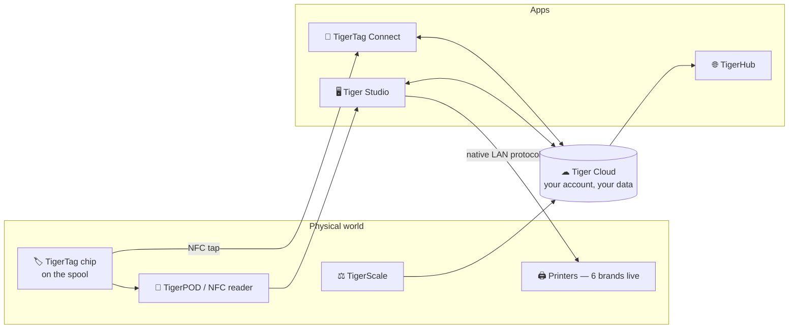

# TigerSystem Documentation

> The official documentation of **TigerSystem** — the open, user-centric
> ecosystem for 3D-printing filament. One spool, one open identity, readable
> everywhere.

**TigerTag** is an open RFID standard: each filament spool carries an NFC chip
with its full profile — brand, material, color, print settings — readable by
any compatible app or reader. Around it, TigerSystem connects a mobile app, a
desktop workbench, a web sharing surface, an open cloud, and open hardware.

## The ecosystem at a glance

## Philosophy in one paragraph

Printer manufacturers build **printer-centric** ecosystems: locked tags, vendor
silos, data that dies with the brand. TigerSystem is **user-centric**: you own
the filament, the metadata, the inventory, the history and the synchronization
— the system just connects every component together. Every layer is open and
optional, and nothing requires anyone's permission to build on.
→ [Why TigerSystem exists](docs/vision/why-tigersystem.md)

## Documentation index

| Section | Contents |
|---|---|
| **[Vision](docs/vision/why-tigersystem.md)** | Why TigerSystem exists |
| **[Philosophy](docs/philosophy/user-centric-ecosystem.md)** | [User-centric vs printer-centric](docs/philosophy/user-centric-ecosystem.md) · [Open ecosystem](docs/philosophy/open-ecosystem.md) · [Smartphone bridge](docs/philosophy/smartphone-bridge.md) · [Second Life](docs/philosophy/second-life.md) |
| **[Concepts](docs/concepts/universal-filament-identity.md)** | [Universal filament identity](docs/concepts/universal-filament-identity.md) · [The TigerTag chip](docs/concepts/tigertag-chip.md) · [Inventory & cloud sync](docs/concepts/inventory-and-cloud-sync.md) |
| **[Architecture](docs/architecture/overview.md)** | [Overview](docs/architecture/overview.md) · [Data flow](docs/architecture/data-flow.md) |
| **[Products](docs/products/README.md)** | [TigerTag](docs/products/tigertag.md) · [TigerTag+](docs/products/tigertag-plus.md) · [Connect](docs/products/tigertag-connect.md) · [Tiger Studio](docs/products/tiger-studio.md) · [TigerHub](docs/products/tigerhub.md) · [Tiger Cloud](docs/products/tiger-cloud.md) · [TigerPOD](docs/products/tigerpod.md) · [TigerScale](docs/products/tigerscale.md) |
| **[Compatibility](docs/compatibility/README.md)** | Bambu Lab · Creality · Elegoo · FlashForge · Anycubic · Snapmaker · Klipper · OpenSpool |
| **[Developers](docs/developers/README.md)** | [Repositories](docs/developers/repositories.md) · [SDKs](docs/developers/sdks.md) · [Cloud API](docs/developers/cloud-api.md) |
| **[FAQ](docs/faq/README.md)** | General · chips · apps · cloud · RFID · troubleshooting · developers · manufacturers |
| **[Tutorials](docs/tutorials/README.md)** / **[Guides](docs/guides/README.md)** | Step-by-step walkthroughs *(in progress)* |
| **[Roadmap](docs/roadmap/README.md)** | Ecosystem direction |

## Products

| Product | One-liner |
|---|---|
| 🏷 **[TigerTag](docs/products/tigertag.md)** | Open NFC chip + standard — the spool's universal identity |
| 🏷+ **[TigerTag+](docs/products/tigertag-plus.md)** | Certified chip with cloud backup |
| 📱 **[TigerTag Connect](docs/products/tigertag-connect.md)** | iOS/Android app — scan & encode by NFC tap |
| 🖥 **[Tiger Studio](docs/products/tiger-studio.md)** | Open-source desktop workbench — inventory, racks, 6 printer brands live |
| 🌐 **[TigerHub](docs/products/tigerhub.md)** | Public sharing on [tigersystem.io](https://tigersystem.io) |
| ☁ **[Tiger Cloud](docs/products/tiger-cloud.md)** | Your account: sync, sharing, reference data, open API surface |
| 📡 **[TigerPOD](docs/products/tigerpod.md)** | Free 3D-printable dual NFC reader stand |
| ⚖ **[TigerScale](docs/products/tigerscale.md)** | Open-source ESP32 filament scale |

## Quick links

- 🛒 **[tigertag.io](https://tigertag.io)** — chips, catalogue, account
- 🌐 **[tigersystem.io](https://tigersystem.io)** — public sharing (TigerHub)
- 📦 **[GitHub organization](https://github.com/TigerTag-Project)** — all open repos ([map](docs/developers/repositories.md))
- ⬇ **[Download Tiger Studio](https://github.com/TigerTag-Project/TigerTag-Studio-Manager/releases)**

## Contributing

This repository is the **single source of truth for ecosystem-level
documentation** — product code and code-level docs live in their own repos.
See **[CONTRIBUTING.md](CONTRIBUTING.md)** for the writing rules (one canonical
home per fact, cross-reference instead of duplicating, never invent — mark
gaps with `TODO`).

## License

Documentation: **[CC BY 4.0](LICENSE)** · Trademarks: **[TRADEMARK.md](TRADEMARK.md)**
