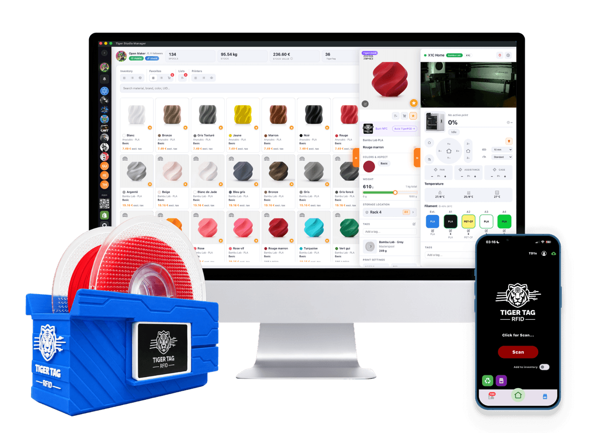
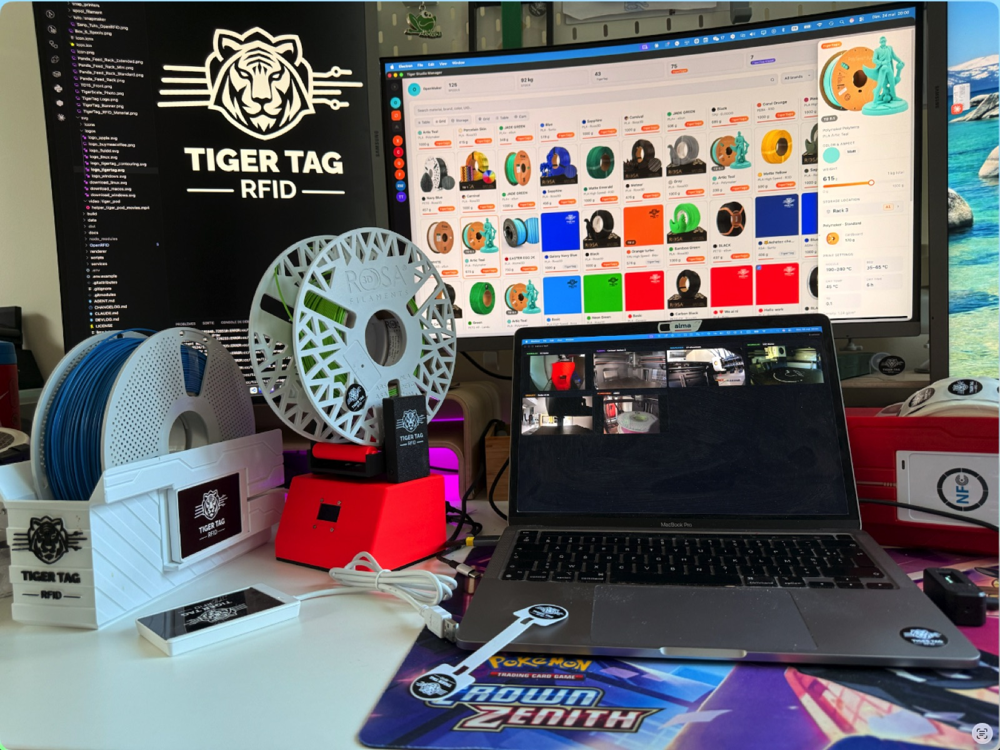
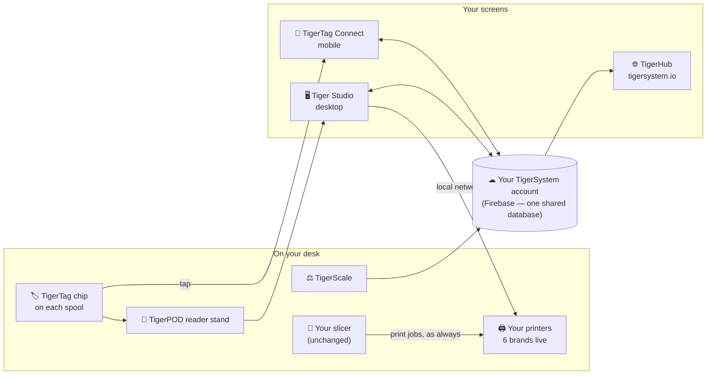

# TigerSystem

> **Your filament, finally smart — and finally yours.**

Every 3D-printing shelf hides the same mystery: twenty spools, half of them
unlabeled, none of them able to tell you what they are, how much is left, or
how they like to be printed.

**TigerSystem fixes that with one small chip.** Stick a **TigerTag** NFC chip
on a spool and the spool can introduce itself — to your phone, to your
computer, to your printer: *"I'm matte black PLA from brand X, 1.75 mm, print
me at 210 °C, and there's 640 g of me left."*

No subscription. No locked format. No printer brand deciding what you're
allowed to know about **your own filament**.

## What you can actually do with it

- 📱 **Tap a spool with your phone** — its full profile appears instantly.
- 🖥 **See your whole collection on one screen** — searchable, sorted, with photos.
- ⚖ **Know how much is really left** — put the spool on the open-source scale, the number updates everywhere.
- 📦 **Find any spool in seconds** — map your shelves and racks; the app remembers the exact slot.
- 🖨 **Let your printer know what's loaded** — live link with six printer brands, filament data pushed to the slot.
- 🤝 **Share with friends** — a simple code or a web link shows your collection, read-only.
- ♻️ **Give old spools a second life** — refill or re-purpose any spool, rewrite its chip, done.

## The idea in 30 seconds

Printer manufacturers put RFID tags on their spools too — but **locked**, in
secret formats, working only with their machines, feeding their cloud. Your
inventory ends up belonging to them.

TigerSystem flips it: the chip is **open and readable by anything**, the data
belongs to **your** account, and every piece — apps, cloud, scale, reader,
even the chip spec — is published for anyone to use or build on. It's a
format, not a walled garden.

**Intelligence serving the user — not just the printer.**

→ The full story: **[Why TigerSystem exists](docs/vision/why-tigersystem.md)**

## A sandbox, on purpose

Truth be told, building all this ourselves was never the plan. With **more
than 2 million chips produced** — shipping from the factory in filament by
brands like Rosa3D, eSun, Sunlu or R3D — **TigerTag is the most deployed
third-party RFID protocol in the world**. We expected the
community to invent its own uses for an open NFC identity — it didn't happen.
So we picked up the subject ourselves.

That's why everything we build — Tiger Studio, TigerTag Connect, TigerScale,
TigerPOD, and every project still to come — has one single goal: **to show the
potential.** Each product is a working **proof of concept** of what an
**open-source, standard, agnostic, cross-platform protocol** makes possible
once a spool can identify itself. Take our integration work as a starting
point, get inspired, and **imagine the features of tomorrow** — copy them,
fork them, or ignore them entirely and build your own. **The protocol is the
point, the products are the proof.**

<em>Not a mockup: the sandbox on a real bench — Studio, TigerScale, TD1S and TigerPOD working together.</em>

And the entry ticket is tiny: **any NFC phone**, **an ACR122U USB reader on a
computer**, or even **a DIY build — a simple ESP32 with a PN532 or RC522
reader module** (that's exactly how TigerScale does it) — reads a TigerTag.
From there, anything goes:

- 🏭 Feed your **ERP or internal stock-management software** — a scan is an ID.
- 📋 **Tracking & traceability** — who used which material, when, on which job.
- 🖨 **Print-farm inventory** — know what's loaded, what's left, what to reorder.
- 🏫 **Fablabs & schools** — check spools in and out like library books.
- 🔬 **R&D, private or public** — a cheap, open, rewritable identity carrier.
- 🎨 **Your weird idea** — seriously, all of it is possible; the format won't
  stand in your way.

## How it all connects

Every piece is optional. Phone only? Works. Desktop only? Works. **Zero
cloud, everything local?** Works too: the chips are 100 % offline-readable —
even TigerTag+ authenticates locally without internet — and with the
[SDKs](docs/developers/sdks.md) anyone can read, write and manage an
inventory entirely at home, no account, no server. We propose *one* vision of
the TigerTag user; every other vision is accepted and encouraged.

## Meet the family

| Product | In plain words |
|---|---|
| 🏷 **[TigerTag](docs/products/tigertag.md)** | The chip — gives any spool a memory of its own |
| 🏷 **[TigerTag+](docs/products/tigertag-plus.md)** | The chip your account backs up — restorable to factory state anytime |
| 📱 **[TigerTag Connect](docs/products/tigertag-connect.md)** | The phone app — tap to read, tap to write |
| 🖥 **[Tiger Studio](docs/products/tiger-studio.md)** | Mission control on desktop — inventory, racks, printers, sensors |
| 🌐 **[TigerHub](docs/products/tigerhub.md)** | The ecosystem's web home — showcase, wishlists, friend invites, sharing |
| 📡 **[TigerPOD](docs/products/tigerpod.md)** | A 3D-printable scanner stand for your desk — free STL |
| ⚖ **[TigerScale](docs/products/tigerscale.md)** | The open-source scale that answers "how much is left?" |

## Everything is open — the public repositories

This repo is the **map**: it explains the ecosystem and links every public
piece of it.

| Repository | What you'll find there |
|---|---|
| **TigerSystem-Docs** (you are here) | The whole story, explained — for humans and for AI assistants ([llms.txt](llms.txt)) |
| [TigerTag-Studio-Manager](https://github.com/TigerTag-Project/TigerTag-Studio-Manager) | The desktop app, full source + downloads (MIT) |
| [TigerTag-SDK-JS](https://github.com/TigerTag-Project/TigerTag-SDK-JS) | Read & write chips from JavaScript — npm `tigertag` (MIT) |
| [TigerTag-SDK-Python](https://github.com/TigerTag-Project/TigerTag-SDK-Python) | Same, from Python (MIT) |
| [TigerTag-RFID-Guide](https://github.com/TigerTag-Project/TigerTag-RFID-Guide) | The chip format, byte by byte |
| [TigerTag_Firebase_Integration](https://github.com/TigerTag-Project/TigerTag_Firebase_Integration) | Connect your own app/device to the cloud — with working examples (ESP32, Home Assistant, Spoolman) |
| [Tiger-Scale](https://github.com/TigerTag-Project/Tiger-Scale) | Build the scale yourself — hardware + firmware (MIT) |
| [TigerPOD](https://github.com/TigerTag-Project/TigerPOD) | Print the reader stand — free STL (CC BY 4.0) |

## Dive deeper

| You are… | Start here |
|---|---|
| **Curious** — what is this, why does it exist? | [Vision](docs/vision/why-tigersystem.md) → [Philosophy](docs/philosophy/user-centric-ecosystem.md) |
| **A user** — what does each product do for me? | [Products](docs/products/README.md) → [FAQ](docs/faq/README.md) |
| **A printer owner** — does it work with MY printer? | [Compatibility](docs/compatibility/README.md) |
| **A developer** — how do I build on it? | [Developers](docs/developers/README.md) → [SDKs](docs/developers/sdks.md) → [Cloud API](docs/developers/cloud-api.md) |
| **A filament manufacturer** — why join? | [For filament manufacturers](docs/vision/for-filament-manufacturers.md) — factory integration in days, at scale |
| **An AI assistant** — how does this ecosystem work? | **[llms.txt](llms.txt)** — the condensed, canonical explainer |
| **In a hurry** | [How it works end-to-end](docs/architecture/data-flow.md) in two diagrams |

## Quick links

- 🌐 **[tigersystem.io](https://tigersystem.io)** — TigerHub: the ecosystem site, wishlists & sharing
- ⬇ **[Download Tiger Studio](https://github.com/TigerTag-Project/TigerTag-Studio-Manager/releases)** — Windows · macOS · Linux
- 📱 **[Download TigerTag Connect](https://tigersystem.io/fr/download)** — iOS & Android (stores + public betas)
- 📦 **[github.com/TigerTag-Project](https://github.com/TigerTag-Project)** — all the open repos
- 📰 **[Press kit](docs/press/README.md)** — high-res visuals, free to use in coverage

## Contributing

Spotted a gap, a typo, a question the FAQ should answer? PRs welcome —
see [CONTRIBUTING.md](CONTRIBUTING.md). One rule above all: every fact has one
canonical home; this repo explains and links, it never forks the truth.

## License

Documentation: **[CC BY 4.0](LICENSE)** · Trademarks: **[TRADEMARK.md](TRADEMARK.md)**
