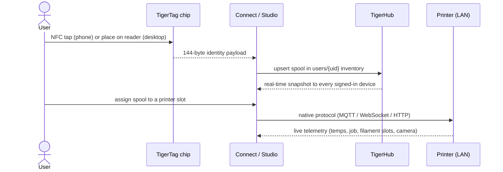
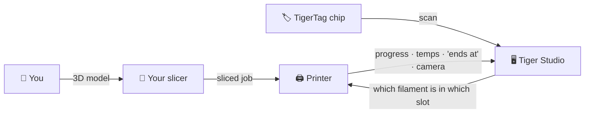

# Data flow

## From tap to print

The full journey of one spool through the system:

## Where each kind of data lives

| Data | Lives in | Notes |
|---|---|---|
| Spool identity | The chip + the user's cloud inventory | Chip is authoritative for offline use |
| Reference database (brands, materials…) | `cdn.tigertag.io` | Bundled with apps, refreshed from CDN |
| Inventory, racks, friends, prefs | Firestore `users/{uid}/…` | Owner-only by default, rules-enforced |
| Public discovery codes | Firestore `publicKeys/{code}` | O(1) friend lookup |
| Printer credentials & telemetry | **Local only** (desktop) | LAN traffic never transits the cloud |
| Live weight (TigerScale) | Device → Firestore | Appears live in all clients |

## Where your slicer fits

TigerSystem **does not replace your slicer** — it completes the picture around
it:

- You slice and launch jobs exactly as before, with any slicer.
- Tiger Studio tells the printer **which filament sits in which slot**
  (AMS / CFS / Canvas / ACE / material station), so the machine-side
  information matches reality.
- Whatever started the print, the job shows up live in Tiger Studio —
  progress, temperatures, finish time, camera.
- The chip carries the filament's recommended print settings; there is **no
  automatic slicer-profile import today** — you mirror them in your slicer
  profile yourself.

## Two planes, deliberately separate

- **Cloud plane** — identity, inventory, sharing. Internet, Firebase,
  rules-enforced.
- **LAN plane** — printer control and cameras. Local network only, native
  vendor protocols, zero cloud dependency (the desktop app keeps working with
  printers when offline).

> **Note:** the exception is Anycubic **cloud mode**, where the printer link
> itself goes through the vendor's cloud MQTT — see
> [Anycubic compatibility](../compatibility/anycubic.md).

---

**◀ Previous:** [Architecture overview](./overview.md) · **▲ [Documentation index](../../README.md)** · **Next ▶** [Products](../products/README.md)

**Related:** [Inventory & cloud sync](../concepts/inventory-and-cloud-sync.md), [Compatibility](../compatibility/README.md)
