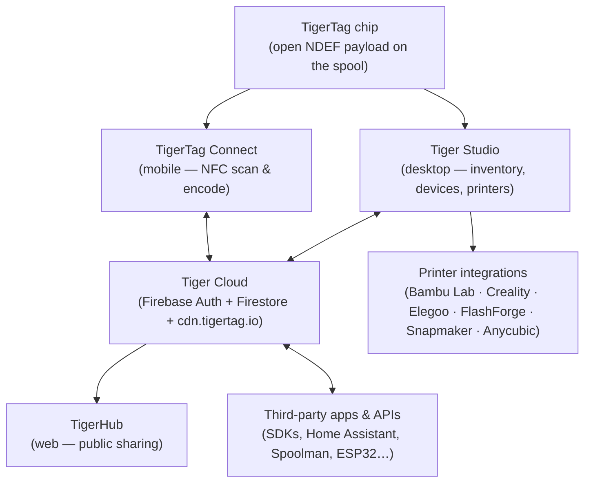

# Architecture overview

## The stack, top to bottom

## Layers

| Layer | Role | Canonical docs |
|---|---|---|
| **TigerTag chip** | Portable, open identity of the physical spool | [Chip format](../concepts/tigertag-chip.md) |
| **TigerTag Connect** | The smartphone bridge: scan, encode, browse | [Product page](../products/tigertag-connect.md) |
| **Tiger Cloud** | Identity + inventory + sharing backbone | [Product page](../products/tiger-cloud.md) |
| **Tiger Studio** | Desktop workbench: inventory, racks, sensors, printers | [Product page](../products/tiger-studio.md) |
| **Printer integrations** | Live LAN links to six printer brands | [Compatibility](../compatibility/README.md) |
| **Third-party APIs** | SDKs + documented Firestore surface for anyone | [Developers](../developers/README.md) |

## Design principles

1. **The chip is self-sufficient.** A spool identifies itself with no cloud, no
   account, no network — the payload is complete and open.
2. **The cloud is the user's, not the system's.** All state lives under the
   user's account; server-side security rules — not client code — enforce
   access.
3. **Every layer is optional.** Phone-only, desktop-only, chip-only, or
   API-only usage all work; components add value but never gate each other.
4. **Integrations speak the printer's native protocol.** No firmware mods, no
   cloud detours: Tiger Studio talks MQTT/WebSocket/HTTP directly on the LAN
   (see [data flow](./data-flow.md)).

---

**◀ Previous:** [Inventory & cloud sync](../concepts/inventory-and-cloud-sync.md) · **▲ [Documentation index](../../README.md)** · **Next ▶** [Data flow](./data-flow.md)

**Related:** [Products](../products/README.md), [Developers](../developers/README.md)
