#  Bambu Lab

## Printer link — **Live**

Tiger Studio connects to a Bambu Lab printer two ways:

| Aspect | Detail |
|---|---|
| LAN | MQTTS (TLS) direct to the printer, port 8883. Needs the printer's **LAN Only mode** and **Developer Mode** turned on once — [step-by-step per model](#switch-to-lan-mode). |
| Cloud | Sign in once with your Bambu Lab account (email + one-time code) — every printer on the account is found automatically, LAN access code included. No on-printer toggle needed for this part. |
| Filament | AMS support — up to 16 slots, per-slot filament edit |
| Discovery | LAN: SSDP + TLS probe, plus Add-by-IP. Cloud: automatic, from the account. |
| Camera | JPEG stream (TCP 6000) / RTSP — same feed either way, needs **LAN Mode Liveview** enabled on the printer |
| Telemetry | Temperatures, job progress, print preview |

> **Cloud connections are read-only today.** You get live telemetry — temperatures, progress,
> camera — but not machine control (pause, resume, stop, lights…). Control needs the LAN path.

## Native RFID — spec documented, in-app read planned

Bambu spool tags are **Mifare Classic 1K** with **HKDF-SHA256 UID-derived
keys** — cryptographically locked to serve the vendor's ecosystem. A read-only
decoding spec is maintained in
[`docs/rfid-vendors/bambu.md`](https://github.com/TigerTag-Project/TigerTag-Studio-Manager/blob/main/docs/rfid-vendors/bambu.md).

## The workflow

1. **Add the printer** — either **on the LAN** (SSDP discovery, or Add by IP,
 paired with the printer's LAN access code) or **from the cloud** (sign in
 with your Bambu Lab account — every printer on it is found automatically).
 The LAN path needs the printer's LAN Only mode and Developer Mode turned on
 once first — [step-by-step per model](#switch-to-lan-mode).
2. **Scan a spool** — phone or desktop reader; the spool lands in your
 inventory.
3. **Assign it to an AMS slot** — Tiger Studio pushes the filament profile
 (material, color) to the slot over MQTTS; the machine-side info now
 matches reality, across up to 16 AMS slots.
4. **Live** — temperatures, job progress, print preview, wall-clock
 **"Ends at"** time, and the camera feed, right in the printers view.

## Switch to LAN mode

The LAN path needs **LAN Only mode** and **Developer Mode** enabled on the printer itself — a
one-time, on-screen setup. Pick your model below for the exact steps.

<a href="../tutorials/bambu-lab-a1-series.md">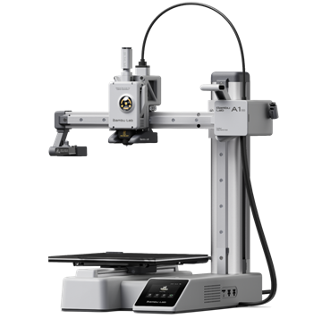A1 mini</a>
<a href="../tutorials/bambu-lab-a1-series.md">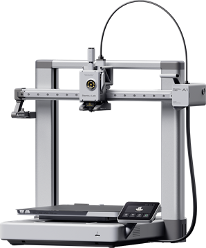A1</a>
<a href="../tutorials/bambu-lab-a1-series.md">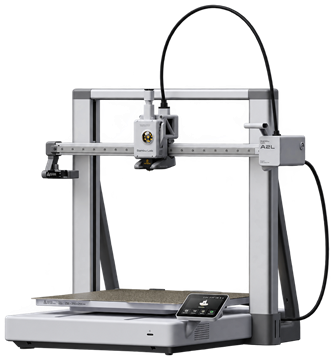A2L</a>
<a href="../tutorials/bambu-lab-p1-series.md">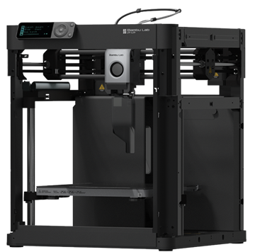P1P</a>
<a href="../tutorials/bambu-lab-p1-series.md">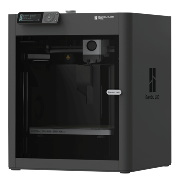P1S</a>
<a href="../tutorials/bambu-lab-x1-h2-p2-series.md">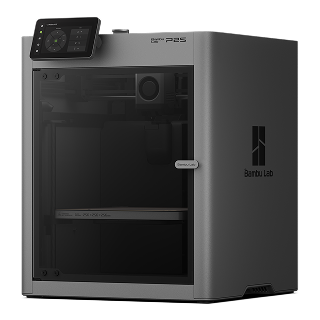P2S</a>
<a href="../tutorials/bambu-lab-x1-h2-p2-series.md">X1 Carbon</a>
<a href="../tutorials/bambu-lab-x1-h2-p2-series.md">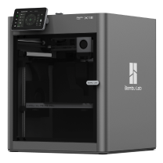X1E</a>
<a href="../tutorials/bambu-lab-x1-h2-p2-series.md">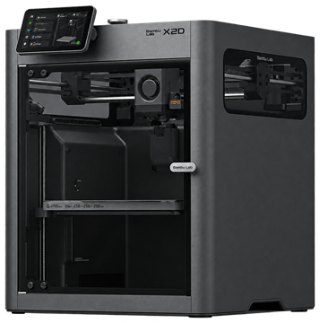X2D</a>
<a href="../tutorials/bambu-lab-x1-h2-p2-series.md">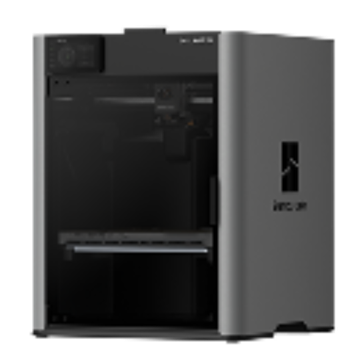H2S</a>
<a href="../tutorials/bambu-lab-x1-h2-p2-series.md">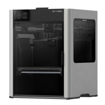H2D</a>
<a href="../tutorials/bambu-lab-x1-h2-p2-series.md">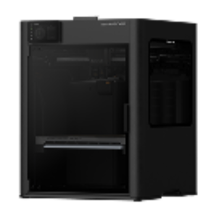H2D Pro</a>
<a href="../tutorials/bambu-lab-x1-h2-p2-series.md">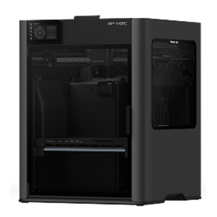H2C</a>

## Limitations

- Native Bambu tags are not read in-app yet — the spec is documented, and the current work aims at converting vendor tag data into TigerData spools (see [Compatibility](./README.md)).
- The camera feed needs LAN Mode Liveview enabled on the printer, whichever connection path is used.

---

**◀ Previous:** [Compatibility](./README.md) · **▲ [Documentation index](../../README.md)** · **Next ▶** [Creality](./creality.md)
