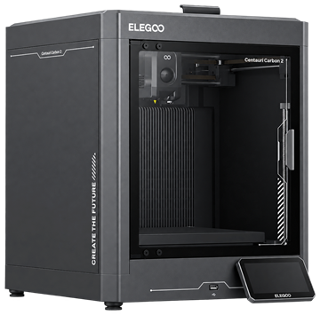

#  Elegoo

## Printer link — **Live**

| Aspect | Detail |
|---|---|
| Protocol | MQTT, port 1883 |
| Discovery | UDP broadcast, port 52700 |
| Filament | 4 slots (Canvas / tray) |
| Control | Live control panel: home/jog, temperatures, light, fan, speed mode, load/unload |
| Telemetry | Temperatures, job progress |

## Native RFID — spec documented, in-app read planned

Elegoo spool tags are **Mifare Ultralight** protected only by **magic bytes**
(`EE EE EE EE`) — no real authentication. Read-only decoding spec:
[`docs/rfid-vendors/elegoo.md`](https://github.com/TigerTag-Project/TigerTag-Studio-Manager/blob/main/docs/rfid-vendors/elegoo.md).

## The workflow

1. **Add the printer** — automatic LAN discovery (UDP broadcast) or Add by
 IP. Needs **LAN Only mode** turned on once on the printer's touch screen —
 [step-by-step](#switch-to-lan-mode).
2. **Scan a spool** — phone or desktop reader; it lands in your inventory.
3. **Assign it to a slot** — Tiger Studio maps inventory spools to the four
 Canvas/tray slots.
4. **Live & control** — beyond telemetry and job progress, Elegoo gets a
 **full control panel**: home/jog the axes, set nozzle & bed targets,
 toggle the light, drive the fan, pick the speed mode, load/unload
 filament per slot.

## Switch to LAN mode

Tiger Studio's direct link needs **LAN Only mode** enabled on the printer itself — a one-time,
on-screen setup.

<a href="../tutorials/elegoo-cc2-lan-mode.md">Centauri Carbon 2</a>

## Bonus: write Elegoo-format tags

The app's built-in editor can **rewrite a chip in the format Elegoo printers
expect** — so a TigerTag chip can even become a native Elegoo tag if that's
what your workflow needs. Your chip, your choice.

## Limitations

- Native Elegoo tags are not read in-app yet — the spec is documented, and the current work aims at converting vendor tag data into TigerData spools (see [Compatibility](./README.md)).

---

**◀ Previous:** [Creality](./creality.md) · **▲ [Documentation index](../../README.md)** · **Next ▶** [FlashForge](./flashforge.md)
