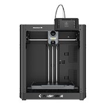
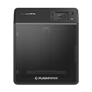

#  FlashForge

## Printer link — **Live**

| Aspect | Detail |
|---|---|
| Protocol | HTTP polling (port 8898) + TCP M-codes (port 8899) |
| Discovery | UDP multicast (225.0.0.9:19000) |
| Filament | Material station (matlStation) support |
| Camera | MJPEG stream |
| Telemetry | Temperatures, job progress |

## Native RFID — none: the machines have no reader

FlashForge printers ship **without any RFID reader**. That makes this the
clearest demonstration of the TigerSystem advantage: **we gave FlashForge
machines the ability to work with NFC-identified filament — using the NFC
reader already in the user's smartphone.** A brand-new capability, added to
someone else's printer, **totally free, at zero cost to the user, with zero
machine modification.**

## The workflow

1. **Add the printer** — automatic LAN discovery (UDP multicast) or Add by
 IP.
2. **Scan a spool** — with your phone (or a desktop reader); it lands in
 your inventory.
3. **Assign it to a material-station slot** — **one scan, one click** from
 Tiger Studio's mapping. The printer ends up knowing its filament as
 precisely as a machine with built-in RFID, without FlashForge having
 changed anything.
4. **Live** — temperatures, job progress, and the MJPEG camera stream in the
 printers view.

## Connect by IP address

FlashForge has no cloud option, and automatic LAN discovery doesn't always find every printer.
When it doesn't, add it by IP instead — you'll just need to look up its serial number, IP address
and printer ID on the touchscreen first. Choose your model below for the exact steps.

<a href="../tutorials/flashforge-connection-tutorial.md">Adventurer 5X</a>
<a href="../tutorials/flashforge-connection-tutorial.md">Adventurer 5M</a>
<a href="../tutorials/flashforge-connection-tutorial.md">Adventurer 5M Pro</a>
<a href="../tutorials/flashforge-connection-tutorial.md">Adventurer A5</a>

---

**◀ Previous:** [Elegoo](./elegoo.md) · **▲ [Documentation index](../../README.md)** · **Next ▶** [Anycubic](./anycubic.md)
