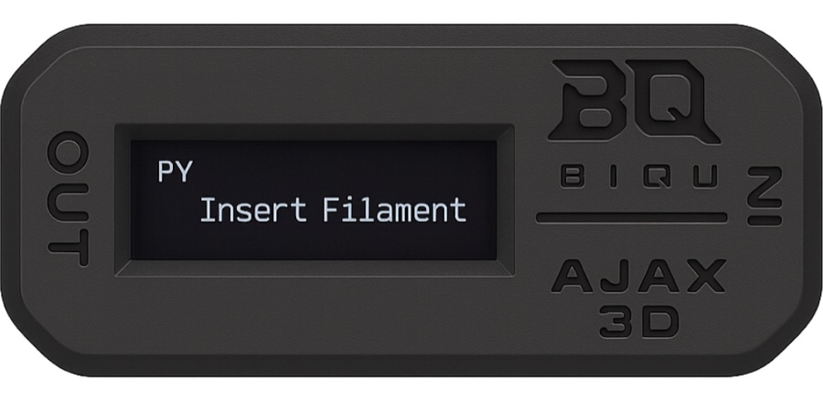
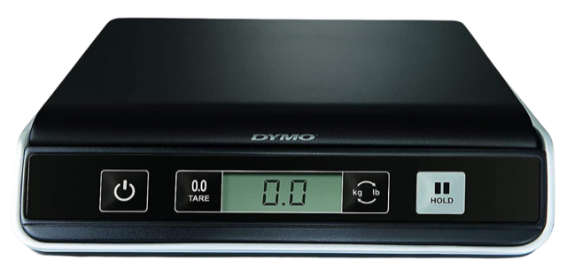
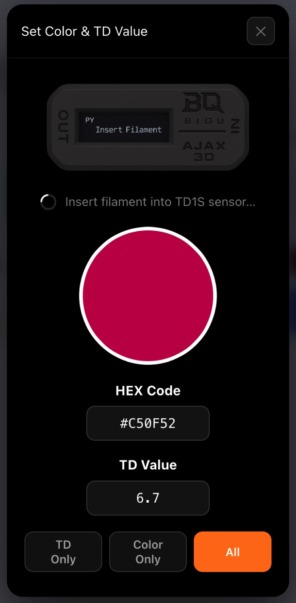

# Compatible third-party hardware

The ecosystem plays well with hardware it didn't make. This page is the
**growing list** of third-party devices that connect, one way or another —
it will keep expanding as development continues and as more makers plug
their gear in.

| Device | Maker | What it does | Works with |
|---|---|---|---|
| **ACR122U** NFC reader | ACS | USB NFC reader/writer — scan a chip and the spool auto-opens; guided, UID-checked writes. Two of them power a [TigerPOD](../products/tigerpod.md) | [Tiger Studio](../products/tiger-studio.md) |
| **TD-1** filament analyzer | [AJAX-3D](https://ajax-3d.com) | DIY build — measures a filament's **Transmission Distance** (the HueForge / Full Spectrum printing value) + color (RGB, 1–3 slots, indicative) | [Tiger Studio](../products/tiger-studio.md) · [Tiger NFC Connect](../products/tigertag-connect.md) (USB-C) |
| **TD1s** filament analyzer | [AJAX-3D](https://ajax-3d.com) | Same device family, pre-assembled and ready out of the box | [Tiger Studio](../products/tiger-studio.md) · [Tiger NFC Connect](../products/tigertag-connect.md) (USB-C) |
| **DYMO M series** USB scales (M5, M10, M25…) | DYMO | Standard USB "HID Scale" devices — live weight into the spool's profile ([protocol details](../products/tigerscale.md)) | [Tiger Studio](../products/tiger-studio.md) |
| **Any HID Scale-compliant USB scale** | any | Same standard protocol as the DYMO M series (HID usage page `0x8D`) — brand doesn't matter | [Tiger Studio](../products/tiger-studio.md) |
| **Any blank NTAG213/215/216 chip** | any | The consumable itself — bought anywhere, works identically ([which chip?](../../docs/faq/README.md)) | Everything |

| | | |
|---|---|---|
|  |  |  |

*The AJAX-3D TD1s · a DYMO M-series USB scale · the chips themselves. (The
ACR122U is the reader inside every [TigerPOD](../products/tigerpod.md) — and
on [the bench photo](../../README.md).)*

*The TD1s at work inside Tiger Studio.*

Measured values don't stay in the device: a TD or a weight lands in the
spool's profile and can live **in the TigerTag protocol itself** — on the
chip, or in a `.ttag` file.

## Your hardware here

Building or connecting a device? The protocol is open, the
[SDKs](../developers/sdks.md) are ready, and **TigerTag Certified** exists
for verified integrations. Tell us on the
[Discord](https://discord.gg/3Qv5TSqnJH) or at
[tigertag@tigertag.io](mailto:tigertag@tigertag.io) — this list is meant to
grow.

---

**▲ [Documentation index](../../README.md)** · **Related:** [Compatibility](./README.md), [Third-party integrations (software)](../developers/integrations.md), [Products](../products/README.md)
