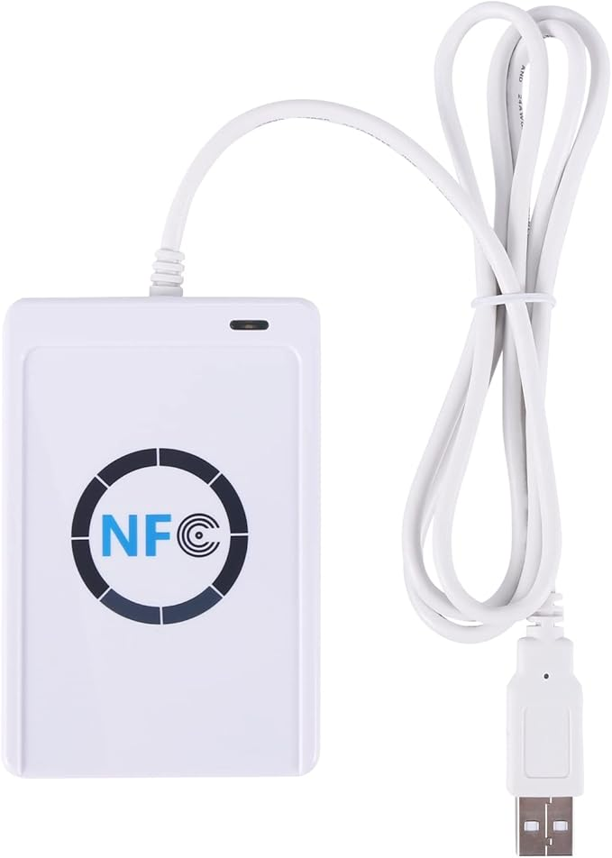
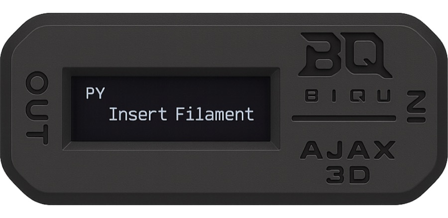
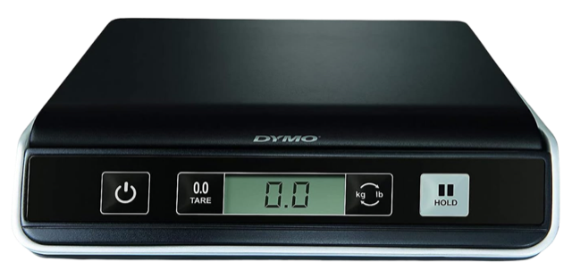
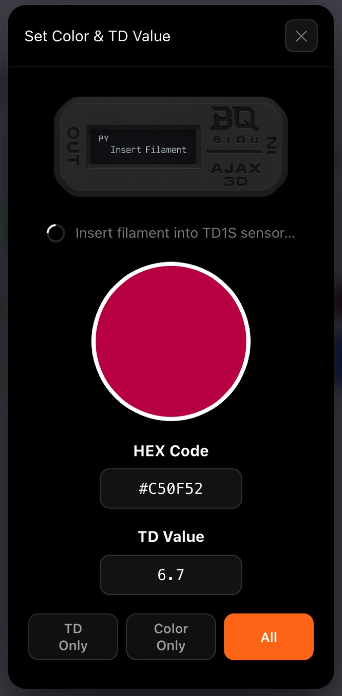

# Compatible third-party hardware

The ecosystem plays well with hardware it didn't make. This page is the
**growing list** of third-party devices that connect, one way or another —
it will keep expanding as development continues and as more makers plug
their gear in.

| Device | Maker | What it does | Works with |
|---|---|---|---|
| **ACR122U** NFC reader | ACS | USB NFC reader/writer — scan a chip and the spool auto-opens; guided, UID-checked writes. Two of them power a [TigerPOD](../products/tigerpod.md) | [Tiger Studio](../products/tiger-studio.md) |
| **TD-1** filament analyzer | [AJAX-3D](https://ajax-3d.com) | DIY build — measures a filament's **Transmission Distance** (the HueForge / Full Spectrum printing value) + color (RGB, 1–3 slots, indicative) | [Tiger Studio](../products/tiger-studio.md) · [Tiger NFC Connect](../products/tigertag-connect.md) (USB-C) |
| **TD1s** filament analyzer | [AJAX-3D](https://ajax-3d.com) | Same device family, pre-assembled and ready out of the box | [Tiger Studio](../products/tiger-studio.md) · [Tiger NFC Connect](../products/tigertag-connect.md) (USB-C) |
| **DYMO M series** USB scales (M5, M10, M25…) | DYMO | Standard USB "HID Scale" devices — live weight into the spool's profile ([protocol details](../products/tigerscale.md)) | [Tiger Studio](../products/tiger-studio.md) |
| **Any HID Scale-compliant USB scale** | any | Same standard protocol as the DYMO M series (HID usage page `0x8D`) — brand doesn't matter | [Tiger Studio](../products/tiger-studio.md) |
| **Any blank NTAG213/215/216 chip** | any | The consumable itself — bought anywhere, works identically ([which chip?](../../docs/faq/README.md)) | Everything |

|| | | |
|---|---|---|---|
|  |  |  |  |

*The ACR122U reader (two of them live inside every
[TigerPOD](../products/tigerpod.md)) · the AJAX-3D TD1s · a DYMO M-series USB
scale · the chip itself, antenna bared.*

*The TD1s at work inside Tiger Studio.*

Measured values don't stay in the device: a TD or a weight lands in the
spool's profile and can live **in the TigerTag protocol itself** — on the
chip, or in a `.ttag` file.

## Readers built by other people

Some makers build their own readers that speak TigerTag directly, without any
of our software in the loop. **BambuTagger**
([bambutagger.de](https://www.bambutagger.de/en/)) is a German open-source
project publishing ESP32-based spool readers — sources on GitHub, printable
cases, PCB files and firmware, all free. Two of its devices declare TigerTag
support:

| Device | What it is | What it does with TigerTag |
|---|---|---|
| **[BT-Touch](https://www.bambutagger.de/en/bt-touch)** | A battery-powered unit with a 5″ 800×480 touchscreen — ESP32-S3 and one RC522 reader — storing over 2000 tags locally | **Reads, clones and writes** TigerTag, alongside Bambu Lab, Spoolease, OpenSpool and OpenTag3D tags |
| **[BT-AMS-C](https://www.bambutagger.de/en/bt-ams)** | A four-slot reader that mounts on a Bambu Lab AMS — ESP32 with 4× RC522, OLED and TFT displays, addressable LEDs. Shows live AMS slot data and **sends tag data to the printer / BMCU** | Reads the same five tag families, one per slot |

Two things worth being precise about.

**These are compatible, not certified.** A third party may say *"compatible
with TigerTag"* freely and without asking anyone — that is exactly what this
is, and it is the whole point of an open format. It is not *certified*:
certification is an audit that TigerSystem grants, and neither device has been
through one. The difference is explained in
[the trademark policy](../../TRADEMARK.md).

**Cloning a chip is not a hole in the format.** A standard TigerTag carries no
authentication and is never write-locked, so copying one is expected — it is
the same property that lets you rewrite your own chips. What a copy cannot
carry is a valid [TigerTag+](../products/tigertag-plus.md) signature: a cloned
tag fails verification on the customer's own phone, offline.

That devices like these exist without us is the measure of the format: nothing
was asked of us, no key was needed, no agreement was signed.

## Your hardware here

Building or connecting a device? The protocol is open, the
[SDKs](../developers/sdks.md) are ready, and **TigerTag Certified** exists
for verified integrations. Tell us on the
[Discord](https://discord.gg/3Qv5TSqnJH) or at
[tigertag@tigertag.io](mailto:tigertag@tigertag.io) — this list is meant to
grow.

---

**▲ [Documentation index](../../README.md)** · **Related:** [Compatibility](./README.md), [Third-party integrations (software)](../developers/integrations.md), [Products](../products/README.md)
