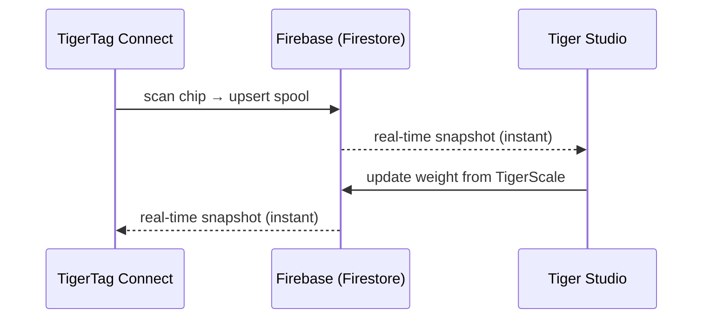

# Inventory & cloud synchronization

## One account, every device

A user's inventory lives in **their TigerSystem account**, backed by plain
**Firebase** (Auth + Firestore) — deliberately unbranded infrastructure whose
job is simple: **one shared database, in one place**, so every element of the
sandbox (desktop, mobile, scale, web) interoperates on the same data. Every client — mobile, desktop, web — subscribes to the same
documents in real time:

There is no "sync button": changes propagate through Firestore's live
listeners, and clients keep a local cache for offline reads.

## What synchronizes

- **Inventory** — one document per spool (identity, weight, container, image…).
- **Racks** — physical shelf layouts and spool placement.
- **Friends & sharing** — friend links, incoming requests, notifications.
- **Preferences** — language, per-account settings.
- **Chip backups** — [TigerTag+](../products/tigertag-plus.md) chip records.

The authoritative field-by-field data model is documented in the
[Firebase integration repo](https://github.com/TigerTag-Project/TigerTag_Firebase_Integration)
(`docs/03-data-model.md`) — the reference for third-party integrators.

## Sharing model (summary)

- Each user has a public **discovery code** (`XXX-XXX`) for O(1) friend lookup.
- Friendship is **bidirectional and consent-based**: request → accept; either
  side can remove it. Read access to a friend's inventory is enforced
  server-side by Firestore security rules — never by the client.
- An inventory can also be flagged **public**, or shared as a read-only web
  list via [TigerHub](../products/tigerhub.md) links.

## Security model (summary)

- All per-user data is owner-only by default; cross-user access always requires
  a prior relationship (friendship, request), enforced by server-side rules.
- The Firebase project config is intentionally public (standard pattern);
  **security lives in the rules, not in secrecy**. See
  [Cloud API & integration](../developers/cloud-api.md).

---

**◀ Previous:** [The TigerTag chip](./tigertag-chip.md) · **▲ [Documentation index](../../README.md)** · **Next ▶** [Architecture overview](../architecture/overview.md)

**Related:** [TigerHub](../products/tigerhub.md), [Developers — Cloud API](../developers/cloud-api.md)
