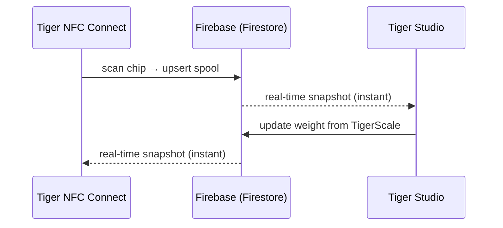

# Inventory & cloud synchronization

## One account, every device

A user's inventory lives in **their TigerSystem account**, backed by plain
**Firebase** (Auth + Firestore) — deliberately unbranded infrastructure whose
job is simple: **one shared database, in one place**, so every element of the
sandbox (desktop, mobile, scale, web) interoperates on the same data. Every client — mobile, desktop, web — subscribes to the same
documents in real time:

```mermaid
sequenceDiagram
  participant Phone as Tiger NFC Connect
  participant Cloud as Firebase (Firestore)
  participant Desktop as Tiger Studio
  Phone->>Cloud: scan chip → upsert spool
  Cloud-->>Desktop: real-time snapshot (instant)
  Desktop->>Cloud: update weight from TigerScale
  Cloud-->>Phone: real-time snapshot (instant)
```

There is no "sync button": changes propagate through Firestore's live
listeners, and clients keep a local cache for offline reads.

## What synchronizes

- **Inventory** — one document per spool (identity, weight, container, image…).
- **Racks** — physical shelf layouts and spool placement.
- **Friends & sharing** — friend links, incoming requests, notifications.
- **Preferences** — language, per-account settings.
- **Chip backups** — [TigerTag+](../products/tigertag-plus.md) chip records.

The authoritative field-by-field data model is documented in the
[Firebase integration repo](https://github.com/TigerTag-Project/TigerTag_Firebase_Integration)
(`docs/03-data-model.md`) — the reference for third-party integrators.

## What leaves your bench, and what stays

The ecosystem says everywhere that the cloud is optional. Here is what that
actually means, and what it costs when you say no.

**Identification is local by design.** A device does not ask a server what a tag
is. The brand and material tables live in its own storage and are refreshed from
the **public** [reference repository](https://github.com/TigerTag-Project/TigerTag-RFID-Guide)
at most once a day. So a lookup never waits on the network, and it works with
the internet down.

**Without an account you lose exactly one thing: sync between devices.** A
[TigerScale](../products/tigerscale.md) still weighs, still reads tags, still
identifies brand and material, still serves its own web UI on your LAN. Nothing
about the chip itself needs us — that is the whole point of writing the data
[on the chip](./tigertag-chip.md).

**With an account, here is what a device actually sends.** Taking the scale as
the worked example, on each completed weighing and on a heartbeat it writes,
under your own user document: the spool's tag UIDs, net/gross/container weight,
firmware version, WiFi signal and IP, calibration factor, last-heartbeat time,
battery state, and screen state. Diagnostics and measurements — no more. Every
field is documented in
[the scale's own reference](https://github.com/TigerTag-Project/Tiger-Scale-V3/blob/main/docs/TELEMETRY.md).

**And here is what it stores locally, which matters more.** A signed-in device
holds a refresh token, your user id and your WiFi credentials. It never stores
your password — sign-in exchanges it for tokens. But treat a provisioned device
as **holding a credential**: before you lend, sell or give one away, sign out
*and* forget the WiFi. A plain reflash does not clear either — that storage is
preserved on purpose so a firmware update does not cost you your setup.

**Two deliberate choices worth knowing.** A device's LAN API is
**unauthenticated**: anyone already on your network can read its state and
trigger a tare. That is a simplification for a home network — put it on a guest
VLAN if you do not trust yours. And the Firebase key visible in the source is a
**public project identifier**, not a secret; every Firebase client ships it, and
access control is enforced by server-side rules against the signed-in user, not
by hiding a string.

For the scale, all of this is documented in full in
[`docs/CLOUD.md`](https://github.com/TigerTag-Project/Tiger-Scale-V3/blob/main/docs/CLOUD.md),
which is canonical.

## Sharing model (summary)

- Each user has a public **discovery code** (`XXX-XXX`) for O(1) friend lookup.
- Friendship is **bidirectional and consent-based**: request → accept; either
 side can remove it. Read access to a friend's inventory is enforced
 server-side by Firestore security rules — never by the client.
- An inventory can also be flagged **public**, or shared as a read-only web
 list via [TigerHub](../products/tigerhub.md) links.

## Security model (summary)

- All per-user data is owner-only by default; cross-user access always requires
 a prior relationship (friendship, request), enforced by server-side rules.
- The Firebase project config is intentionally public (standard pattern);
 **security lives in the rules, not in secrecy**. See
 [Cloud API & integration](../developers/cloud-api.md).

---

**◀ Previous:** [The TigerTag chip](./tigertag-chip.md) · **▲ [Documentation index](../../README.md)** · **Next ▶** [Architecture overview](../architecture/overview.md)

**Related:** [TigerHub](../products/tigerhub.md), [Developers — Cloud API](../developers/cloud-api.md)
