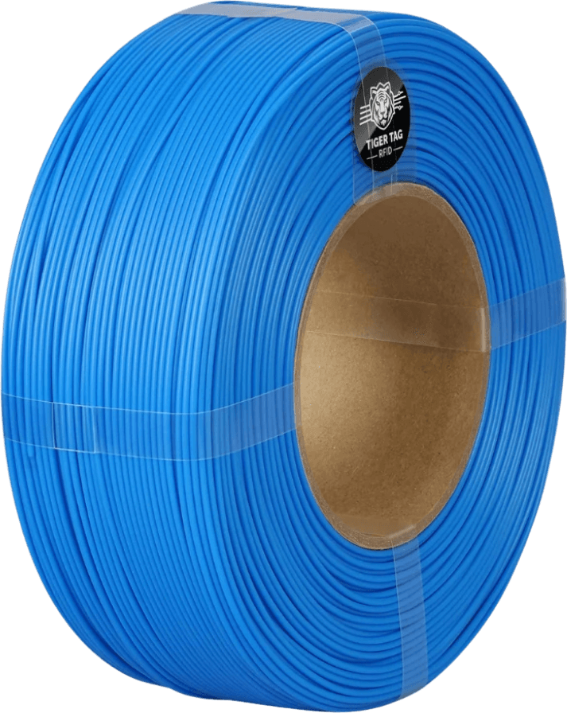

# The TigerTag chip (RFID/NFC format)

## Physical layer

| Property | Value |
|---|---|
| Chip family | NTAG213 / 215 / 216 (NFC Forum Type 2) |
| Recommended form factor | **25 mm round sticker** (other shapes work) |
| Payload | 144-byte NDEF payload — sized to fit the small NTAG213; larger chips leave unused space |
| Official branded chips | Produced as **NTAG215** — the extra memory maximizes end-of-life reuse (standard NDEF objects) so the chip never becomes e-waste |
| Authentication | None — openly readable |
| Write lock | **None** — chips ship unlocked; the user can rewrite them, including migrating to another protocol entirely |
| Reserved area | **32 bytes** at the end of the payload — on a standard TigerTag they are **free for community add-on functions**; on a [TigerTag+](../products/tigertag-plus.md) they carry the **origin signature** (byte-level layout: [TigerTag-RFID-Guide](https://github.com/TigerTag-Project/TigerTag-RFID-Guide)) |
| Chips per spool | **Two**, placed on opposite sides |
| Readable by | Any NFC smartphone, ACR122U-class USB readers, [TigerPOD](../products/tigerpod.md) |

This is the deliberate opposite of manufacturer tags (Mifare Classic with
derived keys, AES sectors, RSA signatures — see
[compatibility](../compatibility/README.md)): a TigerTag chip hides nothing.

## Why every spool carries TWO chips

Two chips, on opposite sides of the spool — it looks redundant, it's actually
the smartest detail of the format:

- **Printers share readers.** A machine typically has one RFID reader for two
  spools (left/right); a Bambu Lab AMS has 2 readers for 4 slots; on a
  Snapmaker the spool sits either side of the printer. With a chip on each
  side, **whatever the slot, one chip always faces the reader**.
- **No flipping when hand-scanning.** However you grab the spool, a chip is
  facing you — tap and done.
- **Scan in place.** A spool mounted on an AMS Lite, the side of an Elegoo
  Centauri Carbon or a FlashForge can be scanned without pulling it out.
- **Integrator freedom.** A filament-dryer maker just puts the reader wherever
  fits — left or right for a single-spool dryer, between the two spools for a
  dual — and it always works.
- **Redundancy.** If one chip stops answering, the other still identifies the
  spool — and serves to repair the broken one.
- **Double the harvest.** At end of life, every kilo of filament printed
  leaves you **two reusable NTAG chips** for DIY projects
  ([zero e-waste](../philosophy/second-life.md)).

A few implementation details:

- The two chips are **fully independent — each has its own UID**; there is no
  shared antenna. They are **written together as a pair (Twin Tag)** and kept
  identical for the spool's whole life, down to the grams left — and always
  counted as **one** spool.
- On factory spools, the chips ride a **carrier**: a strip whose two ends
  fold over the cardboard core (one chip per end), held with double-sided
  tape — the operator peels and sticks, nothing else changes on the line. The
  carrier design is **public and printable at home**.

*The carrier, bare: the two independent antennas are plainly visible — one
per folded end, each with its own UID.*

## Payload

The 144-byte payload encodes the spool's
[universal identity](./universal-filament-identity.md) — brand, material,
aspect/color, type, diameter, print settings — as IDs resolved against the
shared reference database.

> **TODO:** byte-level field layout. The canonical specification lives in
> [TigerTag-RFID-Guide](https://github.com/TigerTag-Project/TigerTag-RFID-Guide);
> this page should summarize it (offsets, versioning, ID tables) once
> finalized there. **Never document offsets here from memory.**

## Reading and writing

| Tool | Read | Write |
|---|---|---|
| [Tiger NFC Connect](../products/tigertag-connect.md) (mobile NFC) | ✅ | ✅ |
| [Tiger Studio](../products/tiger-studio.md) + ACR122U/TigerPOD | ✅ auto-opens the spool on scan | ✅ guided, UID-checked write |
| [JS SDK](../developers/sdks.md) (`tigertag` on npm) | ✅ | ✅ |
| [Python SDK](../developers/sdks.md) | ✅ | ✅ |

## Versioning

The payload carries a format version (reference table `id_version`), so readers
can stay compatible with older chips.

---

**◀ Previous:** [Universal filament identity](./universal-filament-identity.md) · **▲ [Documentation index](../../README.md)** · **Next ▶** [Inventory & cloud sync](./inventory-and-cloud-sync.md)

**Related:** [TigerTag](../products/tigertag.md), [SDKs](../developers/sdks.md), [Compatibility](../compatibility/README.md)
