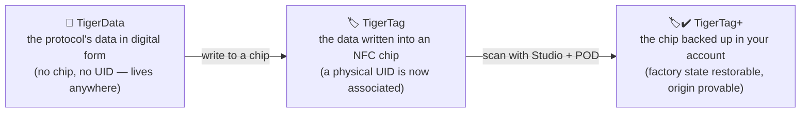

# Universal filament identity

## One identity, readable everywhere

A TigerTag chip gives a spool a **universal identity**: a single, open record of
what the filament *is*, independent of who made it, who sells it, and which
printer will melt it.

The identity covers (non-exhaustive):

| Field family | Examples |
|---|---|
| **Brand** | any filament manufacturer, from a shared reference list |
| **Material / type** | PLA, PETG, ABS, TPU… + subtype |
| **Aspect / color** | color value, finish |
| **Geometry** | diameter (1.75 / 2.85 mm) |
| **Print settings** | recommended temperatures |
| **Lifecycle** | weight, manufacturing date |

## The shared reference database

Identities are not free text: brands, materials, aspects, types, diameters and
units come from a **shared reference database** served at `cdn.tigertag.io`
(hosted in the same Firebase project as the accounts). Every app resolves the same IDs to the same meaning, so a
chip encoded by one tool reads identically in every other.

> **TODO:** link the public database browsing endpoint / dump format once the
> RFID guide documents it. The reference data ships bundled with Tiger Studio
> (`assets/db/tigertag/`) and refreshes from the CDN.

## One identity, three states

The identity is the *record*, not the *chip* — and it moves through three
states:

- **TigerData** is the protocol *before* the chip: the same identity, stored
  digitally — in an inventory, a database, a file, anywhere. The TigerTag
  protocol can live entirely outside an RFID chip.
- The moment that data is **written into an NFC chip**, it becomes a
  **TigerTag**: a physical **UID is finally associated** with the identity.
- Back that chip up in your account and it's a
  [**TigerTag+**](../products/tigertag-plus.md).

A TigerData can stay digital forever, or be **promoted to a real chip
atomically** whenever you're ready (Tiger Studio does this in one step).

---

**◀ Previous:** [Second Life workflow](../philosophy/second-life.md) · **▲ [Documentation index](../../README.md)** · **Next ▶** [The TigerTag chip](./tigertag-chip.md)

**Related:** [TigerTag product page](../products/tigertag.md), [Inventory & cloud sync](./inventory-and-cloud-sync.md)
