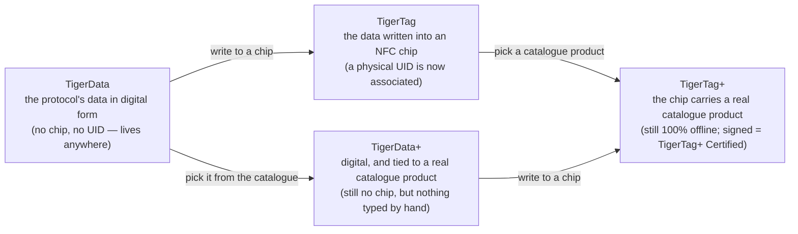

# Universal filament identity

## One identity, readable everywhere

A TigerTag chip gives a spool a **universal identity**: a single, open record of
what the filament *is*, independent of who made it, who sells it, and which
printer will melt it.

The identity covers (non-exhaustive):

| Field family | Examples |
|---|---|
| **Brand** | any filament manufacturer, from a shared reference list |
| **Material / type** | PLA, PETG, ABS, TPU… + subtype |
| **Aspect / color** | color value, finish |
| **Geometry** | diameter (1.75 / 2.85 mm) |
| **Print settings** | recommended temperatures |
| **Lifecycle** | weight, manufacturing date |

## The shared reference database

Identities are not free text: brands, materials, aspects, types, diameters and
units come from a **shared reference database** served at `cdn.tigertag.io`
(hosted in the same Firebase project as the accounts). Every app resolves the same IDs to the same meaning, so a
chip encoded by one tool reads identically in every other.

> **TODO:** link the public database browsing endpoint / dump format once the
> RFID guide documents it. The reference data ships bundled with Tiger Studio
> (`assets/db/tigertag/`) and refreshes from the CDN.

## One identity, four states

The identity is the *record*, not the *chip* — and it moves through four
states:

```mermaid
flowchart LR
  TD["TigerData<br/>the protocol's data in digital form<br/>(no chip, no UID — lives anywhere)"]
  TDP["TigerData+<br/>digital, and tied to a real catalogue product<br/>(still no chip, but nothing typed by hand)"]
  TT["TigerTag<br/>the data written into an NFC chip<br/>(a physical UID is now associated)"]
  TTP["TigerTag+<br/>the chip carries a real catalogue product<br/>(still 100% offline; signed = TigerTag+ Certified)"]
  TD -- "pick it from the catalogue" --> TDP
  TD -- "write to a chip" --> TT -- "pick a catalogue product" --> TTP
  TDP -- "write to a chip" --> TTP
```

- **TigerData** is the protocol *before* the chip: the same identity, stored
 digitally — in an inventory, a database, a file, anywhere. The TigerTag
 protocol can live entirely outside an RFID chip. This notion of a **virtual
 chip is a TigerSystem innovation — it exists nowhere else**: manage a full
 inventory with zero NFC chips, send an identity into a chip later or never,
 and the protocol's interoperability is preserved either way.
- **TigerData+** is a TigerData that knows *exactly which product it is*. Still
 no chip, still nothing to buy — but instead of whatever its owner typed, it
 carries a real product from the official catalogue: the exact brand, colour,
 material, temperatures, diameter, SKU and EAN, straight from the source. It is
 what you get by picking a product rather than describing one.
 >It is **not** a TigerTag+, and never claims to be: no chip, no UID. The `+`
 >means *identified*, not *certified*. For developers: a spool is a TigerData+
 >when it is chipless **and** carries a real product id — that pair is the
 >definition, and it is mirrored onto the record as `protocol: "TigerData+"` so
 >you can read it directly. See the
 >[Firestore data structure](https://github.com/TigerTag-Project/TigerTag_Firebase_Backend#-firestore-data-structure).
- The moment that data is **written into an NFC chip**, it becomes a
 **TigerTag**: a physical **UID is finally associated** with the identity.
- Write a **catalogue product** into that chip rather than hand-typed values
 and it is a [**TigerTag+**](../products/tigertag-plus.md) — same `+` as
 TigerData+, same meaning: *identified*. Signed by a certified manufacturer,
 it becomes a **TigerTag+ Certified**. Either way the chip stays 100 %
 offline-readable.

A TigerData can stay digital forever, or be **promoted to a real chip
atomically** whenever you're ready (Tiger Studio does this in one step). And
all four states travel as files: the
[**`.ttag` interchange format**](../developers/ttag-format.md) carries one or
more inventory materials — TigerData, TigerData+, TigerTag or TigerTag+ — on a USB
stick, in a mail, between tools.

## Promotion: from a record to a chip

*Promoting* a spool is the move from the left of the diagram to the right: an
existing TigerData or TigerData+ record is written onto a blank NTAG chip, and
the spool now carries its identity itself, offline. Tiger Studio does it in
one step, atomically.

What comes out depends only on what went in:

| You promote… | You get… | Because |
|---|---|---|
| a **TigerData** — values its owner chose | a **TigerTag** | a physical UID is now associated with the identity |
| a **TigerData+** — a real catalogue product | a **TigerTag+** | the chip now carries the catalogue product ID: *still identified, still not signed* |

That second row is the whole `+` vocabulary in one line. Promotion changes the
*state* — digital to chip — and never the meaning of the `+`. Only a certified
manufacturer's signature makes a chip a
[TigerTag+ Certified](../products/tigertag-plus.md), and no promotion produces
one.

Nor is promotion a one-way door. Chips are never write-locked: a promoted chip
can be erased from [Tiger NFC Connect](../products/tigertag-connect.md) or
Tiger Studio and written again ([the TigerTag chip](./tigertag-chip.md)). The
identity is the record; the chip is only where it lives right now.

---

**◀ Previous:** [Second Life workflow](../philosophy/second-life.md) · **▲ [Documentation index](../../README.md)** · **Next ▶** [The TigerTag chip](./tigertag-chip.md)

**Related:** [TigerTag product page](../products/tigertag.md), [Inventory & cloud sync](./inventory-and-cloud-sync.md)
