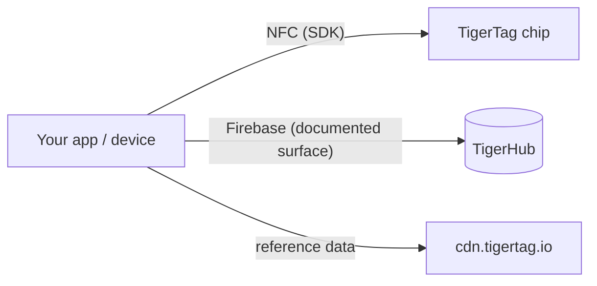

# Developer documentation

Build on TigerSystem: read chips, talk to the cloud, or integrate your own
hardware and software. Nothing requires permission — the protocol is open.

## What can you build?

Reading a TigerTag takes **any NFC smartphone** or an **ACR122U USB reader**
plugged into a computer — commodity hardware, no proprietary gear. From that
one scan, integrate wherever an identity is useful:

- **ERP / stock management** — connect spool identity and quantities to your
  company's existing inventory system.
- **Usage tracking** — log which material went into which job, machine or
  customer order.
- **Custom dashboards & automation** — print-farm monitoring, low-stock
  alerts, reorder triggers.
- **Lending systems** — fablabs, schools, makerspaces checking material in
  and out.
- **R&D projects, private or public** — an open, rewritable, documented
  identity carrier to experiment with.

None of these need our apps or our cloud: the chip + an SDK is enough. Add the
[cloud surface](./cloud-api.md) only if you want accounts and sync.

## Start here

| I want to… | Read |
|---|---|
| Understand the pieces | [Architecture overview](../architecture/overview.md) |
| Know which repo does what | [Repositories](./repositories.md) |
| Read/write TigerTag chips | [SDKs](./sdks.md) |
| Sync with the user's cloud inventory | [Cloud API & integration](./cloud-api.md) |
| Understand the chip payload | [The TigerTag chip](../concepts/tigertag-chip.md) |

## Integration paths

1. **Chip-only** — parse and encode chips with an SDK. No account, no network.
2. **Cloud-connected** — authenticate the *user's own account* and read/write
   their data within server-side security rules
   ([integration contract](./cloud-api.md)).
3. **Hardware** — working examples exist for ESP32/Arduino, Home Assistant and
   a Spoolman bridge (see the
   [integration repo's examples](https://github.com/TigerTag-Project/TigerTag_Firebase_Integration/tree/main/examples)).

## Conventions

- **Versioning** — product releases use SemVer; the chip payload carries its
  own format version for backward compatibility.
- **Naming** — self-describing names over encoded/clever ones; no
  multi-state magic values.
- **Contributions** — each repo has its own guide; docs contributions follow
  [CONTRIBUTING.md](../../CONTRIBUTING.md) here.

---

**◀ Previous:** [OpenSpool](../compatibility/openspool.md) · **▲ [Documentation index](../../README.md)** · **Next ▶** [Repositories](./repositories.md)
