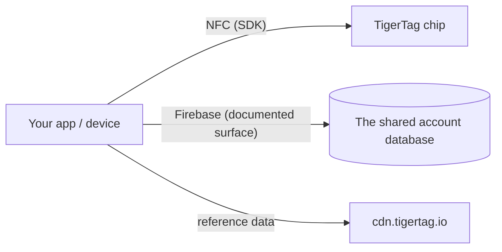

# Developer documentation

Build on TigerSystem: read chips, talk to the cloud, or integrate your own
hardware and software. Nothing requires permission — the protocol is open.

## What can you build?

Reading a TigerTag takes **any NFC smartphone**, an **ACR122U USB reader**
plugged into a computer, or a **DIY device — a simple ESP32 with a PN532 or
RC522 reader module** (the approach TigerScale uses). Commodity hardware, no
proprietary gear. From that one scan, integrate wherever an identity is
useful:

- **ERP / stock management** — connect spool identity and quantities to your
 company's existing inventory system.
- **Usage tracking** — log which material went into which job, machine or
 customer order.
- **Custom dashboards & automation** — print-farm monitoring, low-stock
 alerts, reorder triggers.
- **Lending systems** — fablabs, schools, makerspaces checking material in
 and out.
- **R&D projects, private or public** — an open, rewritable, documented
 identity carrier to experiment with.

None of these need our apps or our cloud: the chip + an SDK is enough. Add the
[cloud surface](./cloud-api.md) only if you want accounts and sync.

Build it and it is **TigerTag Compatible**: free, self-declared, no audit and
no permission. Put it through the audit and it can become **TigerTag
Certified** — open to anything a third party builds, hardware or software, in
two scopes (**TigerTag** and **TigerTag+**). The line between the tiers is not
what your product is; it is whether anyone checked. Compatible says *"it
works"* on your word, Certified says *"we tested it"* on ours
([criteria](https://github.com/TigerTag-Project/TigerTag-RFID-Guide/blob/main/CERTIFICATION.md), reach out through the
[GitHub organization](https://github.com/TigerTag-Project)).

The governance is deliberately two-gated: **anyone** may implement the
protocol and say "compatible with TigerTag" — no permission, ever — and show
the TigerTag logo, unmodified, to say so: in your app, your documentation, your
store listing. That referential use is free. Only **certified partners**
(listed in the certified registry) may apply the mark **on a chip, carrier,
spool or packaging**, where it stops describing compatibility and starts
asserting origin, and only they may issue **TigerTag+ signatures** (TigerTag
holds the private key). The trademark gate is marketing; the signature gate
is technical; **neither restricts the protocol by one line** — an uncertified
chip works perfectly, it just can't prove its origin.

Two details worth having exactly right. The compatibility claim covers the
**`+` tier too**: verifying a TigerTag+ signature is free, offline and
unrestricted — the public keys are published — so a reader that checks them may
say *"compatible with TigerTag+"*. What it may not do is call **a tag** a
TigerTag+ unless that tag really carries a signature issued by TigerTag. And
the word **"certified" is never self-applied**: TigerSystem grants it, nobody
claims it.

This is deliberately the model Zigbee and Matter use — a free *Compatible*
tier that anyone may enter, and a granted *Certified* tier that means something
to a buyer precisely because it is granted. Full policy, certification tiers
and brand assets: [TRADEMARK.md](https://github.com/TigerTag-Project/TigerTag-RFID-Guide/blob/main/TRADEMARK.md) and
[CERTIFICATION.md](https://github.com/TigerTag-Project/TigerTag-RFID-Guide/blob/main/CERTIFICATION.md).

## Start here

| I want to… | Read |
|---|---|
| See who already built on TigerTag | [Third-party integrations](./integrations.md) |
| Understand the pieces | [Architecture overview](../architecture/overview.md) |
| Know which repo does what | [Repositories](./repositories.md) |
| Read/write TigerTag chips | [SDKs](./sdks.md) |
| Exchange inventories as files | [The `.ttag` format](./ttag-format.md) |
| Show a spool's colour the way every other app does | [The material swatch](./material-swatch.md) — and its [live reference renderer](./material-swatch-playground.html) |
| Sync with the user's cloud inventory | [Cloud API & integration](./cloud-api.md) |
| Understand the chip payload | [The TigerTag chip](../concepts/tigertag-chip.md) |

## Integration paths

```mermaid
flowchart LR
  YOU[Your app / device] -->|"NFC (SDK)"| TAG[TigerTag chip]
  YOU -->|"Firebase (documented surface)"| CLOUD[("The shared account database")]
  YOU -->|"reference data"| CDN[cdn.tigertag.io]
```

1. **Chip-only** — parse and encode chips with an SDK. No account, no network.
2. **Cloud-connected** — authenticate the *user's own account* and read/write
 their data within server-side security rules
 ([integration contract](./cloud-api.md)).
3. **Hardware** — working examples exist for ESP32/Arduino, Home Assistant and
 a Spoolman bridge (see the
 [integration repo's examples](https://github.com/TigerTag-Project/TigerTag_Firebase_Integration/tree/main/examples)).

## Conventions

- **Versioning** — product releases use SemVer; the chip payload carries its
 own format version for backward compatibility.
- **Naming** — self-describing names over encoded/clever ones; no
 multi-state magic values.
- **Colour** — a spool's colour is stored as data, not as a picture, so every
 surface must turn that data into the same picture:
 [the material swatch convention](./material-swatch.md) is normative, and
 ships with a [reference renderer](./material-swatch-playground.html) you can check your
 own implementation against.
- **Contributions** — each repo has its own guide; docs contributions follow
 [CONTRIBUTING.md](../../CONTRIBUTING.md) here.

---

**◀ Previous:** [OpenSpool](../compatibility/openspool.md) · **▲ [Documentation index](../../README.md)** · **Next ▶** [Repositories](./repositories.md)
