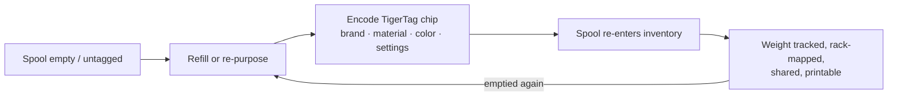

# The Second Life workflow

## The problem with "smart" spools today

When a manufacturer's tagged spool runs out, the tag dies with it: it described
one factory-filled spool, in one vendor's format, and it cannot be reused. The
spool holder gets thrown away or refilled "dumb".

## Second Life: re-identify, don't discard

A TigerTag chip is **writable and rewritable**. When a spool is emptied and
refilled — or when a spool of any brand has no useful tag at all — the user
encodes a TigerTag chip with the new filament's real profile and sticks it on.
The spool gets a *second life* as a first-class, self-identifying object:

## How encoding happens

- **TigerTag Connect** (mobile) — program chips by NFC tap.
- **Tiger Studio** (desktop) — guided chip update with an ACR122U /
  [TigerPOD](../products/tigerpod.md) reader: place the chip, UID-match check,
  verified write.
- **Digital-first** — Tiger Studio's *TigerData* lets you create a fully digital
  (chipless) spool now and **promote it to a real chip later, atomically**.

> **Note:** the catalogue of brands, materials and colors used when encoding is
> served by the [Tiger Cloud](../products/tiger-cloud.md) reference database, so
> a re-encoded chip is as precise as a factory one.

---

**◀ Previous:** [Smartphone bridge](./smartphone-bridge.md) · **▲ [Documentation index](../../README.md)** · **Next ▶** [Universal filament identity](../concepts/universal-filament-identity.md)

**Related:** [TigerTag](../products/tigertag.md), [TigerTag+](../products/tigertag-plus.md)
