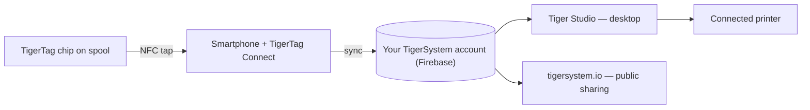

# The Smartphone Bridge concept

## The insight

Every modern smartphone contains an NFC reader. That means **every 3D-printing
user already owns TigerTag hardware** — no proprietary reader, no printer
upgrade, no purchase required to start.

The phone acts as the **bridge** between the physical spool and the digital
inventory:

1. **Tap** — the chip's profile (brand, material, color, settings) is read in one gesture.
2. **Sync** — the spool appears in the user's cloud inventory instantly.
3. **Everywhere** — the desktop app, the web, and connected printers now know the spool.

## Native RFID vs the bridge

Some printers read tags natively (their own proprietary format); most read
nothing at all. The bridge makes the printer's capabilities irrelevant:

| Path | Requires | Works with |
|---|---|---|
| **Native RFID** | A printer that reads that vendor's locked tag | One brand only |
| **Smartphone bridge** | Any NFC phone | **Every printer**, every brand, even fully offline machines |

With the bridge, filament data reaches the printer through
[Tiger Studio's printer integrations](../compatibility/README.md) (six brands
live today) — the spool identifies itself to the *system*, and the system talks
to the machine.

---

**◀ Previous:** [Open ecosystem](./open-ecosystem.md) · **▲ [Documentation index](../../README.md)** · **Next ▶** [Second Life workflow](./second-life.md)

**Related:** [TigerTag Connect](../products/tigertag-connect.md), [Architecture overview](../architecture/overview.md)
