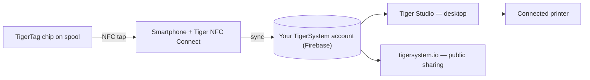

# The Smartphone Bridge concept

## The insight

> In China we kept asking: *"Where are the RFID readers?"* Everyone answered:
> *"In the Bambu Labs."* False — Bambu's readers are in the AMS, not in the
> printer; the machine can't detect a third-party spool at all. **The RFID
> readers are in your pockets** — in every phone, ready to use, without you
> even knowing.

Every modern smartphone contains an NFC reader. That means **every 3D-printing
user already owns TigerTag hardware** — no proprietary reader, no printer
upgrade, no purchase required to start.

```mermaid
flowchart LR
  TAG[TigerTag chip on spool] -- NFC tap --> PHONE[Smartphone + Tiger NFC Connect]
  PHONE -- sync --> CLOUD[("Your TigerSystem account (Firebase)")]
  CLOUD --> STUDIO[Tiger Studio — desktop]
  STUDIO --> PRINTER[Connected printer]
  CLOUD --> WEB["tigersystem.io — public sharing"]
```

The phone acts as the **bridge** between the physical spool and the digital
inventory:

1. **Tap** — the chip's profile (brand, material, color, settings) is read in one gesture.
2. **Sync** — the spool appears in the user's cloud inventory instantly.
3. **Everywhere** — the desktop app, the web, and connected printers now know the spool.

## Native RFID vs the bridge

Some printers read tags natively — usually their own proprietary format,
occasionally TigerTag itself; most read nothing at all. The bridge makes the
printer's capabilities irrelevant:

| Path | Requires | Works with |
|---|---|---|
| **Native RFID — vendor tag** | A printer that reads that vendor's locked tag | One brand only |
| **Native RFID — TigerTag** | A machine whose own firmware reads TigerTag — rare, and community-built so far | Every brand, no app in the loop |
| **Smartphone bridge** | Any NFC phone | **Every printer**, every brand, even fully offline machines |

The middle row is not ours, and it is recent. The community's extended
firmware makes the [Snapmaker U1](../compatibility/snapmaker.md) the first
printer to read a TigerTag on the machine itself; and the **BT-AMS-C**, a
four-slot reader that mounts on a Bambu Lab AMS, sends TigerTag data straight
to the printer's BMCU ([third-party hardware](../compatibility/third-party-hardware.md)).
Both stay exceptions — which is the argument for the bridge, not against it:
it never had to wait for them.

With the bridge, filament data reaches the printer through
[Tiger Studio's printer integrations](../compatibility/README.md) (six brands
live today) — the spool identifies itself to the *system*, and the system talks
to the machine.

The proof by example: **FlashForge printers have no RFID reader at all** —
and through the bridge they now work with NFC-identified filament anyway. An
entire new capability, added to someone else's machines, **totally free for
the user** ([the FlashForge case](../compatibility/flashforge.md)).

---

**◀ Previous:** [Open ecosystem](./open-ecosystem.md) · **▲ [Documentation index](../../README.md)** · **Next ▶** [Second Life workflow](./second-life.md)

**Related:** [Tiger NFC Connect](../products/tigertag-connect.md), [Architecture overview](../architecture/overview.md)
