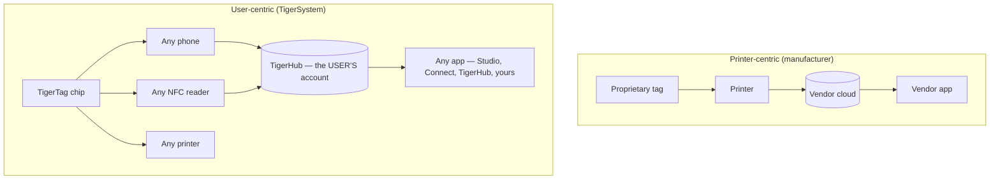

# User-centric vs printer-centric

## Two opposite architectures

In a printer-centric world the **printer** is the center: the tag exists to serve
the machine, and the data flows into the manufacturer's silo.

In TigerSystem the **user** is the center. The user owns:

- **the filament** — any brand, any vendor;
- **the metadata** — material, color, print settings, encoded on a chip they control;
- **the inventory** — stored under their own cloud account, exportable;
- **the history** — weights, locations, usage over time;
- **the synchronization** — the same account feeds every app and device.

TigerSystem simply **connects every component together**.

## Why manufacturers lock RFID

Manufacturer tags are usually cryptographically locked (see the
[compatibility section](../compatibility/README.md) for per-vendor details:
UID-derived keys, AES-encrypted sectors, RSA signatures). Locking serves the
vendor: it ties consumable purchases to the machine and keeps the data pipeline
proprietary. It also means **your own spool inventory is not yours**.

TigerTag chips take the opposite stance: an open NDEF payload on a standard
NTAG chip, documented publicly, with open SDKs to read and write it.

---

**◀ Previous:** [Why TigerSystem exists](../vision/why-tigersystem.md) · **▲ [Documentation index](../../README.md)** · **Next ▶** [Open ecosystem](./open-ecosystem.md)

**Related:** [Universal filament identity](../concepts/universal-filament-identity.md), [Compatibility](../compatibility/README.md)
