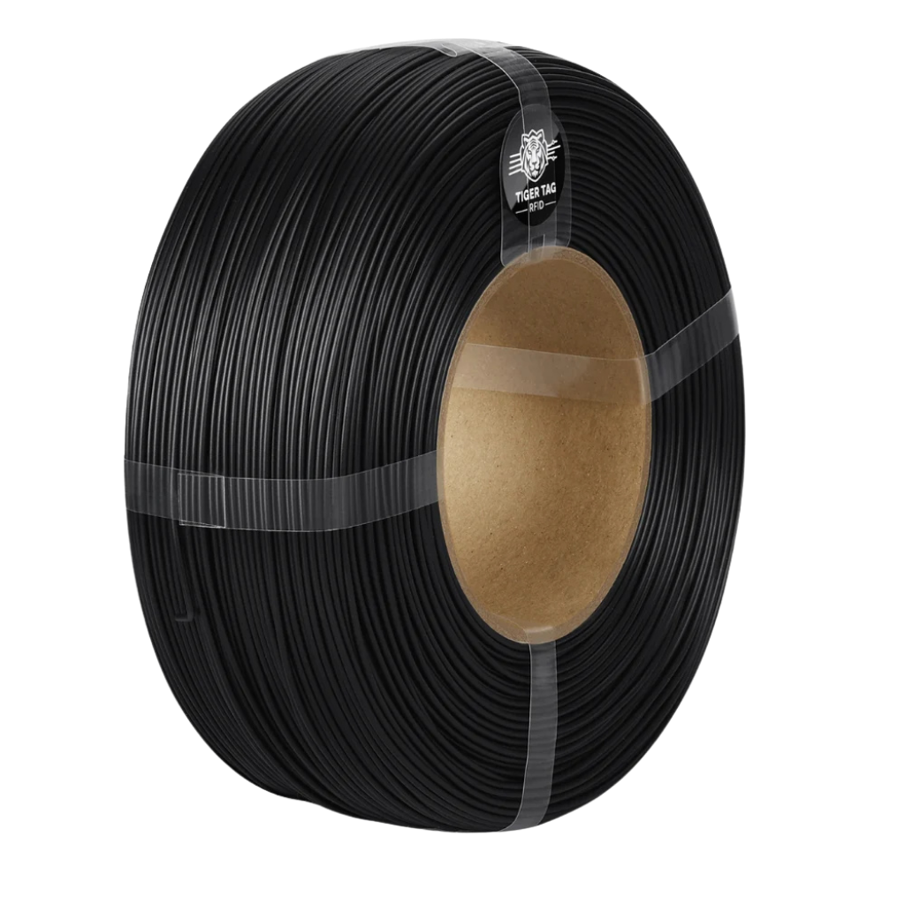

# Press kit

Media assets for articles, videos and posts covering **TigerSystem** and
**TigerTag**.

## TigerTag filament refills — 18 high-resolution renders

Eighteen renders of spool-less filament refills (cardboard core), each
carrying its TigerTag NFC chip — one per color.

⬇ **[Download the pack (ZIP, ~22 MB, 18 PNG files)](./tigertag-filament-refills.zip)**

## More assets

- The visuals used across this documentation live in
  [`docs/assets/`](../assets/) — ecosystem hero, real bench setup, app
  screenshots, TigerPOD, TigerScale, partner filament boxes.
- Logos and additional press material are available on request through the
  [GitHub organization](https://github.com/TigerTag-Project).

## Usage

Free to use in coverage of TigerSystem / TigerTag (articles, reviews, videos,
social posts). Please credit **TigerTag**. Trademark rules:
[TRADEMARK.md](../../TRADEMARK.md).

---

**▲ [Documentation index](../../README.md)**
