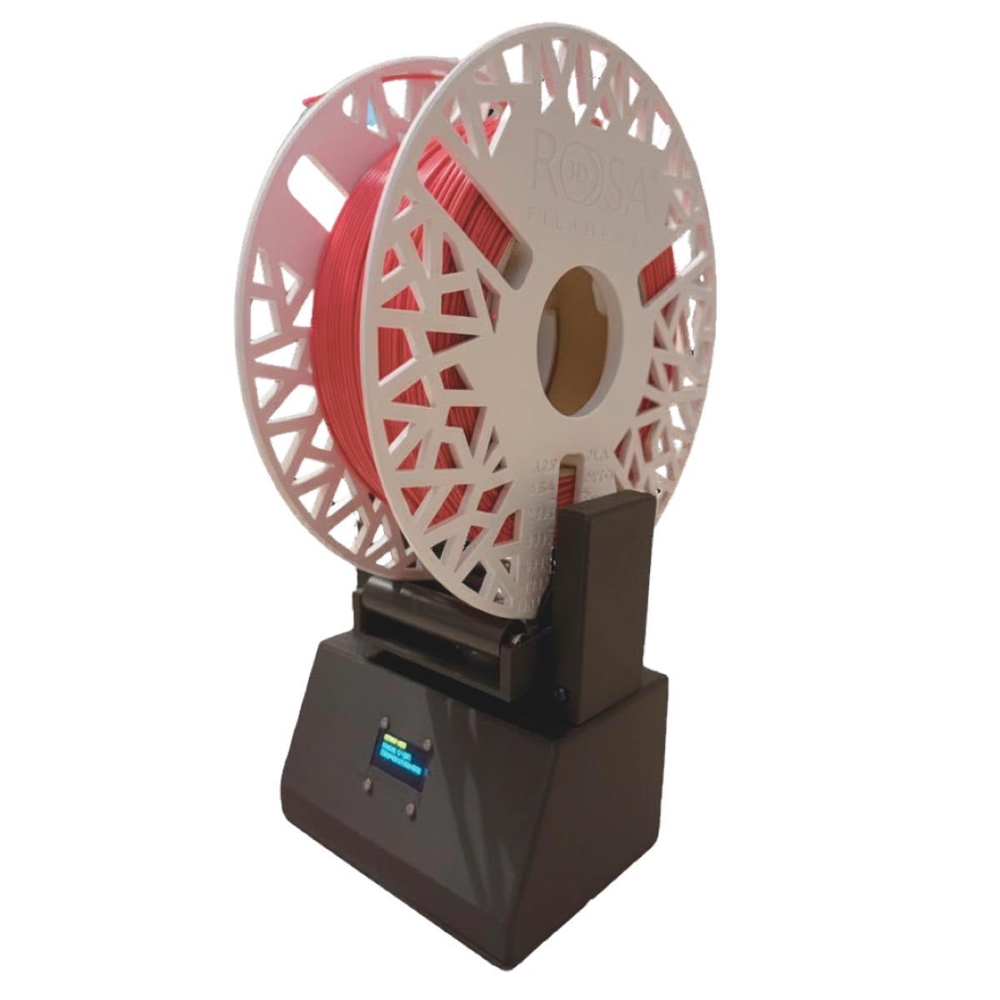
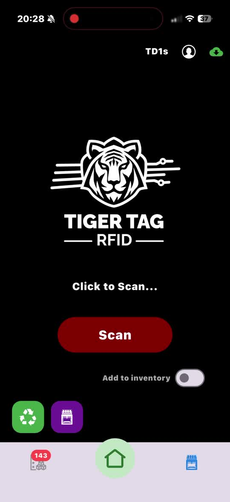

# Press kit

Media assets for articles, videos and posts covering **TigerSystem** and
**TigerTag** — logos, product visuals, real photos and approved wording,
ready to publish.

## Logos & marks

|| | | |
|---|---|---|---|
|  |  |  |  |

|| |
|---|---|
|  |  |

The official marks as vector SVG — the square **TigerTag RFID** badge (the one
printed on partner boxes and chips), the contained variant, the tiger head, the
full logo and its contour variant, plus the **TigerSystem** app icon.
Monochrome files are single-color vectors: recolor them freely to fit your
layout.

**[Download the logo pack (ZIP, ~120 KB, 6 SVG files)](./tigertag-logos.zip)**

## The ecosystem, in one image

The hero visual: every piece of TigerSystem around one open protocol.
Direct file: [`hero-tigersystem-ecosystem.png`](../assets/hero-tigersystem-ecosystem.png)

## TigerPOD

The 3D-printable desktop spool reader — the hero render and the rainbow
line-up banner. In use with Tiger Studio:
[`tigerpod-in-studio.jpg`](../assets/tigerpod-in-studio.jpg)

## TigerScale

The open-hardware connected scale, real photo.

## The chip & the carrier

|| | |
|---|---|---|
|  |  |  |

The chip itself, the branded chip on a spool, the NFC tap in motion — and the
factory carrier (front and back) that brings two chips onto every spool.

## TigerTag filament refills — 18 high-resolution renders

|| | |
|---|---|---|
|  |  |  |

Eighteen renders of spool-less filament refills (cardboard core), each
carrying its TigerTag NFC chip — one per color.

**[Download the pack (ZIP, ~22 MB, 18 PNG files)](./tigertag-filament-refills.zip)**

## Partner filament boxes — high-resolution photos + cutouts

  

Real partner boxes shipping with TigerTag inside — **Rosa3D, eSun, Sunlu** —
as studio photos and transparent-background cutouts (6 files).

**[Download the pack (ZIP, ~3 MB)](./tigertag-partner-filament-boxes.zip)**

## Partner spools & refills

|| | | |
|---|---|---|---|
|  |  |  |  |

The filament that actually ships with TigerTag chips — Rosa3D, eSUN, Sunlu,
R3D.

## The apps

|| | |
|---|---|---|
|  |  |  |

|| | |
|---|---|---|
|  |  |  |

Tiger Studio (desktop) and Tiger NFC Connect (mobile) — screenshots and the
combined mockup.

## Real setups

|| |
|---|---|
|  |  |

No renders here — real benches, the whole system in daily use.

## Approved headlines

The validated hero lines and standing claims — factually airtight, ready to
quote: **[headlines.md](./headlines.md)**.

## More assets

- Every visual used across this documentation lives in
  [`docs/assets/`](../assets/) — free to reuse under the same terms.
- Something missing (other formats, higher resolution, specific shots)? Ask
  through the [GitHub organization](https://github.com/TigerTag-Project) or
  [tigertag@tigertag.io](mailto:tigertag@tigertag.io).

## Usage

Free to use in coverage of TigerSystem / TigerTag (articles, reviews, videos,
social posts). Please credit **TigerTag**. Trademark rules:
[TRADEMARK.md](../../TRADEMARK.md).

---

**▲ [Documentation index](../../README.md)**
