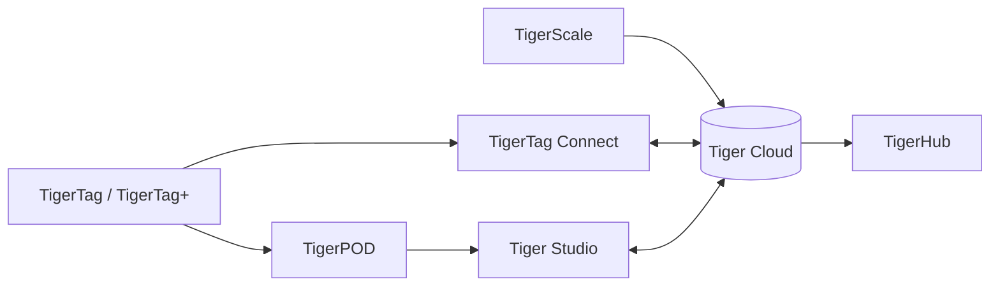

# Products

The TigerSystem ecosystem, one page per product.

| Product | What it is | Type |
|---|---|---|
| [TigerTag](./tigertag.md) | Open RFID/NFC chip + standard for spool identity | Hardware + spec |
| [TigerTag+](./tigertag-plus.md) | Certified TigerTag with cloud backup | Hardware + service |
| [TigerTag Connect](./tigertag-connect.md) | Mobile app (iOS/Android) — scan, encode, browse | App |
| [Tiger Studio](./tiger-studio.md) | Desktop app — inventory, racks, sensors, printers | App |
| [TigerHub](./tigerhub.md) | Public web surface — sharing at `tigersystem.io` | Web |
| [Tiger Cloud](./tiger-cloud.md) | Firebase backend + `cdn.tigertag.io` services | Cloud |
| [TigerPOD](./tigerpod.md) | 3D-printable dual NFC reader stand | Hardware |
| [TigerScale](./tigerscale.md) | Open-source ESP32 filament scale | Hardware |

---

**◀ Previous:** [Data flow](../architecture/data-flow.md) · **▲ [Documentation index](../../README.md)** · **Next ▶** [TigerTag](./tigertag.md)
