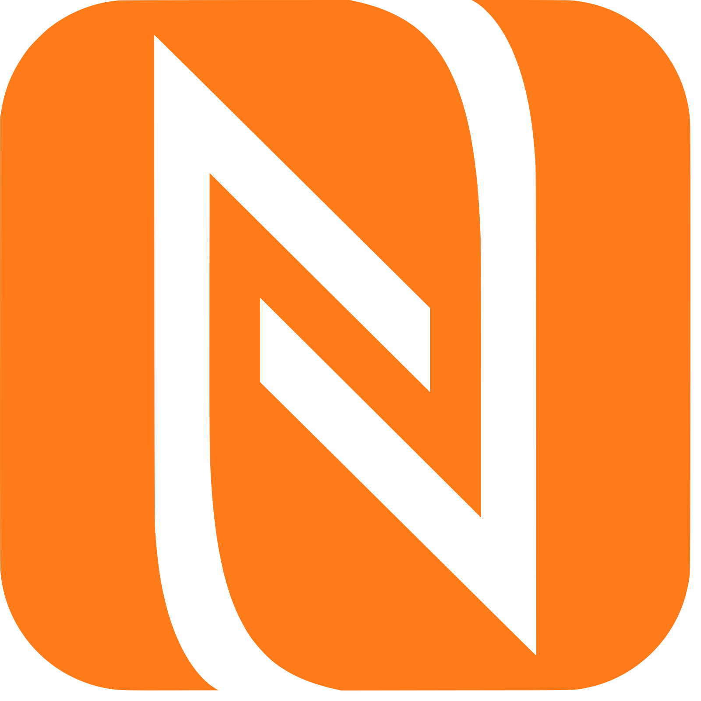
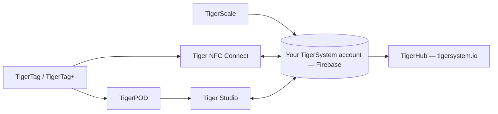

# Products

The TigerSystem ecosystem, one page per product.

> **Note:** every **user-facing** product below — and every future one — is a
> working **proof of concept**. Their only goal is to show the potential of an
> open-source, standard, agnostic, cross-platform protocol, and to inspire
> what others will build with it. (The factory-side chip-programming toolchain
> is a different story: industrial-grade, in production.) See
> [A sandbox, on purpose](../vision/why-tigersystem.md).

| Product | What it is | Type |
|---|---|---|
|  [TigerTag](./tigertag.md) | Open RFID/NFC chip + standard for spool identity | Hardware + spec |
|  [TigerTag+](./tigertag-plus.md) | A TigerTag backed up in your account — factory-state restore on the original chip | Hardware + service |
|  [Tiger NFC Connect](./tigertag-connect.md) | Mobile app (iOS/Android) — scan, encode, browse | App |
|  [Tiger Studio](./tiger-studio.md) | Desktop app — inventory, racks, sensors, printers | App |
|  [TigerHub](./tigerhub.md) | The ecosystem's web home — showcase, wishlists, friends & sharing at `tigersystem.io` | Web |
|  [TigerPOD](./tigerpod.md) | 3D-printable dual NFC reader stand | Hardware |
|  [TigerScale](./tigerscale.md) | Open-source ESP32 filament scale | Hardware |
|  [TigerTag Factory & Manager](./factory-suite.md) | Industrial chip programming & filament-database tools for factories — **not public**, production-grade | Industrial |

---

**◀ Previous:** [Data flow](../architecture/data-flow.md) · **▲ [Documentation index](../../README.md)** · **Next ▶** [TigerTag](./tigertag.md)
