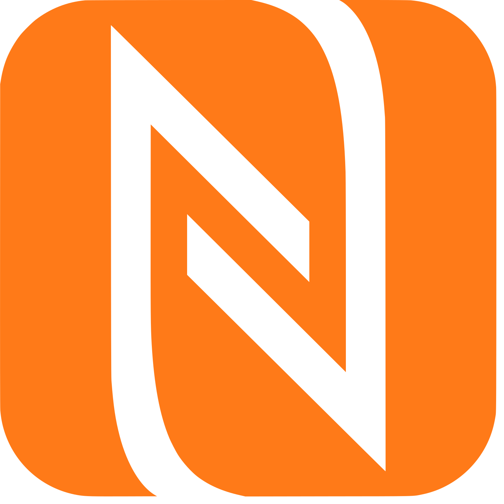
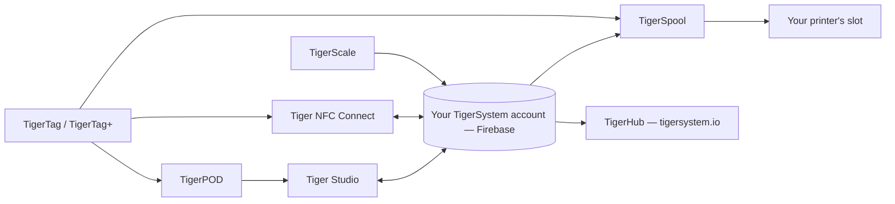

# Products

The TigerSystem ecosystem, one page per product.

**These are the official products** — designed and published by TigerSystem.
"Official" here means *we made it*, not *you need it*: every one of them is
open source and forkable, and their names (Tiger Studio, TigerHub, TigerScale,
TigerPOD, Tiger NFC Connect) are deliberately **not claimed as trademarks**.
Only the **TigerTag** mark itself is reserved, and only for the chip.

Anyone may build and sell an alternative — a reader, an app, a scale, a whole
inventory system. See [third-party hardware](../compatibility/third-party-hardware.md)
and [software built on TigerTag](../developers/integrations.md) for what
already exists. A third-party product is **TigerTag Compatible** by simply
working; it becomes **TigerTag Certified** only when TigerSystem grants it
([trademark policy](../../TRADEMARK.md)).

> **Note:** every **user-facing** product below — and every future one — is a
> working **proof of concept**. Their only goal is to show the potential of an
> open-source, standard, agnostic, cross-platform protocol, and to inspire
> what others will build with it. (The factory-side chip-programming toolchain
> is a different story: industrial-grade, in production.) See
> [A sandbox, on purpose](../vision/why-tigersystem.md).

| Product | What it is | Type |
|---|---|---|
|  [TigerData](../concepts/universal-filament-identity.md) | The virtual chip — the identity in digital form, no chip needed, upgradeable anytime | Concept |
|  [TigerTag](./tigertag.md) | Open RFID/NFC chip + standard for spool identity | Hardware + spec |
|  [TigerTag+](./tigertag-plus.md) | A TigerTag carrying a catalogue product ID and optional enrichment — still 100% offline; signed, it is TigerTag+ Certified | Hardware + spec |
|  [Tiger NFC Connect](./tigertag-connect.md) | Mobile app (iOS/Android) — scan, encode, browse | App |
|  [Tiger Studio](./tiger-studio.md) | Desktop app — inventory, racks, sensors, printers | App |
|  [TigerHub](./tigerhub.md) | The ecosystem's web home — showcase, wishlists, friends & sharing at `tigersystem.io` | Web |
|  [TigerPOD](./tigerpod.md) | 3D-printable dual NFC reader stand | Hardware |
|  [TigerScale](./tigerscale.md) | Open-source ESP32 filament scale | Hardware |
|  [TigerSpool](./tigerspool.md) | Open-source ESP32 box beside the printer — tap a spool, pick a slot, any brand | Hardware |
|  [TigerTag Factory & Manager](./factory-suite.md) | Industrial chip programming & filament-database tools for factories — **not public**, production-grade | Industrial |

```mermaid
flowchart LR
  TT[TigerTag / TigerTag+] --> CO[Tiger NFC Connect]
  TT --> POD[TigerPOD] --> ST[Tiger Studio]
  SC[TigerScale] --> FB[("Your TigerSystem account — Firebase")]
  TT --> SPL[TigerSpool] --> PRN["Your printer's slot"]
  FB --> SPL
  CO <--> FB
  ST <--> FB
  FB --> HUB["TigerHub — tigersystem.io"]
```

---

**◀ Previous:** [Data flow](../architecture/data-flow.md) · **▲ [Documentation index](../../README.md)** · **Next ▶** [TigerTag](./tigertag.md)
