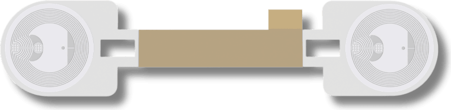
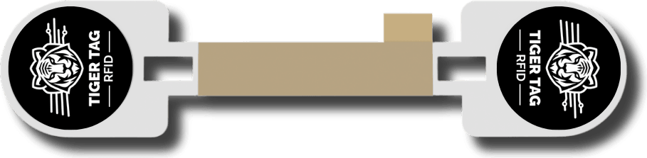
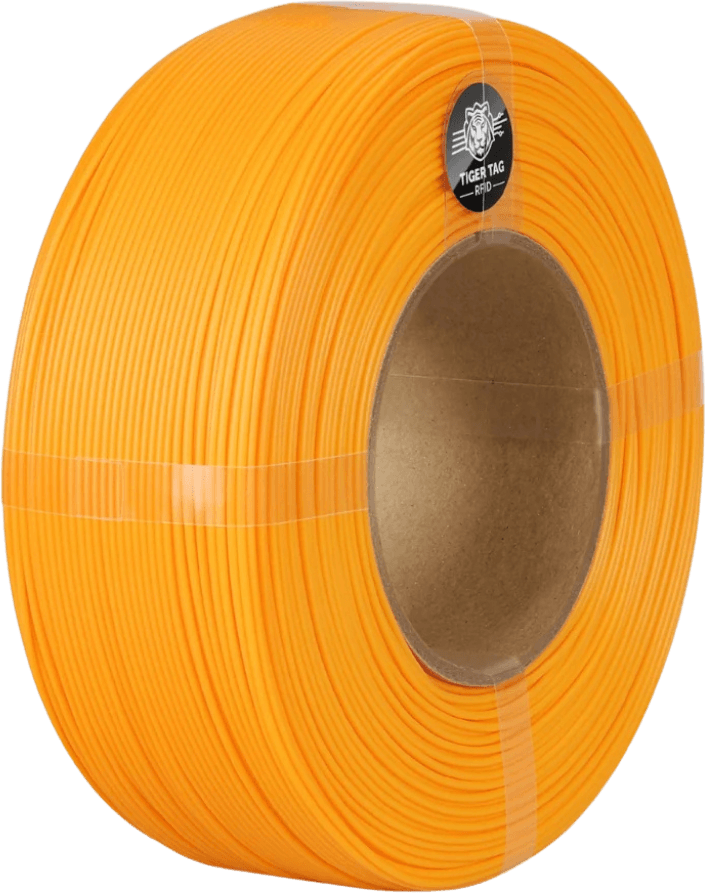

# TigerTag Factory & TigerTag Manager (factory suite)

## Purpose

The **industrial side** of TigerSystem — the tools filament factories use to
put TigerTag inside their products. Unlike the user-facing sandbox, **this is
production software**: it is what put more than 2.5 million chips in the
field.

Two tools cover the two halves of the job:

- **TigerTag Manager** — manages the brand's **filament database**: products,
  materials, colors, settings.
- **TigerTag Factory** — **mass-writes the data into every spool produced**,
  at line speed: **about 1 second per chip** — thousands of spools a day,
  one click.

## The carrier — two chips, peel and stick

| | |
|---|---|
|  |  |

*The two independent NFC chips are plainly visible — one per end. The ends
fold over the cardboard core so the spool reads from either side; the middle
holds with double-sided tape. The operator peels and sticks — nothing else on
the line changes. The carrier design is public and printable at home.*

## Proof of origin

Chips written on the production line carry the **factory signature** — the
authentication that **proves the product's origin**. It is the layer behind
[TigerTag+](./tigertag-plus.md) factory-state restores and the trust anchor
for brands: a signed chip demonstrably came out of the real factory.

## Availability

**Not public.** These tools are reserved for third-party manufacturers
implementing the TigerTag RFID/NFC technology in their products. A filament
production line can be up and running with TigerTag in **as little as
5 days** — see
[For filament manufacturers](../vision/for-filament-manufacturers.md) and
reach out through the
[GitHub organization](https://github.com/TigerTag-Project).

---

**▲ [Documentation index](../../README.md)** · **Related:** [For filament manufacturers](../vision/for-filament-manufacturers.md), [TigerTag+](./tigertag-plus.md), [Products](./README.md)
