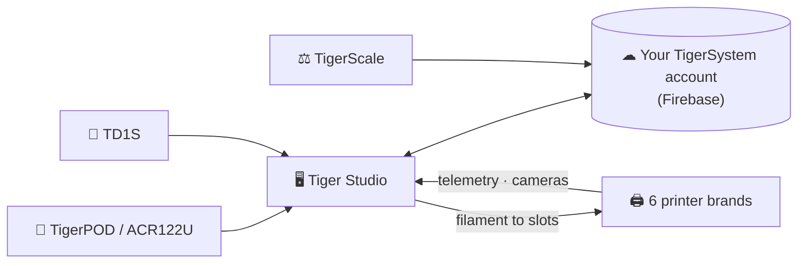
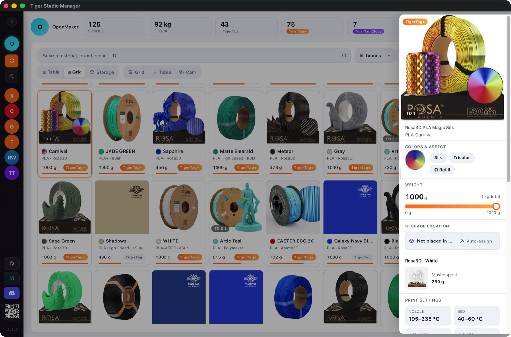
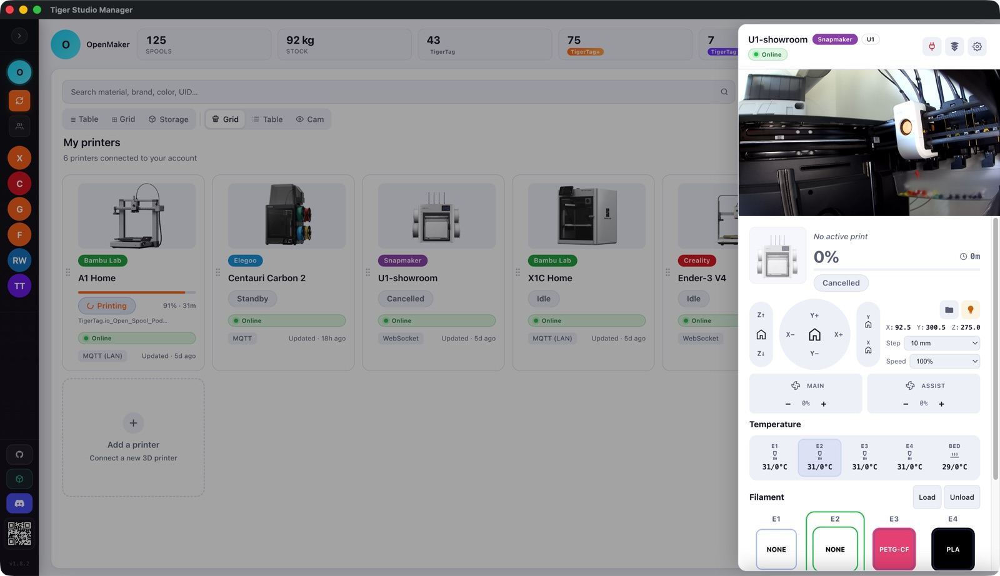
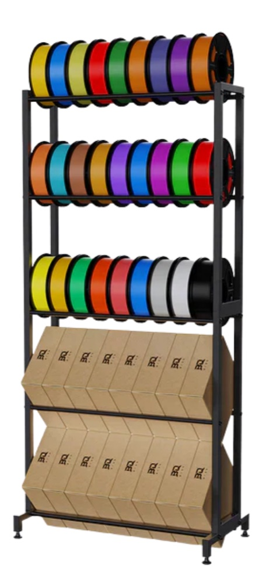

# Tiger Studio (desktop app)

## Purpose

**Tiger Studio is mission control for your filament.** Every spool, every
rack, every printer on one screen — scan a chip and its spool pops open,
update a weight and it syncs everywhere, glance at a printer and see what it's
doing right now. Open source, on Windows / macOS / Linux.

It is deliberately **a laboratory, not the destination** — a demonstration of
what the open protocol makes possible, readable, forkable and free to copy
([philosophy](../philosophy/open-ecosystem.md)).

## Where it sits

## Features (highlights)

- **Inventory** — real-time Firestore sync, table/grid views, detail panel,
  weight tracking, container calibration, digital spools (TigerData) with
  atomic chip promotion.
- **Printers** — live integrations for **6 brands** (telemetry, filament per
  slot, job progress, cameras, and for some brands full control panels). See
  [compatibility](../compatibility/README.md).
- **Racks** — drag-and-drop physical storage mapping.
- **Friends & sharing** — discovery codes, read-only friend inventories.
- **Devices** — ACR122U NFC reader, [TigerPOD](./tigerpod.md),
  [TigerScale](./tigerscale.md), TD1S color sensor.
- **9 locales** — EN · FR · DE · ES · IT · PL · PT-BR · PT-PT · 中文.

The complete, always-current catalogue lives in the app repo's
[FEATURES.md](https://github.com/TigerTag-Project/TigerTag-Studio-Manager/blob/main/FEATURES.md).

## Architecture

Electron + vanilla JS, no bundler. Printer links speak each vendor's **native
LAN protocol** directly (MQTT / WebSocket / HTTP) — per-brand protocol notes are
maintained in the app repo (`renderer/printers/<brand>/PROTOCOL.md`).

## In pictures

## Links

- 📦 Repo + downloads: [TigerTag-Studio-Manager](https://github.com/TigerTag-Project/TigerTag-Studio-Manager) (MIT)
- 📖 Full feature catalogue: [FEATURES.md](https://github.com/TigerTag-Project/TigerTag-Studio-Manager/blob/main/FEATURES.md)

---

**◀ Previous:** [Tiger NFC Connect](./tigertag-connect.md) · **▲ [Documentation index](../../README.md)** · **Next ▶** [TigerHub](./tigerhub.md)

**Related:** [Compatibility](../compatibility/README.md), [Architecture](../architecture/overview.md)
