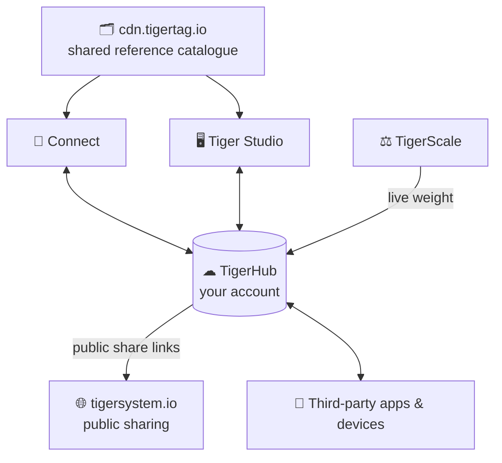

# TigerHub

## Purpose

**TigerHub is the memory behind everything.** It is the Firebase-managed
backbone of your TigerSystem account, built on one principle: **a single copy
of the data, in a single place.** Tiger Studio, the TigerTag Connect mobile
app, TigerScale and your user account all lean on that same data — nobody
holds a private copy, so there is nothing to reconcile: update a weight on the
scale and the desktop, the phone and a shared view all show it instantly. It
keeps every device in sync in real time, enforces who can see what, and powers
the public sharing surface at [tigersystem.io](https://tigersystem.io).

## Where it sits

## Components

| Component | Role |
|---|---|
| **Firebase Auth** | Sign-in (Google, passkeys) — one account across all apps |
| **Firestore** | Real-time per-user data: inventory, racks, friends, prefs, chip backups |
| **Security rules** | Server-side enforcement: owner-only by default, relationship-gated sharing |
| **`tigersystem.io`** | Public web sharing — read-only list links (`/list/<token>`), no app or account needed for the viewer |
| **`cdn.tigertag.io`** | Reference database (brands, materials, colors…), health endpoint, spool APIs |
| **`tigertag.io`** | E-commerce shop for TigerTag chips |

## Sharing in practice

Send someone a `tigersystem.io/list/<token>` link and they see your published
list in their browser — nothing to install, no account on their side. TigerHub
only ever exposes what you chose to make public.

## Openness

The Firebase project config is **intentionally public** — any third-party app
can connect, authenticate its user, and read/write that user's own data within
the rules. The integration contract (config URL, auth flows, data model,
rate limits) is documented in the dedicated public repo:

**[TigerTag_Firebase_Integration](https://github.com/TigerTag-Project/TigerTag_Firebase_Integration)** —
with working examples (Python CLI, ESP32/Arduino, Home Assistant, Spoolman
bridge).

## Security model

- All user data under `users/{uid}/…` is **owner-only by default**.
- Cross-user access (friend inventories, notifications) always requires a
  **prior relationship**, enforced by Firestore security rules — never by
  client code.
- Sensitive collections are **field-whitelisted** server-side.

See [Inventory & cloud sync](../concepts/inventory-and-cloud-sync.md) for the
model and [Developers — Cloud API](../developers/cloud-api.md) for integration.

---

**◀ Previous:** [Tiger Studio](./tiger-studio.md) · **▲ [Documentation index](../../README.md)** · **Next ▶** [TigerPOD](./tigerpod.md)

**Related:** [Cloud API](../developers/cloud-api.md), [Architecture](../architecture/overview.md)
