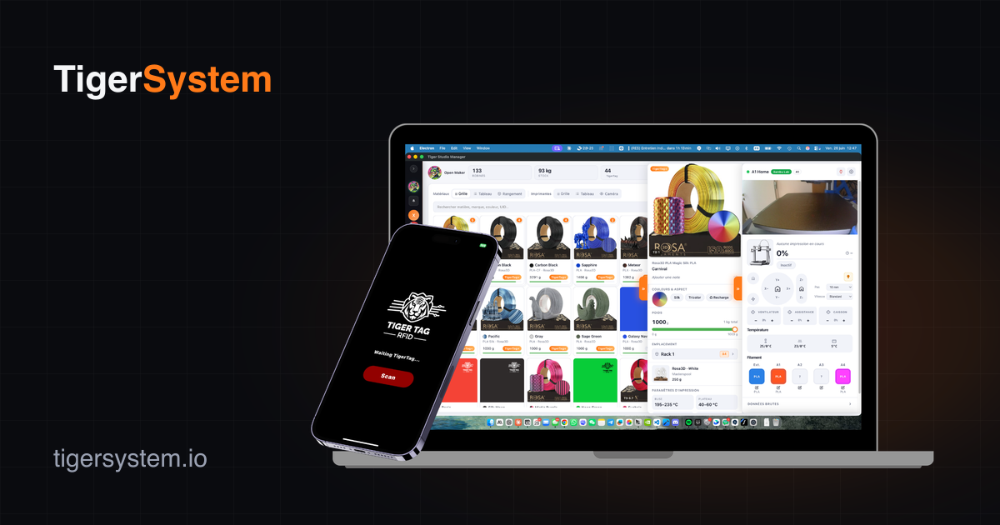
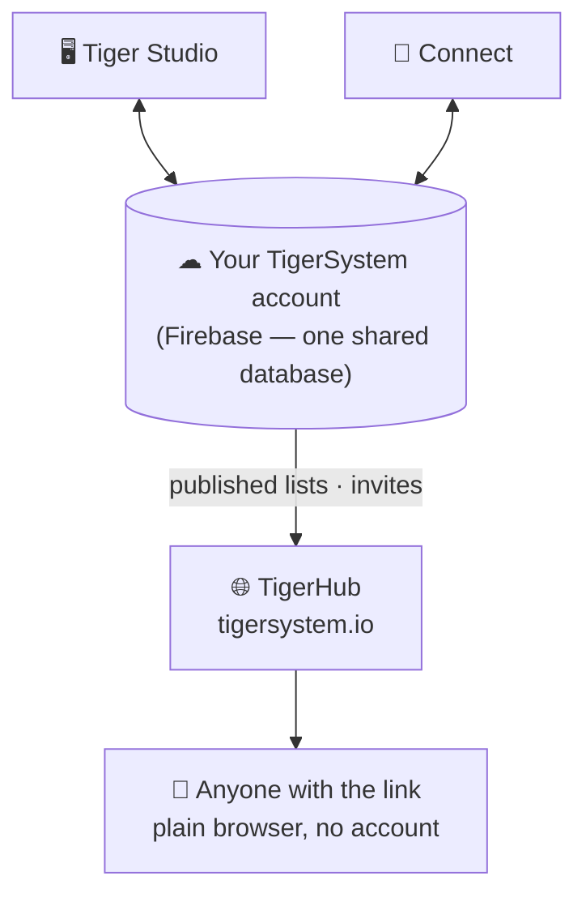

# TigerHub

## Purpose

**TigerHub is the ecosystem's home on the web** — the site at
**[tigersystem.io](https://tigersystem.io)**. It presents the TigerSystem
sandbox and what the open TigerTag protocol makes possible, and it hosts the
**social side** of the sandbox: share a wishlist, invite someone to become a
friend, publish a read-only list anyone can open in a browser.

## Where it sits

## Features — all live today

- **Ecosystem showcase** — the home page tells the whole story: how it works,
  the six printer brands, the components, and the three tiers (TigerData —
  software-only tracking · TigerTag — the offline chip · TigerTag+ — verified
  authenticity).
- **Your account on the web** (`/account`) — sign in to your TigerSystem
  account from a browser.
- **Wishlists** — public ones and friends-only ones, both deployed.
- **Friend codes & invitations** — add each other as friends from the web.
- **Public list links** — share a read-only inventory or wishlist as
  `https://tigersystem.io/list/<token>`; the viewer needs no app and no
  account.
- **Material catalogue & reference database** (`/materials`, `/database`) —
  browse the shared catalogue every app resolves against.
- **Printers & features** (`/printers`, `/features`) — what works with what.
- **3D models** (`/models`) — printable models (TigerPOD and friends).
- **For manufacturers, developers & press** (`/manufacturers`, `/developers`,
  `/press`) — the B2B story, integration pointers, media assets.
- **Goodies** (`/goodies`) — the merch corner.

## TigerHub is not the database

The user accounts and the data behind all the apps live in **plain Firebase**
(Auth + Firestore) — deliberately unbranded infrastructure: **a single shared
database, in a single place**, so Tiger Studio, Tiger NFC Connect, TigerScale
and the TigerSystem account all interoperate on the same data. TigerHub is the
**web surface** built on top of it. See
[Inventory & cloud sync](../concepts/inventory-and-cloud-sync.md).

## Interactions

| With | How |
|---|---|
| Tiger Studio / Connect | Generate & revoke share links, send friend invites |
| Firebase (account database) | Source of the published data |
| Visitors | Plain browser, no account needed |

---

**◀ Previous:** [Tiger Studio](./tiger-studio.md) · **▲ [Documentation index](../../README.md)** · **Next ▶** [TigerPOD](./tigerpod.md)

**Related:** [Inventory & cloud sync](../concepts/inventory-and-cloud-sync.md), [Architecture](../architecture/overview.md)
