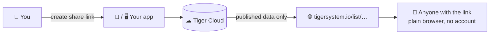

# TigerHub (web)

## Purpose

**TigerHub shows your collection to the world with a simple link.** Send
someone a URL and they see your list in their browser — nothing to install, no
account needed on their side. It is the public web surface of the ecosystem,
hosted at **[tigersystem.io](https://tigersystem.io)**, and it only ever shows
what you chose to make public.

## Where it sits

## Features

- **Public list links** — a user shares a read-only inventory/wishlist as
  `https://tigersystem.io/list/<token>`; anyone with the link can view it in a
  browser.

> **TODO:** document the full TigerHub feature set (viewing surfaces, buy
> links, future community features) as they ship. This page intentionally lists
> only what is live.

## Architecture

Web app (Vercel) reading from [Tiger Cloud](./tiger-cloud.md). Share tokens
gate read-only access to the published data.

## Interactions

| With | How |
|---|---|
| Tiger Studio / Connect | Generate & revoke public share links |
| Tiger Cloud | Source of the published data |
| Visitors | Plain browser, no account needed |

---

**◀ Previous:** [Tiger Studio](./tiger-studio.md) · **▲ [Documentation index](../../README.md)** · **Next ▶** [Tiger Cloud](./tiger-cloud.md)

**Related:** [Inventory & cloud sync](../concepts/inventory-and-cloud-sync.md)
