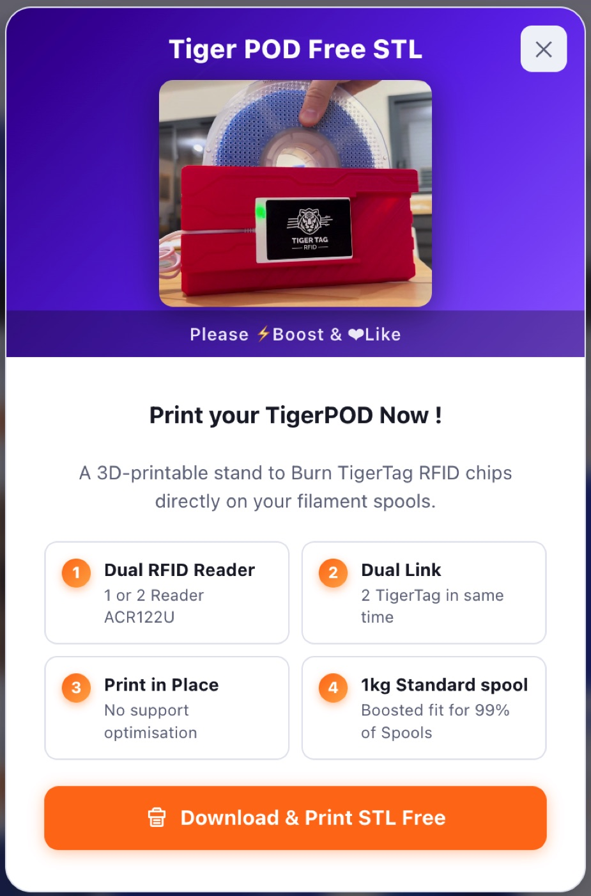

# TigerPOD

## Purpose

**TigerPOD puts a spool scanner on your desk — and you print it yourself.**
A free, open-source 3D-printable stand holding two USB NFC readers: place a
spool, it identifies itself in Tiger Studio; place a blank chip, encode it.
As natural as tapping a phone, but hands-free on the desktop.

Why **two** readers? Because every spool carries
[**two chips**, on opposite sides](../concepts/tigertag-chip.md) — the POD
reaches both in one pass: encode both, verify both, or repair one from the
other, without repositioning the spool.

## Where it sits

## Features

- 3D-printable shell — **free STL on
  [MakerWorld](https://makerworld.com/en/models/1289152)**.
- Houses two ACR122U-class USB readers (read + write stations).
- Plug-and-play with [Tiger Studio](./tiger-studio.md): scanning a chip
  auto-opens the matching spool; the guided chip-update flow uses it for
  UID-checked writes.
- Licensed **CC BY 4.0** — remix and adapt freely.

## Interactions

| With | How |
|---|---|
| TigerTag chips | Read / encode / verify |
| Tiger Studio | Instant spool identification, chip promotion & update |

## In pictures

## Links

- 📦 Repo: [TigerPOD](https://github.com/TigerTag-Project/TigerPOD)
- 🖨 STL: [MakerWorld model 1289152](https://makerworld.com/en/models/1289152)

---

**◀ Previous:** [TigerHub](./tigerhub.md) · **▲ [Documentation index](../../README.md)** · **Next ▶** [TigerScale](./tigerscale.md)

**Related:** [Second Life workflow](../philosophy/second-life.md)
