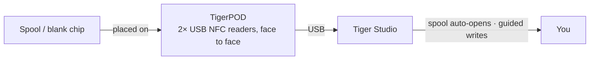
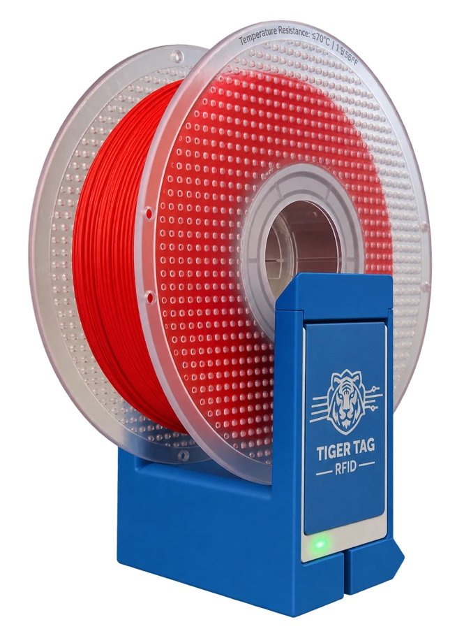
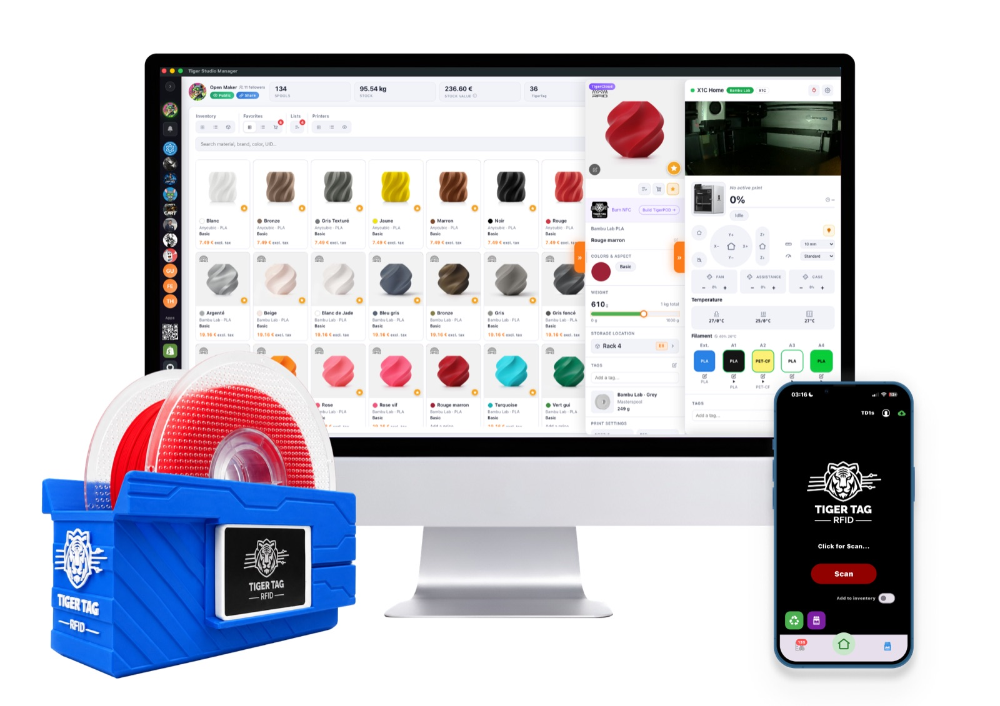
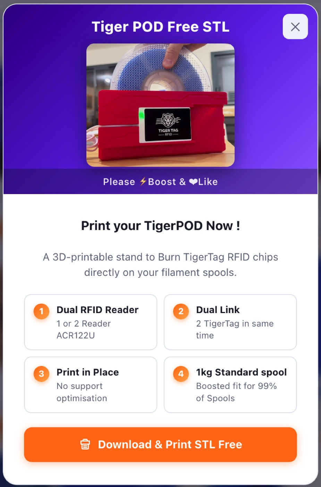

# TigerPOD

## Purpose

**The first "CD player" for smart filament spools.** TigerPOD puts a spool
scanner on your desk — and you print it yourself.
A free, open-source 3D-printable stand holding **two** USB NFC readers **facing
each other**: place a spool, it identifies itself in Tiger Studio; place a blank
chip, encode it. As natural as tapping a phone, but hands-free on the desktop.

*Put the spool down; it introduces itself.*

## Why two readers, facing each other

This is the whole point of the shell, and the one thing to get right. **We
recommend two readers, always.** One reader technically works, but it degrades
the experience in two concrete ways:

- **Reading.** A spool carries
 [**two chips, on opposite faces**](../concepts/tigertag-chip.md). With a single
 reader, a spool that lands the "wrong" way round has to be picked up and
 flipped before it is seen. With one reader on each side, whichever way you drop
 the spool in, a chip is already in front of a reader. Nothing to turn, nothing
 to aim.
- **Writing.** When you tag a spool yourself, you write **both** chips. One
 reader means two passes, and two chances to mismatch them. Two readers write
 the pair **in one go**, and Tiger Studio can verify them against each other.

The Pod exists to hold that geometry: two readers, upright, facing, at spool
distance. Everything else is a shell around it.

## Where it sits

```mermaid
flowchart LR
  TAG["Spool / blank chip"] -- "placed on" --> POD["TigerPOD<br/>2× USB NFC readers, face to face"]
  POD -- "USB" --> ST["Tiger Studio"]
  ST -- "spool auto-opens · guided writes" --> YOU["You"]
```

## Two shells to print — both free

| | **TigerPOD Mini** — *recommended* | **TigerPOD (original)** |
|---|---|---|
| |  |  |
| Prints | Faster, less filament | Longer, more filament |
| Desk space | Less | More |
| Cables | Routed **inside** the shell | External |
| Tags | TigerTag **and** OpenSpool (NDEF) | TigerTag **and** OpenSpool (NDEF) |
| Download | **[MakerWorld — TigerPOD Mini](https://makerworld.com/fr/models/3190348-tigerpod-mini-for-openspool-tigertag-rfid-filament#profileId-3609236)** | **[MakerWorld — TigerPOD original](https://makerworld.com/fr/models/1289152-tigerpod-for-openspool-tigertag-rfid-filament#profileId-1318958)** |

Both hold the same two ACR122U-class readers facing each other. The Mini is a
redesign of the original and is simply the better Pod: start there unless you
specifically want the larger cradle.

Licensed **CC BY 4.0** — remix and adapt freely.

## What it is made of

The STL is the shell; these are the parts that go inside it. Nothing here is
exclusive — any ACR122U-class reader and any USB-C splitter work — but this is
the combination the shell is designed around:

| Part | Quantity | What it is |
|---|---|---|
| **TigerTag Player** | **2** | The USB NFC reader — an ACR122U-class device. One per side, so both of the spool's chips are reached in a single pass. |
| **TigerTag Spliter** | 1 | USB-C to 2× USB-A, so the two readers reach the computer on one port and can be programmed in parallel. |
| **The printed shell** | 1 | **Mini** or original — see above. |

### Getting the parts

The shell is a free download; the two readers and the splitter are the part you
buy. They are sold as a bundle, which is the cheapest way to end up with the
right pair:

- **[TigerTag Player Bundle — 2 readers + Spliter](https://www.atome3d.com/products/tigertag-player-bundle-2pcs-spliter)** (Atome3D)
- Also available on **[tigertag.io](https://shop.tigertag.io/collections/tigertag-rfid-maker)**

> **Note:** assembling one yourself and buying a pre-assembled one lead to
> exactly the same device. Any two ACR122U-class readers will do — the bundle
> just saves you sourcing them separately.

## Build one

1. **Print a shell** — the Mini or the original, above.
2. **Get two ACR122U-compatible readers**, from any shop you like, and a pack of
 blank NTAG 213 / 215 / 216 chips to write on.
3. **Slide one reader into each slot** — no screws, no glue, no wiring.
4. **Plug both into your computer.** A splitter makes it one cable; two USB
 ports work just as well.
5. **Install [Tiger Studio](./tiger-studio.md)** — it picks the readers up on
 its own.

Rough budget, sourced separately — prices vary by shop and region:

| Part | Qty | Approx. | Where |
|---|---|---|---|
| ACR122U-compatible NFC reader | 2 | €15–25 each | [Amazon](https://amzn.to/4vok3d7) · or any shop |
| Blank NTAG 213 / 215 / 216 chips | 1 pack | €10–20 — two chips per spool, so a pack tags many | [Amazon](https://amzn.to/3TzxGc7) · [official chips](./tigertag.md) |
| The printed shell | 1 | filament only | MakerWorld, above |
| USB splitter (2× USB-A female → 1× USB-A male) | 1 | €5–10, optional | [Amazon](https://amzn.to/4plgsv8) |

> Some links in this table are **Amazon affiliate links**: as an Amazon
> Associate, TigerTag earns from qualifying purchases, **at no extra cost to
> you**. It helps fund the open protocol. Buying the same parts anywhere else
> works exactly as well.

Buying the [kit](https://shop.tigertag.io/collections/tigertag-rfid-maker)
instead costs less than sourcing the same parts one by one, the readers arrive
carrying the project's official logo, and it funds the standard — one of
several ways to [support the project](../support.md). But building one from
generic parts is **not a lesser path — it is the same Pod**. That is what an
open protocol means.

### Reader compatibility

The ACR122U speaks **PC/SC**, the OS-level smart-card standard every reader of
this class implements. Because the Pod builds on PC/SC rather than on a vendor
driver, the same setup runs on **Windows, macOS and Linux**, and any PC/SC
library can drive it.

## Features

- 3D-printable shell — **free STLs on MakerWorld**, in a **Mini** and an
 **original** size.
- Houses two ACR122U-class USB readers, face to face (read + write stations).
- Plug-and-play with [Tiger Studio](./tiger-studio.md): scanning a chip
 auto-opens the matching spool; the guided chip-update flow uses it for
 UID-checked writes.
- Not locked to TigerTag: the same two readers handle **OpenSpool** (NDEF) tags
 as well.

## More than TigerTag — a universal NFC station

The Pod is **not locked to the TigerTag protocol**. It is, quite literally, two
standard PC/SC readers in a spool-shaped holder: **anything an ACR122U can do,
the Pod can do.**

You control the chip completely — read what is on it, write something new,
change what is there, erase it back to blank. All four, in both directions. No
write-once, no one-way street, no vendor lock. And for filament that happens in
**Dual NFC**, both chips of a spool handled together, on any brand's spools.

The ACR122U handles far more than NTAG: **ISO 14443 Type A and B**, **MIFARE**
(Classic 1K/4K, Ultralight, DESFire), **FeliCa**, **Topaz/Jewel**, and **NFC
Forum tag types 1–4**. Whatever you can read or write with an ACR122U, you can
read or write in the Pod — including [OpenSpool](../compatibility/openspool.md)
tags.

That is also what makes the [second life](../philosophy/second-life.md) real. A
TigerTag is never write-locked, so when a spool is finished you can erase its
chips and rewrite them as fresh TigerTags — or turn them into something else
entirely: a plain **NDEF** tag for home automation, a Wi-Fi hand-off, a URL, a
business card. And back into a TigerTag whenever you want. The chip is a
reusable asset, not single-use packaging.

## Interactions

| With | How |
|---|---|
| TigerTag chips | Read / encode / verify — both chips of a spool at once |
| Tiger Studio | Instant spool identification, chip promotion & update |

## In pictures

## Links

- Repo: [TigerPOD](https://github.com/TigerTag-Project/TigerPOD)
- STL — **[TigerPOD Mini](https://makerworld.com/fr/models/3190348-tigerpod-mini-for-openspool-tigertag-rfid-filament#profileId-3609236)** · [TigerPOD original](https://makerworld.com/fr/models/1289152-tigerpod-for-openspool-tigertag-rfid-filament#profileId-1318958)
- Readers: [TigerTag Player Bundle (2 pcs + Spliter)](https://www.atome3d.com/products/tigertag-player-bundle-2pcs-spliter)

---

**◀ Previous:** [TigerHub](./tigerhub.md) · **▲ [Documentation index](../../README.md)** · **Next ▶** [TigerScale](./tigerscale.md)

**Related:** [Second Life workflow](../philosophy/second-life.md)
