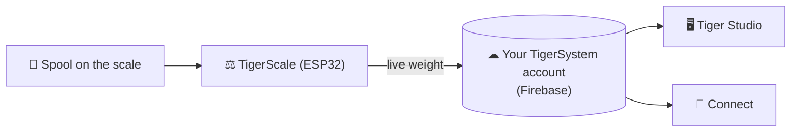

# TigerScale

## Purpose

**TigerScale answers the eternal question: how much filament is left?** Put a
spool on the open-source ESP32 scale and the live weight flows straight into
your inventory — no manual entry, no shaking the spool next to your ear.

> **The chip knows what the filament *is*; the scale knows how much is
> *left*.** Together they make the inventory actually true: identity from
> [TigerTag](./tigertag.md), live quantity from TigerScale.

## Where it sits

## Features

- ESP32-based hardware + firmware, fully open source (MIT) — commodity parts,
  the living example that a simple ESP32 and an NFC reader module (PN532 /
  RC522 class) are enough to build a TigerTag-reading device.
- **Live weight tracking** — updates appear in real time in Tiger Studio and
  TigerTag Connect via Firestore.
- Works with Tiger Studio's **container weight calibration** so net filament
  weight stays accurate per container type.

> **TODO:** hardware BOM, build guide and flashing instructions — canonical in
> the [Tiger-Scale](https://github.com/TigerTag-Project/Tiger-Scale) repo;
> summarize here once stabilized.

## Interactions

| With | How |
|---|---|
| Firebase (account database) | Writes live weight to the user's account |
| Tiger Studio / Connect | Display live weight; health monitoring |

## Links

- 📦 Repo: [Tiger-Scale](https://github.com/TigerTag-Project/Tiger-Scale) (MIT)

---

**◀ Previous:** [TigerPOD](./tigerpod.md) · **▲ [Documentation index](../../README.md)** · **Next ▶** [Compatibility](../compatibility/README.md)

**Related:** [Inventory & cloud sync](../concepts/inventory-and-cloud-sync.md)
