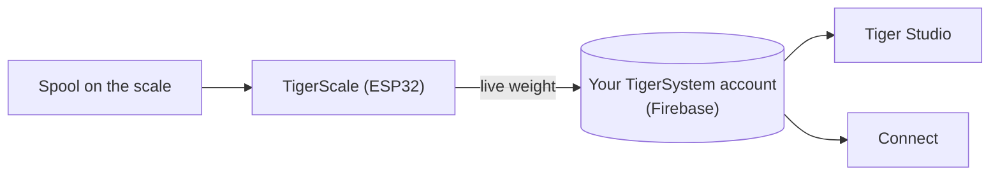

# TigerScale

## Purpose

**TigerScale answers the eternal question: how much filament is left?** Put a
spool on the open-source ESP32 scale and the live weight flows straight into
your inventory — no manual entry, no shaking the spool next to your ear.

> **The chip knows what the filament *is*; the scale knows how much is
> *left*.** Together they make the inventory actually true: identity from
> [TigerTag](./tigertag.md), live quantity from TigerScale.

## TigerScale V3 — the current generation

[Tiger-Scale-V3](https://github.com/TigerTag-Project/Tiger-Scale-V3), MIT.
This is the one to build.

- **It knows which spool is on it**: **dual PN532 NFC readers**, one per
 side — a [twin-tagged spool](../concepts/tigertag-chip.md) is identified
 whichever way you put it down. Read the tag, weigh, subtract the empty
 spool's weight, sync — no typing, no guessing.
- **ESP32-S3** (16 MB flash, PSRAM), **3.5″ 480×320 colour touchscreen**
 (LVGL) with full on-screen setup: WiFi picker + keyboard, calibration
 wizard, hardware self-test, OTA updates.
- **Battery powered** (AXP2101 PMIC, charge state on screen), audio codec.
- Precision weighing: HX711 + load cell, median + adaptive EMA filtering —
 tuned for a kitchen-scale feel.
- **8 firmware languages**, 9-language web UI.
- **Live weight tracking** — updates appear in real time in Tiger Studio and
 Tiger NFC Connect via Firestore.
- Works with Tiger Studio's **container weight calibration** so net filament
 weight stays accurate per container type.

*On the bench: put the spool down, it identifies itself and weighs itself.*

## Where it sits

```mermaid
flowchart LR
  SPOOL["Spool on the scale"] --> SCALE["TigerScale (ESP32)"]
  SCALE -- "live weight" --> CLOUD[("Your TigerSystem account<br/>(Firebase)")]
  CLOUD --> ST["Tiger Studio"] & CO["Connect"]
```

## The story so far

Three generations, and the shape of the thing changed at each one:

| | Reading | Screen | Board | Form factor |
|---|---|---|---|---|
| **V1** — never released publicly | **one** PN532 | mini OLED | ESP32 | a **spool holder**: a central support passing through the middle of the spool |
| **V2** — [Tiger-Scale](https://github.com/TigerTag-Project/Tiger-Scale), MIT | 2× RC522 | 0.96″ OLED | ESP32-WROOM, USB-powered | a flat scale |
| **V3** — [Tiger-Scale-V3](https://github.com/TigerTag-Project/Tiger-Scale-V3), MIT | 2× PN532 | 3.5″ colour touchscreen | ESP32-S3, battery | a flat scale, self-contained |

The V1 already carried essentially the V2's electronics — ESP32, mini OLED,
an HX711 board with a 5 kg load cell — but a **single** reader, and a
completely different body.

> **V3 is different hardware, not a firmware update.** The two are not
> interchangeable: a V2 you already built keeps its own repository and keeps
> working. It is simply no longer developed.

All three are fully open source (MIT) on commodity parts — the living proof
that an ESP32 and an NFC reader module (PN532 / RC522 class) are enough to
build a TigerTag-reading device.

## Third-party scales — USB HID (DYMO M series and friends)

TigerScale is the first-party scale — but Tiger Studio also reads standard
**USB "HID Scale" devices** (HID usage page `0x8D`, usage `0x20`): starting
with the **DYMO M5** and the rest of the DYMO M series (M10, M25… same
protocol), and **any compliant HID Scale**, whatever the brand. A third-party
option, not a Tiger product.

Protocol, validated on real hardware — 6-byte *Scale Data Reports* at ~1 Hz:

| Byte | Meaning |
|---|---|
| `[0]` | report id `0x03` |
| `[1]` | status: 1 fault · 2 stable @ zero · 3 in motion · 4 stable · 5 negative · 6 over capacity |
| `[2]` | unit (HID PoS codes): `0x02` gram · `0x0B` ounce · `0x0C` pound |
| `[3]` | signed power-of-ten exponent applied to the raw value |
| `[4..5]` | weight, LE16 (LSB, MSB) |

DYMO vendor id `0x0922`; the M5 is pid `0x8009`. Quirk: the very first frame
right after a tare reports unit `0x00`.

## Interactions

| With | How |
|---|---|
| Firebase (account database) | Writes live weight to the user's account |
| Tiger Studio / Connect | Display live weight; health monitoring |

## Links

- **V3 (current)**: [Tiger-Scale-V3](https://github.com/TigerTag-Project/Tiger-Scale-V3) (MIT)
- V2, no longer developed: [Tiger-Scale](https://github.com/TigerTag-Project/Tiger-Scale) (MIT)

---

**◀ Previous:** [TigerPOD](./tigerpod.md) · **▲ [Documentation index](../../README.md)** · **Next ▶** [Compatibility](../compatibility/README.md)

**Related:** [Inventory & cloud sync](../concepts/inventory-and-cloud-sync.md)
