# TigerScale

## Purpose

**TigerScale answers the eternal question: how much filament is left?** Put a
spool on the open-source ESP32 scale and the live weight flows straight into
your inventory — no manual entry, no shaking the spool next to your ear.

> **The chip knows what the filament *is*; the scale knows how much is
> *left*.** Together they make the inventory actually true: identity from
> [TigerTag](./tigertag.md), live quantity from TigerScale.

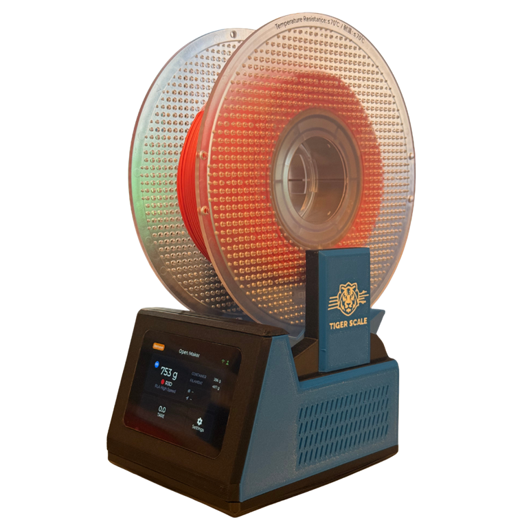

## TigerScale V3 — the current generation

[Tiger-Scale-V3](https://github.com/TigerTag-Project/Tiger-Scale-V3), MIT.
This is the one to build.

- **It knows which spool is on it**: **dual PN532 NFC readers**, one per
 side — a [twin-tagged spool](../concepts/tigertag-chip.md) is identified
 whichever way you put it down. Read the tag, weigh, subtract the empty
 spool's weight, sync — no typing, no guessing.
- **ESP32-S3** (16 MB flash, PSRAM), **3.5″ 480×320 colour touchscreen**
 (LVGL) with full on-screen setup: WiFi picker + keyboard, calibration
 wizard, hardware self-test, OTA updates.
- **Battery powered** (AXP2101 PMIC, charge state on screen), audio codec.
- Precision weighing: HX711 + load cell, median + adaptive EMA filtering —
 tuned for a kitchen-scale feel.
- **8 firmware languages**, 9-language web UI.
- **Live weight tracking** — updates appear in real time in Tiger Studio and
 Tiger NFC Connect via Firestore.
- Works with Tiger Studio's **container weight calibration** so net filament
 weight stays accurate per container type.
- **It works offline.** Brand and material identification comes from a database
 held in the device's own flash, refreshed at most once a day — a tag lookup
 never waits on the network.
- **Cloud sync is optional.** The scale is fully usable without an account.
- **Its own web UI**, served from the device, mobile-friendly, live over
 WebSocket at 10 Hz — no app to install to drive it from a phone.
- **No binary blobs**: everything compiles from source.

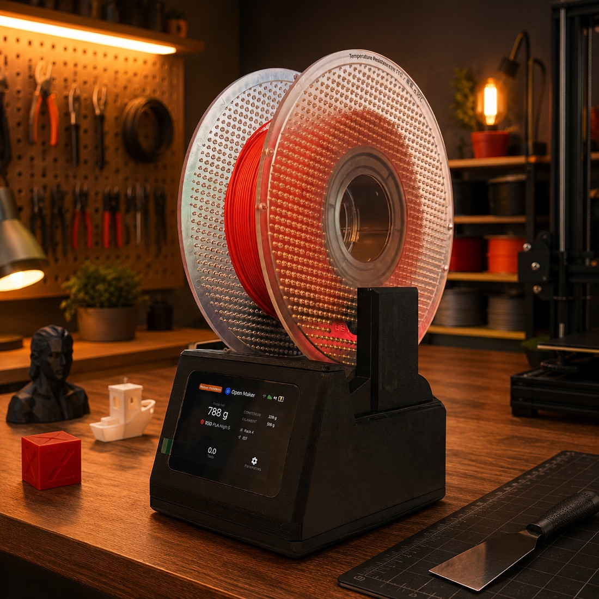

*On the bench: put the spool down, it identifies itself and weighs itself.*

## Building one

The scale is a DIY build, and the steps people expect to be hard are not:

1. **Print the enclosure.** One `.3mf` Bambu Studio project with the plates
 already laid out — [on MakerWorld](https://makerworld.com/en/models/3161869-tigerscale-v3-best-smart-filament-scale-with-nfc#profileId-3573543).
 Open it in Bambu Studio or Orca and press Slice: nothing to orient, no
 supports to place.
2. **Wire the components.** Connect the load cell, HX711, speaker and both
 PN532 readers to the board following the [wiring diagram](#wiring-diagram)
 below — the same pinout for either board variant.
3. **Flash from your browser.** The
 [web installer](https://tigertag-project.github.io/Tiger-Scale-V3/) always
 serves the current release; after that the scale updates itself over the air.

The parts are commodity:

| Qty | Component | Where |
|---|---|---|
| 1 | Waveshare **ESP32-S3-Touch-LCD-3.5B** — 480×320 IPS touch (the **-3.5** without the B works too) | [-3.5B](https://link.amazon/B0gaANfF5) · [-3.5](https://link.amazon/B0dpgOlOQ) |
| 2 | **PN532 V3** NFC module — pin header **and** mode switch required | [Amazon](https://link.amazon/B0iTXrhjd) |
| 1 | 5 kg load cell + HX711 | [Amazon](https://link.amazon/B09LOUuI1) |
| 1 | USB-C 4-pin cable + connector | [cable](https://link.amazon/B0aoW8qQx) · [connector](https://link.amazon/B0aiEyjLx) |
| 1 | Li-ion battery — **optional**, the scale runs on USB | [Amazon](https://link.amazon/B0etKlE1i) |
| — | Dupont wires, M3 self-tapping screws | [wires](https://link.amazon/B0bl6jvMs) · [screws](https://link.amazon/B0ekzxx1E) |
| — | 2× M4×30 and 2× M5×30 (load cell), 4× M2×6 (display) | any hardware shop |
| 1 | A small speaker | ships with the ESP32-S3 board |

<figure>
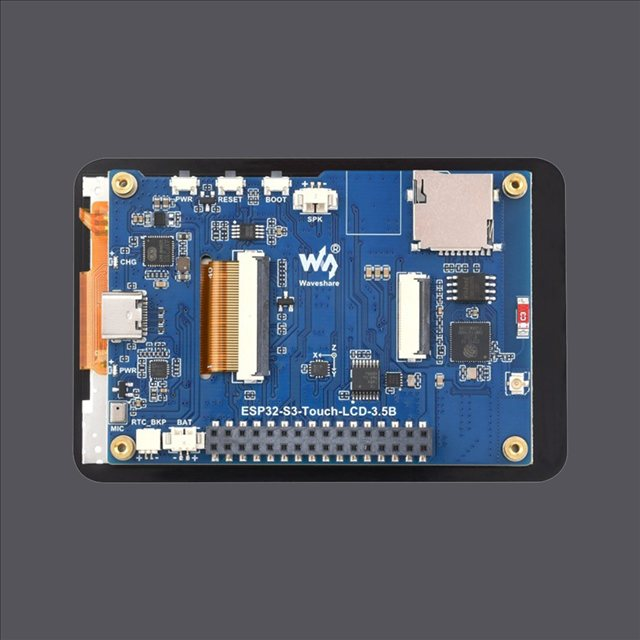
<figcaption><strong>Both variants work, but they need different firmware.</strong> Read the silkscreen: <strong>-3.5B</strong> or <strong>-3.5</strong>. The web installer asks which one you have; the wiring and the case are the same either way.</figcaption>
</figure>
<figure>
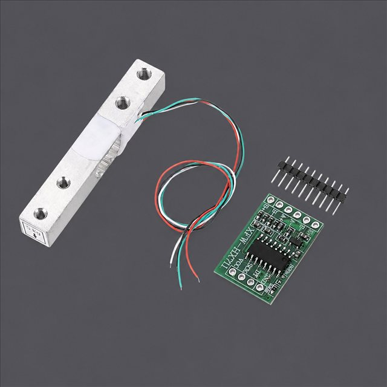
<figcaption><strong>Warning:</strong> the load cell must have 2× M4 and 2× M5 tapped holes, and the HX711 board must be identical to the one shown — otherwise it will not fit in its designated slot.</figcaption>
</figure>

> Some links in this table are **Amazon affiliate links**: as an Amazon
> Associate, TigerTag earns from qualifying purchases, **at no extra cost to
> you**. It helps fund the open protocol. Buying the same parts anywhere else
> works exactly as well.

The full costed bill of materials lives in the
[repository](https://github.com/TigerTag-Project/Tiger-Scale-V3).

### Assembly

<figure>
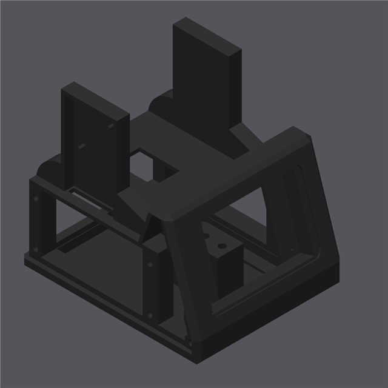
<figcaption>Front three-quarter</figcaption>
</figure>
<figure>
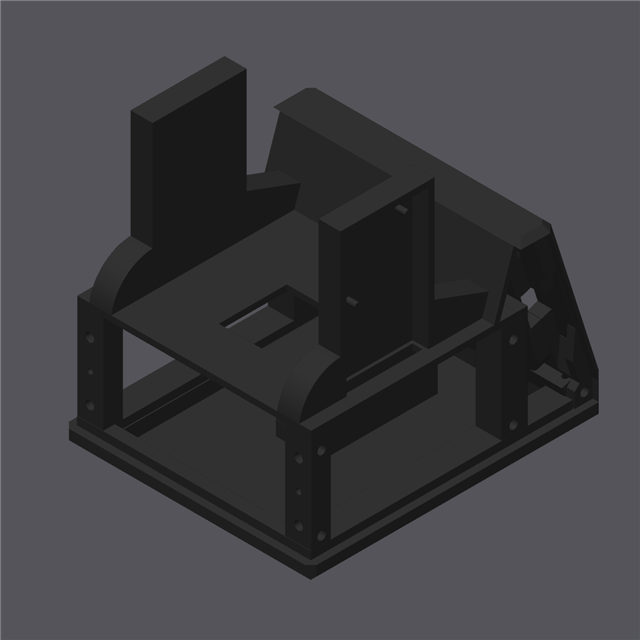
<figcaption>Rear three-quarter</figcaption>
</figure>
<figure>
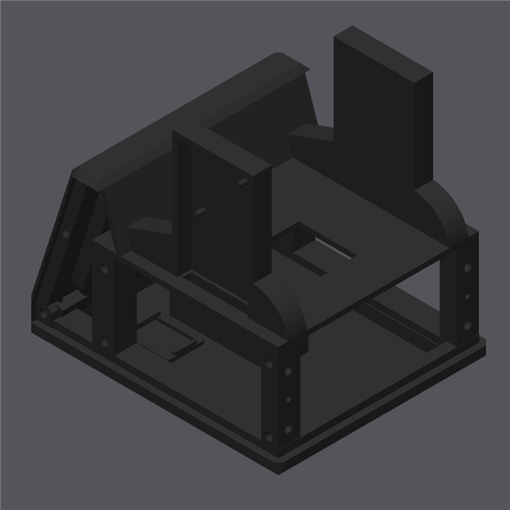
<figcaption>Rear three-quarter, close</figcaption>
</figure>
<figure>
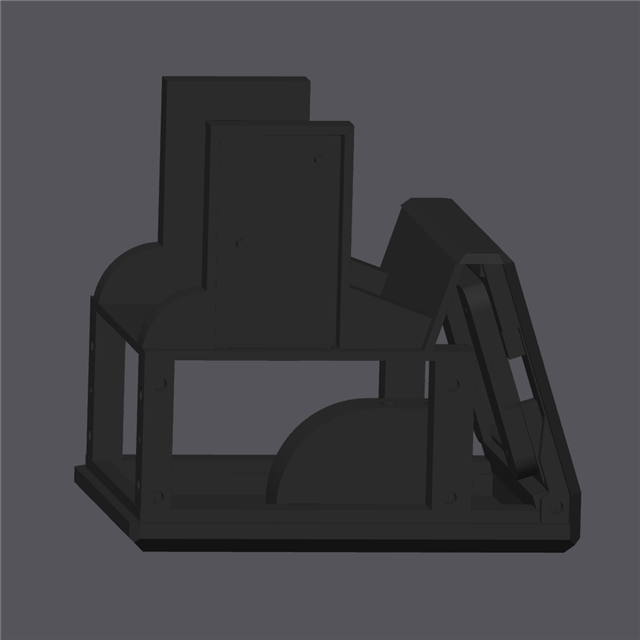
<figcaption>Side elevation</figcaption>
</figure>

<figure>
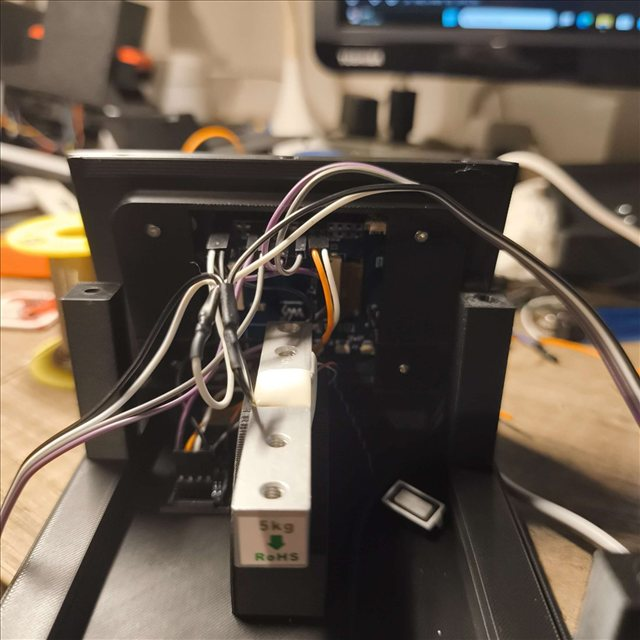
<figcaption>Scale position and orientation</figcaption>
</figure>
<figure>
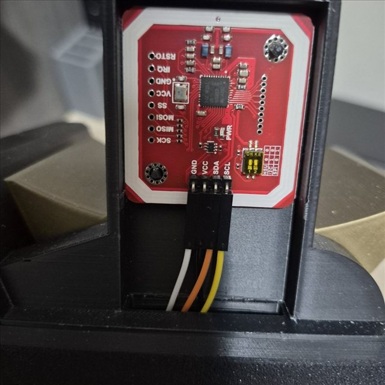
<figcaption>PN532 seated in its slot</figcaption>
</figure>

### Wiring diagram

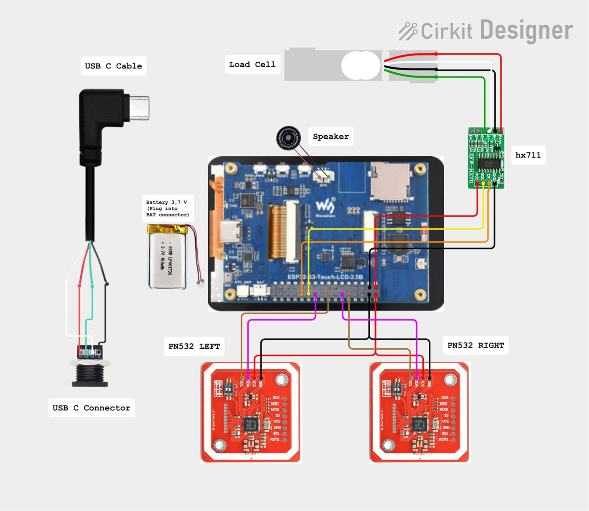

*[Interactive schematic in Cirkit Designer](https://app.cirkitdesigner.com/project/c6aa6c0a-9462-498f-8923-9ad4454e0e69)*

## Yours to make and to sell

**Anyone can manufacture and sell TigerScale hardware. No licence fee, no
royalty, no registration.** Build it, flash the official firmware, ship it.

The single condition for calling your product a **TigerScale** is running that
official firmware **unmodified**, so every unit behaves identically inside the
ecosystem. Fork it if you want to change it — and give the fork a different
name. That is the whole of the deal.

## Where it sits

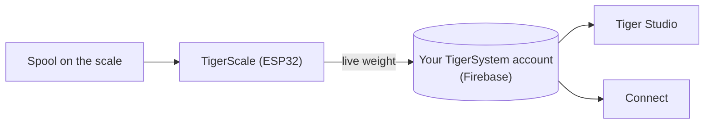
```mermaid
flowchart LR
  SPOOL["Spool on the scale"] --> SCALE["TigerScale (ESP32)"]
  SCALE -- "live weight" --> CLOUD[("Your TigerSystem account<br/>(Firebase)")]
  CLOUD --> ST["Tiger Studio"] & CO["Connect"]
```

## The story so far

Three generations, and the shape of the thing changed at each one:

| | Reading | Screen | Board | Form factor |
|---|---|---|---|---|
| **V1** — never released publicly | **one** PN532 | mini OLED | ESP32 | a **spool holder**: a central support passing through the middle of the spool |
| **V2** — [Tiger-Scale](https://github.com/TigerTag-Project/Tiger-Scale), MIT | 2× RC522 | 0.96″ OLED | ESP32-WROOM, USB-powered | a flat scale |
| **V3** — [Tiger-Scale-V3](https://github.com/TigerTag-Project/Tiger-Scale-V3), MIT | 2× PN532 | 3.5″ colour touchscreen | ESP32-S3, battery | a flat scale, self-contained |

The V1 already carried essentially the V2's electronics — ESP32, mini OLED,
an HX711 board with a 5 kg load cell — but a **single** reader, and a
completely different body.

> **V3 is different hardware, not a firmware update.** The two are not
> interchangeable: a V2 you already built keeps its own repository and keeps
> working. It is simply no longer developed.

All three are fully open source (MIT) on commodity parts — the living proof
that an ESP32 and an NFC reader module (PN532 / RC522 class) are enough to
build a TigerTag-reading device.

## Third-party scales — USB HID (DYMO M series and friends)

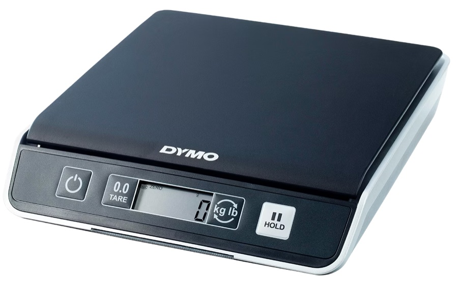

TigerScale is the first-party scale — but Tiger Studio also reads standard
**USB "HID Scale" devices** (HID usage page `0x8D`, usage `0x20`): starting
with the **DYMO M5** and the rest of the DYMO M series (M10, M25… same
protocol), and **any compliant HID Scale**, whatever the brand. A third-party
option, not a Tiger product.

Protocol, validated on real hardware — 6-byte *Scale Data Reports* at ~1 Hz:

| Byte | Meaning |
|---|---|
| `[0]` | report id `0x03` |
| `[1]` | status: 1 fault · 2 stable @ zero · 3 in motion · 4 stable · 5 negative · 6 over capacity |
| `[2]` | unit (HID PoS codes): `0x02` gram · `0x0B` ounce · `0x0C` pound |
| `[3]` | signed power-of-ten exponent applied to the raw value |
| `[4..5]` | weight, LE16 (LSB, MSB) |

DYMO vendor id `0x0922`; the M5 is pid `0x8009`. Quirk: the very first frame
right after a tare reports unit `0x00`.

> **The DYMO M2 is not supported** — it has no USB port at all, so there is
> nothing to connect to a computer. The protocol is beside the point.

## Interactions

| With | How |
|---|---|
| Firebase (account database) | Writes live weight to the user's account |
| Tiger Studio / Connect | Display live weight; health monitoring |

## Recommended setup

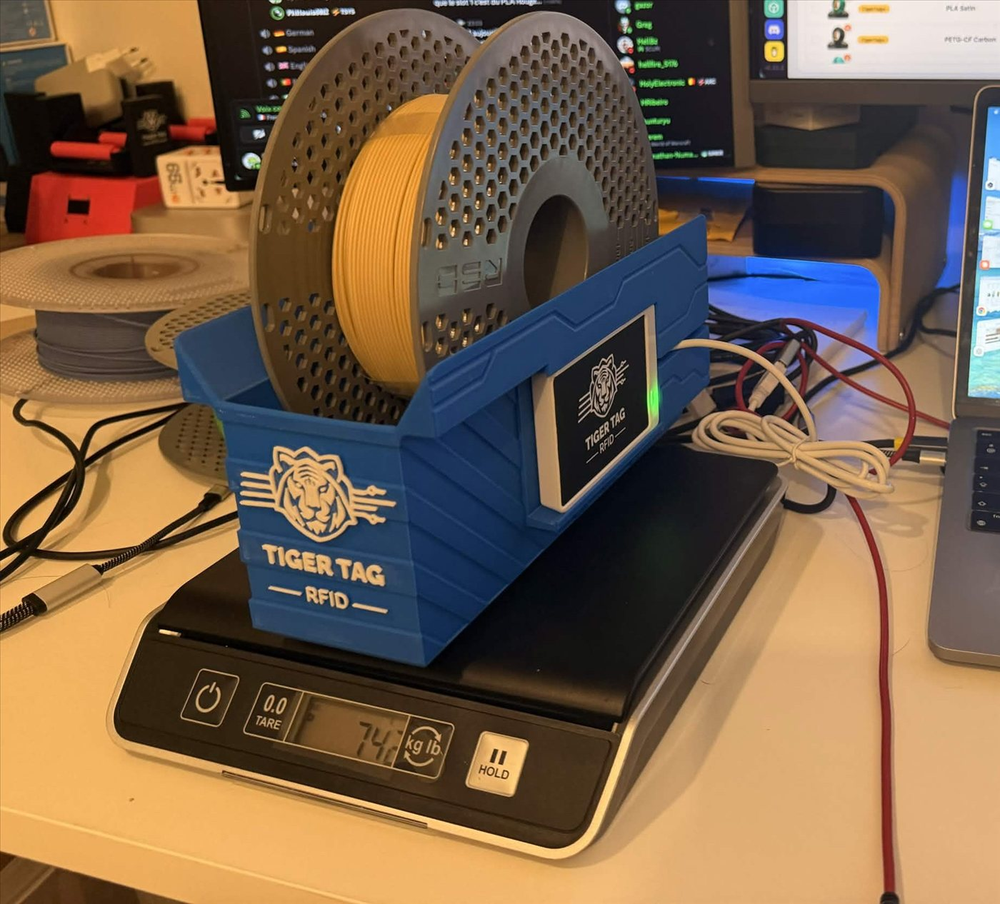

1. **Plug your DYMO scale into your computer over USB.**
2. **Set the TigerPOD Mini or the original on top of the scale.**
3. **Tare the DYMO scale.**
4. **Open Tiger Studio Manager.**
5. **Put a spool on the TigerPOD.**
6. **The TigerPOD reads the spool's NTAG chips and opens its card in Tiger
 Studio Manager.**
7. **The DYMO scale weighs the spool — Tiger Studio Manager updates its
 weight automatically.**

## Links

- **V3 (current)**: [Tiger-Scale-V3](https://github.com/TigerTag-Project/Tiger-Scale-V3) (MIT)
- Flash it from your browser: [web installer](https://tigertag-project.github.io/Tiger-Scale-V3/)
- Print the enclosure: [MakerWorld](https://makerworld.com/en/models/3161869-tigerscale-v3-best-smart-filament-scale-with-nfc#profileId-3573543)
- V2, no longer developed: [Tiger-Scale](https://github.com/TigerTag-Project/Tiger-Scale) (MIT)

---

**◀ Previous:** [TigerPOD](./tigerpod.md) · **▲ [Documentation index](../../README.md)** · **Next ▶** [Compatibility](../compatibility/README.md)

**Related:** [Inventory & cloud sync](../concepts/inventory-and-cloud-sync.md)
