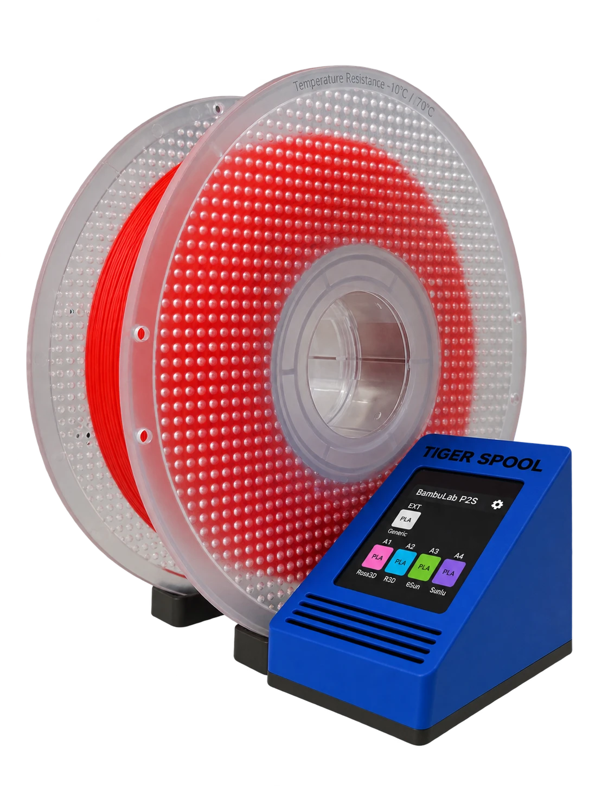
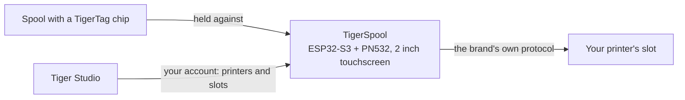
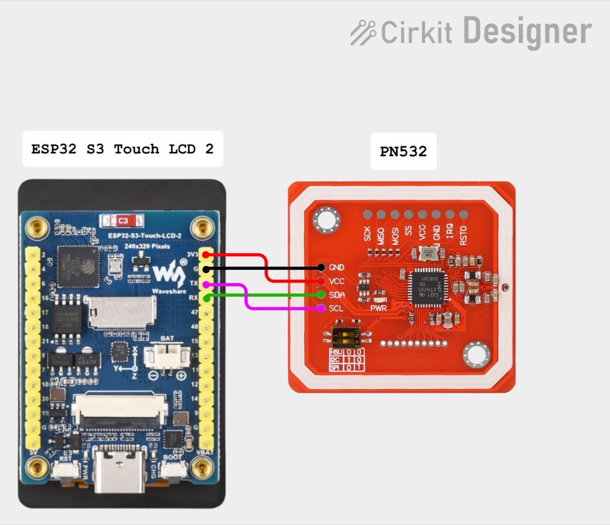

# TigerSpool

**A small box beside the printer. Hold a spool against it, tap a slot, and the
filament is written into that slot — on any brand of printer.**

*The box, a spool, and the printer's own slots on screen — each one showing
what is loaded in it. Hold the spool against the box, pick a slot, done.*

<a class="ts-cta-primary" href="https://tigertag-project.github.io/TigerSpool-RFID/">Install from your browser</a>

<a href="https://github.com/TigerTag-Project/TigerSpool-RFID"> Sources</a>

Your printer already keeps a list of slots. Your spool already carries its own
[identity](../concepts/universal-filament-identity.md). TigerSpool is the thirty
centimetres between the two: no app to open, no keyboard, nothing retyped that
the chip already knows.

Open source under **MIT**, ESP32-S3, about **40 €** of common parts.

## What it does

1. **Hold the spool to the box.** The [TigerTag chip](../concepts/tigertag-chip.md)
 is read on contact.
2. **Tap the slot** you want on the touchscreen — the same slot names the
 printer itself uses.
3. **Confirm.** The assignment reaches the printer over that brand's own
 protocol: material, brand, colour and temperatures, in the right slot.

It speaks eight languages, asks which one before anything else, and updates
itself over the air.

:::caution[Warning]
Scanning a TigerTag and confirming a slot on the screen does not load
anything — it only tells the printer what the spool *is*. **You still have
to physically put the spool in that slot yourself** — the CFS, the AMS, the
ACE unit, or whatever that printer calls its own tray. Skip that and the
printer reports no filament, because there genuinely is none loaded.
:::

## Where it sits

TigerSpool is not a chip writer — that is the [TigerPOD](./tigerpod.md)'s job,
on the desk. TigerSpool takes an identity that already exists and puts it where
the printer expects it.

## What has to exist first

**This is what catches people out, so it comes before the hardware.**

The box has no keyboard and no way to type a printer's address, deliberately.
It reads your printers **from your TigerSystem account**, which means two
things must exist before it is useful:

1. **An account, created in [Tiger Studio](./tiger-studio.md).** The box signs
 in to it — by e-mail, or with Google through a QR code, so no password is
 ever typed on a two-inch screen.
2. **Your printers, added in Tiger Studio.** Address, access code, brand and
 model all live there.

If you skip this, the printer list on the box is **empty**. That is not a
fault and there is nothing to repair on the device: it is showing you exactly
what your account contains. Add the printer in Tiger Studio and it appears at
the next sync.

> **In short:** Tiger Studio → create an account → add your printers →
> *then* set up the box.

## Which printers

**The six brands Tiger Studio integrates are covered** — written, and proven
on hardware. That is not every printer on the market, and *"any printer"*
stays the goal; it is every brand this ecosystem speaks to today:

| Brand | Firmware | Transport |
|---|---|---|
| [Creality](../compatibility/creality.md) | implemented, proven | WebSocket |
| [FlashForge](../compatibility/flashforge.md) | implemented, proven | HTTP |
| [Bambu Lab](../compatibility/bambu-lab.md) | implemented, proven | MQTT over TLS |
| [Snapmaker](../compatibility/snapmaker.md) | implemented, proven | Moonraker over WebSocket |
| [Elegoo](../compatibility/elegoo.md) | implemented, proven | MQTT |
| [Anycubic](../compatibility/anycubic.md) | implemented, proven | MQTT over TLS |

Slot names follow the printer's own: `Ext.` and `1A`–`1D` on Creality and
FlashForge, `A1`–`A4` then `B1`–`B4` on Bambu Lab, `E1`–`E4` on Snapmaker, `S1`–`S4` on
Elegoo's Canvas, and one letter per ACE unit on Anycubic — `A1`, `A2`… then
`B1`… for a second box.

Check the [per-brand status](https://github.com/TigerTag-Project/TigerSpool-RFID/blob/main/docs/PRINTER-COMPATIBILITY.md)
before buying parts for a specific machine.

## Build one

Three things to buy, four wires, one printed shell — plus two extras worth
considering. **The electronics are identical for every printer brand** — only
the shell changes, which is what keeps it to one firmware and one parts list.

| Qty | Component | Where |
|---|---|---|
| 1 | Waveshare **ESP32-S3-Touch-LCD-2** development board — 2.0" 240×320 IPS capacitive touch, ESP32-S3**R8**, 16 MB flash, 8 MB octal PSRAM. Screen, touch panel and MCU on one board, and the 16 MB is what makes two OTA slots comfortable | [Amazon](https://link.amazon/B0c5hr3uf) |
| 1 | **PN532 V3** NFC module — DIP switches, must support **HSU/UART**, both switches to `0` / OFF. A two-pack costs barely more than one | [Amazon](https://link.amazon/B0dyEfwKa) |
| 1 | A USB-C cable **that carries data** — speed is irrelevant, any USB 2.0 data cable does | [Amazon](https://link.amazon/B00Xg3WT4) |
| 1 | Magnetic USB-C connector — **recommended**: the port is the part handled every day, and the cable lets go instead of the socket | [Amazon](https://link.amazon/B0bWVIBa0) |
| 1 | 3.7 V 1000 mAh LiPo cell, PH1.25 — **optional**, charged over USB; the box then runs cable-free and gains a Battery entry in Settings. Check the polarity | [Amazon](https://link.amazon/B0fL0jjf3) |

> Some links in this table are **Amazon affiliate links**: as an Amazon
> Associate, TigerTag earns from qualifying purchases, **at no extra cost to
> you**. It helps fund the open protocol. Buying the same parts anywhere else
> works exactly as well.

The **four jumper wires come with the PN532** — 3V3, GND, TX, RX, and that is
the whole harness. No level shifters: the PN532 runs at 3V3, same as the board.
A battery is **optional** — the box normally sits beside a printer that is
already plugged in, and the cell above is for the times it does not.

*The whole harness. On the PN532 the two data pins are silkscreened `SDA` and
`SCL` — in HSU mode they carry the UART, so that is where TX and RX go.
[Interactive schematic](https://app.cirkitdesigner.com/project/7a6c0887-8e44-4303-81b3-be51aab4b40a).*

**Flashing is done from the browser** — plug the board in, click Install, wait
a minute. Chrome, Edge or Opera on a desktop; Safari and Firefox do not
implement WebSerial, and no mobile browser does.

**[Install it from your browser →](https://tigertag-project.github.io/TigerSpool-RFID/)**

### Three traps worth knowing before you order

- **The reader goes on GPIO43/44, never GPIO6/7.** That pair is an I²C bus
 with pull-ups on this board: a PN532 wired there powers up, answers, and
 returns random UIDs with failing reads. It looks like a bad tag. It is not,
 and it costs a day.
- **`TXD` crosses to the board's RX, `RXD` to its TX.** Transmit talks to
 receive. If the reader reports firmware version 0 at boot, swap those two
 before changing anything else.
- **A charge-only USB cable makes a working board look dead.** The screen
 lights up and no serial port ever appears, so the web installer finds nothing
 to install to. Use a cable you know transfers files.

Waveshare sells several similar boards; the 1.28", 1.69" and 3.5" ones in the
same family have different panel controllers and pinouts, and this firmware
will not run correctly on them. Check the silkscreen, not the listing title.

Full parts list, wiring diagram and bring-up checklist:
[TigerSpool-RFID](https://github.com/TigerTag-Project/TigerSpool-RFID).

## Where it stands today

Written down rather than discovered:

- **The printed shells are not published yet.** The rule that governs them is —
 same board, same reader, same four wires, same USB-C entry, so that one firmware
 image runs on every model and anyone can contribute a shell without touching
 code.
- **The firmware is not signed.** Its update connection is verified against the
 root certificate store, so the box knows who it is talking to — but not who
 produced the image.
- **On-screen text carries no accents**, the compiled font being ASCII plus
 degree and bullet.

---

**▲ [Documentation index](../../README.md)** · **Related:** [TigerPOD](./tigerpod.md), [Tiger Studio](./tiger-studio.md), [The TigerTag chip](../concepts/tigertag-chip.md), [Printer compatibility](../compatibility/README.md)
