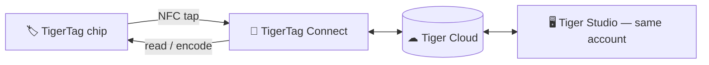

# TigerTag Connect (mobile app)

## Purpose

**Your phone already is a TigerTag reader — Connect switches it on.** The
iOS/Android app reads any spool with a tap, writes chips just as easily, and
keeps your whole collection in your pocket. It is the everyday entry point to
the ecosystem and the embodiment of the
[smartphone bridge](../philosophy/smartphone-bridge.md).

## Where it sits

## Features

- **NFC scanning on the go** — tap a spool, see its full profile.
- **Chip programming** — encode and re-encode TigerTag chips from the phone.
- **Catalogue browsing** — the shared brand/material/color reference database.
- **Shared account** — same Firebase backend as Tiger Studio: inventory,
  friends and racks stay in sync in real time across devices.

> **TODO:** App Store / Google Play links and current feature list per
> platform. A download QR code is available in Tiger Studio's sidebar.

## Architecture

Flutter app talking to [Tiger Cloud](./tiger-cloud.md) (Firebase Auth +
Firestore). Printer connectivity on mobile is cloud-oriented where vendors
allow it.

## Interactions

| With | How |
|---|---|
| TigerTag chips | Read & write by NFC tap |
| Tiger Cloud | Real-time inventory / friends / prefs sync |
| Tiger Studio | Desktop companion — same account, complementary features |

## Screenshots

> **TODO:** add mobile screenshots (`docs/assets/`).

---

**◀ Previous:** [TigerTag+](./tigertag-plus.md) · **▲ [Documentation index](../../README.md)** · **Next ▶** [Tiger Studio](./tiger-studio.md)

**Related:** [Smartphone bridge](../philosophy/smartphone-bridge.md), [Inventory & cloud sync](../concepts/inventory-and-cloud-sync.md)
