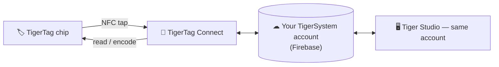

# TigerTag Connect (mobile app)

## Purpose

**Your phone already is a TigerTag reader — Connect switches it on.** The
iOS/Android app reads any spool with a tap, writes chips just as easily, and
keeps your whole collection in your pocket. It is the everyday entry point to
the ecosystem and the embodiment of the
[smartphone bridge](../philosophy/smartphone-bridge.md).

## Where it sits

## Features

- **NFC scanning on the go** — tap a spool, see its full profile.
- **Chip programming** — encode and re-encode TigerTag chips from the phone.
- **Catalogue browsing** — the shared brand/material/color reference database.
- **Shared account** — same Firebase backend as Tiger Studio: inventory,
  friends and racks stay in sync in real time across devices.

## Get it

- **Released** on the **App Store (iOS)** and **Google Play (Android)** —
  version 1.0.2 today.
- **Public betas** also available (TestFlight on iOS, open beta on Android).
- All download links: **[tigersystem.io/fr/download](https://tigersystem.io/fr/download)**
  — a QR code is also always available in Tiger Studio's sidebar.

> **Naming note:** the store name is currently **"TigerTag RFID Connect"**; it
> is being renamed **"TigerTag NFC Connect"** to echo the NFC reader already
> in every phone.

## Architecture

Flutter app talking to Firebase (Auth + Firestore) — the single shared
account database behind all the apps. Printer connectivity on mobile is cloud-oriented where vendors
allow it.

## Interactions

| With | How |
|---|---|
| TigerTag chips | Read & write by NFC tap |
| Firebase (account database) | Real-time inventory / friends / prefs sync |
| Tiger Studio | Desktop companion — same account, complementary features |

## Screenshots

> **TODO:** add mobile screenshots (`docs/assets/`).

---

**◀ Previous:** [TigerTag+](./tigertag-plus.md) · **▲ [Documentation index](../../README.md)** · **Next ▶** [Tiger Studio](./tiger-studio.md)

**Related:** [Smartphone bridge](../philosophy/smartphone-bridge.md), [Inventory & cloud sync](../concepts/inventory-and-cloud-sync.md)
