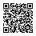
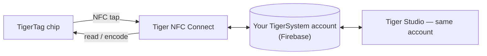

# Tiger NFC Connect (mobile app)

## Purpose

**Your phone already is a TigerTag reader — Connect switches it on.** The
iOS/Android app reads any spool with a tap, writes chips just as easily, and
keeps your whole collection in your pocket. It is the everyday entry point to
the ecosystem and the embodiment of the
[smartphone bridge](../philosophy/smartphone-bridge.md).

<strong>iPhone · iPad</strong>
<a class="ts-cta-primary" href="https://apps.apple.com/app/id6745437963">App Store</a>
Scan with the camera, or tap the button

<strong>Android</strong>
<a class="ts-cta-primary" href="https://play.google.com/store/apps/details?id=com.tigertag.connect">Google Play</a>
Scan with the camera, or tap the button

<a href="https://tigersystem.io/download">All downloads on tigersystem.io</a>
<a href="https://testflight.apple.com/join/jVHhmK4C">TestFlight beta (iOS)</a>
<a href="https://play.google.com/apps/testing/com.tigertag.connect">Google Play beta</a>

Free, on both stores. The app reads a chip with the phone's own NFC — nothing
to buy, no reader, no account needed to read.

## Where it sits

```mermaid
flowchart LR
  TAG["TigerTag chip"] -- "NFC tap" --> CO["Tiger NFC Connect"]
  CO -- "read / encode" --> TAG
  CO <--> CLOUD[("Your TigerSystem account<br/>(Firebase)")]
  CLOUD <--> ST["Tiger Studio — same account"]
```

## Features

- **NFC scanning on the go** — tap a spool, see its full profile.
- **Chip programming** — encode and re-encode TigerTag chips from the phone.
- **Catalogue browsing** — the shared brand/material/color reference database.
- **Shared account** — same Firebase backend as Tiger Studio: inventory,
 friends and racks stay in sync in real time across devices.
- **USB-C accessories** — supports the AJAX-3D **TD-1 / TD1s** filament
 analyzer over USB-C: measure a filament's Transmission Distance (and
 color) right from the phone
 ([compatible third-party hardware](../compatibility/third-party-hardware.md)).

## Get it

- **Released** on the **App Store (iOS)** and **Google Play (Android)** —
 version 1.0.2 today.
- **Public betas** also available (TestFlight on iOS, open beta on Android).
- All download links: **[tigersystem.io/download](https://tigersystem.io/download)**
 — a QR code is also always available in Tiger Studio's sidebar.

> **Naming note:** formerly published as *"TigerTag RFID Connect"* — renamed
> **Tiger NFC Connect** to echo the NFC reader already in every phone.
> The app is **free to use but proprietary** (not open source) for now —
> unlike Tiger Studio, the SDKs and the hardware, which are open.

## Architecture

Flutter app talking to Firebase (Auth + Firestore) — the single shared
account database behind all the apps. Printer connectivity on mobile is cloud-oriented where vendors
allow it.

## Interactions

| With | How |
|---|---|
| TigerTag chips | Read & write by NFC tap |
| Firebase (account database) | Real-time inventory / friends / prefs sync |
| Tiger Studio | Desktop companion — same account, complementary features |

## In pictures

|| | | |
|---|---|---|---|
|  |  |  |  |

---

**◀ Previous:** [TigerTag+ Certified](./tigertag-plus-certified.md) · **▲ [Documentation index](../../README.md)** · **Next ▶** [Tiger Studio](./tiger-studio.md)

**Related:** [Smartphone bridge](../philosophy/smartphone-bridge.md), [Inventory & cloud sync](../concepts/inventory-and-cloud-sync.md)
