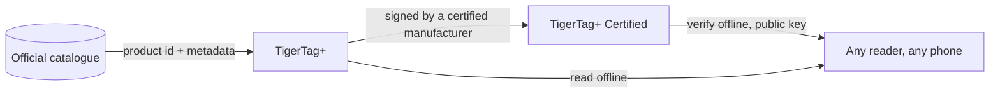

# TigerTag+ Certified

## Purpose

**Certified is the level that can prove where a chip came from.** A
[TigerTag+](./tigertag-plus.md) that additionally carries a **cryptographic
signature** is a **TigerTag+ Certified**. The signature is written by a
manufacturer holding [TigerTag+ certification](../developers/README.md), who is
given the signing tools as part of it; TigerTag holds the private key.

It is the only one of the three levels not open to everyone, and the only one
that answers a question the other two cannot: *is this spool genuine?*

## The three levels, side by side

| | TigerTag | TigerTag+ | TigerTag+ Certified |
|---|---|---|---|
| Print data, **on the chip** | ✅ | ✅ | ✅ |
| Works fully offline | ✅ | ✅ | ✅ |
| Catalogue product ID, **on the chip** | — | ✅ | ✅ |
| Enrichment metadata, **via the Web API, optional** | — | ✅ | ✅ |
| Origin signature, **on the chip** | — | — | ✅ |
| Who can produce one | everyone | everyone | **a certified manufacturer** |

Read the left column carefully: the enrichment metadata is the one row that
does **not** live on the chip. It is looked up from the catalogue when you
happen to be online, and it can improve after the chip is written — which is
precisely why it can never be something the chip needs. Everything the printer
requires is in the rows marked *on the chip*, which is what keeps all three
levels 100 % offline.

## Verifying is free — issuing is what certification grants

**Verifying** a signature is free, offline and unrestricted: the public keys
are published, and any reader can check one without an account or a network.
**Issuing** one is what certification grants.

The signed message deliberately covers the chip's **own UID**, so a signed
payload copied onto another chip no longer matches it: a cloned tag fails
verification, on the customer's own phone. The same property is why the two
chips of one spool carry two *different* signatures
([how the two chips are bound](../concepts/tigertag-chip.md)).

## Where it sits

The byte-level layout — chip type ids, the 64-byte signature area at pages
`0x18`–`0x27` — is specified in
[TigerTag-RFID-Guide](https://github.com/TigerTag-Project/TigerTag-RFID-Guide).

## Who is certified

The authoritative list of manufacturers allowed to put the mark on a product is
the [certified partners registry](../certified-partners.md). A logo on a chip,
a carrier, a spool or its packaging is only authorized for the makers on that
page.

---

**◀ Previous:** [TigerTag+](./tigertag-plus.md) · **▲ [Documentation index](../../README.md)** · **Next ▶** [Tiger NFC Connect](./tigertag-connect.md)

**Related:** [The TigerTag chip](../concepts/tigertag-chip.md), [Certified partners](../certified-partners.md), [Developer documentation](../developers/README.md)
