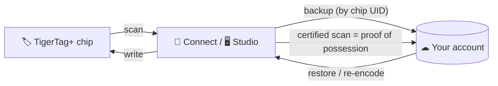

# TigerTag+

## Purpose

**TigerTag+ is the chip your account never forgets.** Same open chip, one
superpower: its content is safely backed up in your cloud account. Chip
damaged or lost? Restore it. Need to prove the spool is really in your hands?
One scan does it.

## Where it sits

## Features

- Everything a standard [TigerTag](./tigertag.md) does — the payload stays open.
- **Chip backup**: the chip's content is stored in the owner's TigerHub
  account, keyed by the chip's physical UID; a chip with a backup *is* a
  TigerTag+.
- **Restore / re-encode** from the backup if a chip is lost or damaged.
- **Certified scans**: a TigerTag+ scan can prove physical possession of the
  chip to the cloud — used to unlock account-level capabilities.

> **TODO:** public commercial description (pricing, where to buy, exact unlock
> perks). Keep this page aligned with **[tigertag.io](https://tigertag.io)**
> once published there.

## Architecture

The backup lives in the user's private cloud data (owner-only, rules-enforced —
see [Inventory & cloud sync](../concepts/inventory-and-cloud-sync.md)). The
chip's reserved 16-byte signature slot supports certification.

## Interactions

| With | How |
|---|---|
| TigerTag Connect / Tiger Studio | Scanning registers the chip and its backup on the account |
| TigerHub | Stores per-account chip records (UID, first-seen, payload backup) |

## Links

- 🛒 Buy chips: **[tigertag.io](https://tigertag.io)** (shop)

---

**◀ Previous:** [TigerTag](./tigertag.md) · **▲ [Documentation index](../../README.md)** · **Next ▶** [TigerTag Connect](./tigertag-connect.md)

**Related:** [The TigerTag chip](../concepts/tigertag-chip.md)
