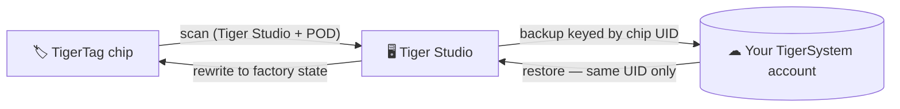

# TigerTag+

## Purpose

**TigerTag+ is a TigerTag your account remembers.** Scan a chip in
[Tiger Studio](./tiger-studio.md) with a [TigerPOD](./tigerpod.md) /
ACR122U reader and its exact content is **backed up in the cloud, keyed by
the chip's physical UID** — a chip with a backup *is* a TigerTag+. (The same
technology is coming to the mobile app soon.)

Like everything in the ecosystem, it is also a **sandbox concept**: a working
proof that a factory-encoded chip can be backed up and later **reprogrammed
back to its exact factory state — factory authentication included** — as long
as the data is written back into the **original chip, the one whose UID
matches the backup**.

## Where it sits

## What the backup gives you

- **Factory-state restore**: if the chip's content is accidentally rewritten
  or corrupted, reprogram it back exactly as the factory encoded it —
  **without losing the factory authentication**.
- **Same chip only**: the restore is valid only on the original chip; the
  backup is bound to its physical UID. It is a safeguard for *that* chip, not
  a way to clone it.
- **Proof of possession**: a scan matching the backup shows the original chip
  is physically in your hands.

> **Note:** creating the backup currently requires **Tiger Studio + a
> USB reader (TigerPOD / ACR122U)**; mobile support is planned.

## Interactions

| With | How |
|---|---|
| Tiger Studio + TigerPOD/ACR122U | Scanning creates/refreshes the backup; guided restore |
| TigerTag Connect | Coming soon |
| Firebase (account database) | Stores per-account chip records (UID, first-seen, payload backup) |

## Links

- 🛒 Official chips: **[tigertag.io](https://tigertag.io)** (shop)

---

**◀ Previous:** [TigerTag](./tigertag.md) · **▲ [Documentation index](../../README.md)** · **Next ▶** [TigerTag Connect](./tigertag-connect.md)

**Related:** [The TigerTag chip](../concepts/tigertag-chip.md), [Second Life](../philosophy/second-life.md)
