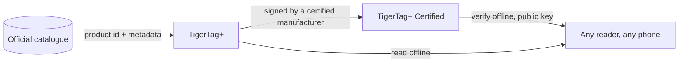

# TigerTag+

## Purpose

**The `+` means identified.** A TigerTag+ is a TigerTag whose identity carries a
**product ID from the official catalogue** — not values someone typed, but the
exact product: brand, colour, material, temperatures, diameter, SKU, EAN,
straight from the source. On top of that it can carry **optional enrichment
metadata**, served by the Web API and improvable after the chip is written.

The chip itself stays **100 % offline**. Everything needed to print is on it,
exactly as on a standard TigerTag — the catalogue ID adds the ability to look
up richer, fresher data *when you happen to be online*, and takes nothing away
when you are not. A TigerTag+ read in airplane mode behaves like any other
TigerTag.

This is the same `+` as in [TigerData+](../concepts/universal-filament-identity.md):
in both cases it means *this identity is a real catalogue product*, and in
neither case does it mean *certified*.

> **Naming note:** formerly sold as **"TigerTag Pro"** — the name is now
> **TigerTag+**.

## What the `+` adds

| | TigerTag | TigerTag+ |
|---|---|---|
| Print data, **on the chip** | ✅ | ✅ |
| Works fully offline | ✅ | ✅ |
| Catalogue product ID, **on the chip** | — | ✅ |
| Enrichment metadata, **via the Web API, optional** | — | ✅ |
| Who can produce one | everyone | everyone |

The enrichment metadata is the one row that does **not** live on the chip. It
is looked up from the catalogue when you happen to be online, and it can
improve after the chip is written — which is precisely why it can never be
something the chip needs. Everything the printer requires is on the chip, which
is what keeps every level 100 % offline.

## The signed variant

A TigerTag+ that additionally carries a cryptographic signature is a
**[TigerTag+ Certified](./tigertag-plus-certified.md)** — the level that can
prove a spool's origin, and the only one restricted to certified
manufacturers. Verifying a signature stays free and offline for everyone.

## Where it sits

```mermaid
flowchart LR
  CAT[("Official catalogue")] -- "product id + metadata" --> TTP["TigerTag+"]
  TTP -- "signed by a certified manufacturer" --> CERT["TigerTag+ Certified"]
  CERT -- "verify offline, public key" --> ANY["Any reader, any phone"]
  TTP -- "read offline" --> ANY
```

## Backing up a chip — a separate feature

Tiger Studio can **back up a chip's exact content** in your account, keyed to
its physical UID, and later reprogram it back to that state. This is useful and
unrelated to the `+`: it applies to any chip you can scan, and having a backup
does not make a chip a TigerTag+.

- **Factory-state restore**: if a chip is accidentally rewritten or corrupted,
 put it back exactly as it was — signature included, if it had one.
- **Same chip only**: the restore is valid on the original chip, because the
 backup is bound to its UID. A safeguard for *that* chip, never a way to clone.
- **Proof of possession**: a scan matching the backup shows the original chip
 is physically in your hands.

> **Note:** creating a backup currently requires **Tiger Studio + a USB reader
> (TigerPOD / ACR122U)**; mobile support is planned.

## Interactions

| With | How |
|---|---|
| Tiger Studio + TigerPOD/ACR122U | Reads and verifies signatures; creates and restores chip backups |
| Tiger NFC Connect | Reads and verifies; backup support coming |
| SDKs | `tigertag[verify]` checks a signature offline, in Python or JS |
| Firebase (account database) | Holds the catalogue, the enrichment metadata, and per-account chip backups |

## Links

- Official chips: **[tigertag.io](https://tigertag.io)** (shop)

---

**◀ Previous:** [TigerTag](./tigertag.md) · **▲ [Documentation index](../../README.md)** · **Next ▶** [TigerTag+ Certified](./tigertag-plus-certified.md)

**Related:** [Universal filament identity](../concepts/universal-filament-identity.md), [The TigerTag chip](../concepts/tigertag-chip.md), [Developer documentation](../developers/README.md)
