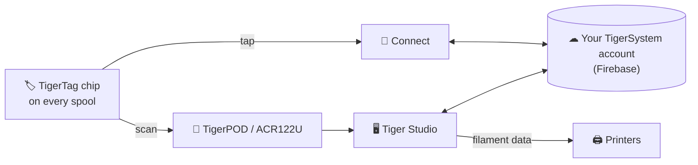

# TigerTag

## Purpose

**TigerTag gives every spool a memory of its own.** A small NFC chip holds
everything about the filament — brand, material, color, how it likes to be
printed — so you never have to guess, label or remember. Tap it with your
phone and the spool tells you itself.

Technically, it is the heart of the ecosystem: an open RFID standard, readable
by any compatible app or reader — no vendor lock, no secret format.

## Where it sits

## Features

- Standard **NTAG213 / 215 / 216** chip (25 mm round recommended), 144-byte
  open NDEF payload — sized to fit the smallest NTAG213; no keys, no lock-in.
- **Two chips per spool, on opposite sides** — one always faces the reader
  (printer slot, AMS, phone in hand) and each backs the other up
  ([why](../concepts/tigertag-chip.md)).
- Identity resolved against the shared [reference database](../concepts/universal-filament-identity.md).
- Writable and **rewritable** — enables the [Second Life workflow](../philosophy/second-life.md);
  official branded chips ship as NTAG215 so the chip itself can be reused as a
  plain NDEF object (keychain, business card…) once the spool is empty —
  never e-waste.
- Readable by any NFC smartphone, ACR122U readers and [TigerPOD](./tigerpod.md).
- A reserved **32-byte area**: free for **community add-on functions** on a
  standard TigerTag; carries the origin signature on a
  [TigerTag+](./tigertag-plus.md).

## Architecture

See [The TigerTag chip](../concepts/tigertag-chip.md) for the format summary and
[TigerTag-RFID-Guide](https://github.com/TigerTag-Project/TigerTag-RFID-Guide)
for the canonical byte-level specification.

## Interactions

| With | How |
|---|---|
| Tiger NFC Connect | NFC tap: read, encode |
| Tiger Studio | Reader scan auto-opens the spool; guided chip update |
| SDKs | Parse / verify / encode from JS or Python |
| Printers | Indirectly — via the [smartphone bridge](../philosophy/smartphone-bridge.md) and Studio's printer links |

## In pictures

> **Naming note:** standard chips were formerly sold as **"TigerTag Maker"**
> — the name is now simply **TigerTag**.

## Chips without lock-in

More than **2.5 million TigerTag chips** have been produced — most integrated at
the factory by filament brands (Rosa3D, eSun, Sunlu, Landu, Jamg He, R3D,
Filforme, Nanovia…).
But the protocol is deliberately **not tied to official chips**: any cheap,
blank NTAG chip bought anywhere (Amazon, AliExpress, locally) works
identically, and nothing blocks it. Branded chips help support the R&D;
adoption of the protocol is the first reward.

The freedom runs both ways: **chips are never write-locked**. TigerTag is
simply the base protocol filament factories ship spools with — if you prefer
another NFC/RFID protocol (custom or existing), you can rewrite the chip and
migrate its data to it. Your spool, your chip, your format.

## Links

- 🛒 Official chips: **[tigertag.io](https://tigertag.io)** (shop — supports the R&D)
- 📖 Chip format: [TigerTag-RFID-Guide](https://github.com/TigerTag-Project/TigerTag-RFID-Guide)

---

**◀ Previous:** [Products](./README.md) · **▲ [Documentation index](../../README.md)** · **Next ▶** [TigerTag+](./tigertag-plus.md)

**Related:** [Universal filament identity](../concepts/universal-filament-identity.md), [Second Life](../philosophy/second-life.md)
