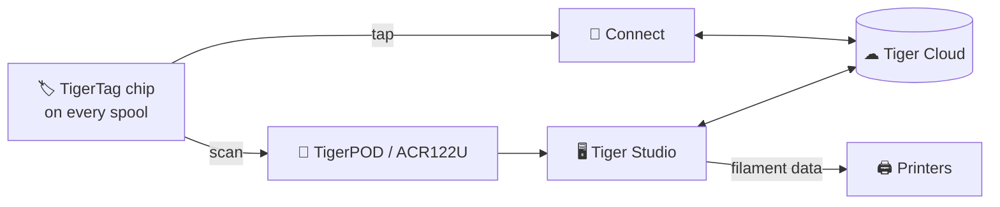

# TigerTag

## Purpose

**TigerTag gives every spool a memory of its own.** A small NFC chip holds
everything about the filament — brand, material, color, how it likes to be
printed — so you never have to guess, label or remember. Tap it with your
phone and the spool tells you itself.

Technically, it is the heart of the ecosystem: an open RFID standard, readable
by any compatible app or reader — no vendor lock, no secret format.

## Where it sits

## Features

- Standard **NTAG** NFC chip, 144-byte open NDEF payload — no keys, no lock-in.
- Identity resolved against the shared [reference database](../concepts/universal-filament-identity.md).
- Writable and **rewritable** — enables the [Second Life workflow](../philosophy/second-life.md).
- Readable by any NFC smartphone, ACR122U readers and [TigerPOD](./tigerpod.md).
- Reserved 16-byte signature slot, used by [TigerTag+](./tigertag-plus.md).

## Architecture

See [The TigerTag chip](../concepts/tigertag-chip.md) for the format summary and
[TigerTag-RFID-Guide](https://github.com/TigerTag-Project/TigerTag-RFID-Guide)
for the canonical byte-level specification.

## Interactions

| With | How |
|---|---|
| TigerTag Connect | NFC tap: read, encode |
| Tiger Studio | Reader scan auto-opens the spool; guided chip update |
| SDKs | Parse / verify / encode from JS or Python |
| Printers | Indirectly — via the [smartphone bridge](../philosophy/smartphone-bridge.md) and Studio's printer links |

## Screenshots

> **TODO:** add chip/packaging photos (`docs/assets/`).

## Links

- 🛒 Buy chips & manage your account: **[tigertag.io](https://tigertag.io)**
- 📖 Chip format: [TigerTag-RFID-Guide](https://github.com/TigerTag-Project/TigerTag-RFID-Guide)

---

**◀ Previous:** [Products](./README.md) · **▲ [Documentation index](../../README.md)** · **Next ▶** [TigerTag+](./tigertag-plus.md)

**Related:** [Universal filament identity](../concepts/universal-filament-identity.md), [Second Life](../philosophy/second-life.md)
