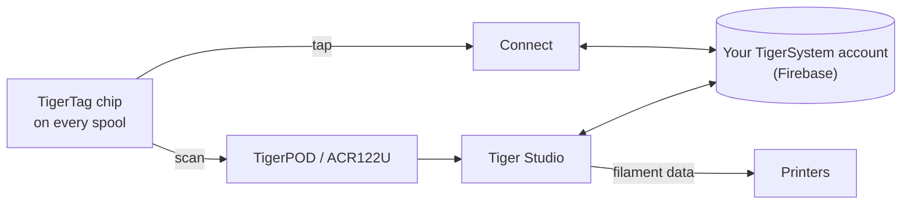

# TigerTag

## Purpose

**TigerTag gives every spool a memory of its own.** A small NFC chip holds
everything about the filament — brand, material, color, how it likes to be
printed — so you never have to guess, label or remember. Tap it with your
phone and the spool tells you itself.

Technically, it is the heart of the ecosystem: an open RFID standard, readable
by any compatible app or reader — no vendor lock, no secret format.

## Where it sits

```mermaid
flowchart LR
  TAG["TigerTag chip<br/>on every spool"] -- "tap" --> CO["Connect"]
  TAG -- "scan" --> RD["TigerPOD / ACR122U"] --> ST["Tiger Studio"]
  CO & ST <--> CLOUD[("Your TigerSystem account<br/>(Firebase)")]
  ST -- "filament data" --> PRN["Printers"]
```

## Features

- Standard **NTAG213 / 215 / 216** chip (25 mm round recommended), 144-byte
 open NDEF payload — sized to fit the smallest NTAG213; no keys, no lock-in.
- **Two chips per spool, on opposite sides** — one always faces the reader
 (printer slot, AMS, phone in hand) and each backs the other up
 ([why](../concepts/tigertag-chip.md)).
- Identity resolved against the shared [reference database](../concepts/universal-filament-identity.md).
- Writable and **rewritable** — enables the [Second Life workflow](../philosophy/second-life.md);
 official branded chips ship as NTAG215 so the chip itself can be reused as a
 plain NDEF object (keychain, business card…) once the spool is empty —
 never e-waste.
- Readable by any NFC smartphone, ACR122U readers and [TigerPOD](./tigerpod.md).
- A reserved **64-byte area** (pages `0x18`–`0x27`, leaving 80 bytes of data):
 free for **community add-on functions** on a standard TigerTag; carries the
 origin signature — 32 bytes of `R`, 32 of `S` — on a
 [TigerTag+](./tigertag-plus.md).

## Architecture

See [The TigerTag chip](../concepts/tigertag-chip.md) for the format summary and
[TigerTag-RFID-Guide](https://github.com/TigerTag-Project/TigerTag-RFID-Guide)
for the canonical byte-level specification.

## Interactions

| With | How |
|---|---|
| Tiger NFC Connect | NFC tap: read, encode |
| Tiger Studio | Reader scan auto-opens the spool; guided chip update |
| SDKs | Parse / verify / encode from JS or Python |
| Printers | Indirectly — via the [smartphone bridge](../philosophy/smartphone-bridge.md) and Studio's printer links |

## In pictures

> **Naming note:** standard chips were formerly sold as **"TigerTag Maker"**
> — the name is now simply **TigerTag**.

## The official chips, and everyone else's

**TigerSystem manufactures the official chips** and puts the TigerTag logo on
them. They come in two form factors, and both ship **blank**:

| Form factor | For |
|---|---|
| **Sticker** | any spool you already own — one on each side ([why two](../concepts/tigertag-chip.md)) |
| **Refill carrier** | filament [refills](../philosophy/second-life.md) with a cardboard core: one carrier already carries **both chips**, it sits inside the core before the refill goes on a reusable masterspool, so the chip travels with the filament, not the reel |

Who may say what, when a chip is for sale:

| Who | What they are selling | May call it | Logo |
|---|---|---|---|
| **TigerSystem** | the chips it manufactures | **official** — made by us | yes — it applies the mark |
| **Any reseller or distributor** | those same genuine chips | **official** — the goods are | yes — the mark is already on them |
| **A third party TigerSystem has audited** | anything it built — chips, inlays, carriers, a device, an app | **certified** — granted, audited, listed, withdrawable | yes, on the product |
| **Anyone making their own chip** | their own compatible chip | *"compatible with TigerTag"* — and with **TigerTag+** if it verifies signatures. Never *"certified"*, which only TigerSystem grants | in their app, docs and store listing — **never on the chip, carrier, spool or packaging** |

That last distinction is the whole trademark policy, and it is narrower than it
looks. Saying your product *talks to* TigerTag is a fact about your product,
and showing the logo to say so is free. Putting the mark **on** a chip is a
statement about **who made it** — it stops meaning "this works with TigerTag"
and starts meaning "this *is* a TigerTag". Only that second use needs written
authorization. See [TRADEMARK.md](../../TRADEMARK.md).

More than **2.5 million TigerTag chips** have been produced — most integrated
at the factory by filament brands (Rosa3D, eSun, Sunlu, Landu, Jamg He, R3D —
with Filforme, Nanovia and more being integrated). All of them are
[certified partners](../certified-partners.md); that page is the registry, and
the only authoritative way to check that a mark on a box is legitimate.

|| | |
|---|---|---|
|  |  |  |

|| | | |
|---|---|---|---|
|  |  |  |  |

*The boxes and the spools inside them — bought in a shop, not staged for a
photo. This is what "most deployed" looks like.* But the protocol is
deliberately **not tied to official chips**: any cheap, blank NTAG chip bought
anywhere (Amazon, AliExpress, locally) works identically, and nothing blocks
it. Branded chips help support the R&D; adoption of the protocol is the first
reward.

The freedom runs both ways: **chips are never write-locked**. TigerTag is
simply the base protocol filament factories ship spools with — if you prefer
another NFC/RFID protocol (custom or existing), you can rewrite the chip and
migrate its data to it. Your spool, your chip, your format.

## Where to buy them

Both form factors ship **blank**, and both are sold by TigerSystem and by its
resellers:

| | **Sticker** | **Refill carrier** |
|---|---|---|
| What you get | round 25 mm adhesive chips — **two per spool**, one on each side | one carrier = **two chips already paired**, one per folded end, for the cardboard core |
| For | any spool with flanges | filament refills mounted on a masterspool |
| Official shop | [tigertag.io](https://shop.tigertag.io/collections/tigertag-rfid-maker) | [tigertag.io](https://shop.tigertag.io/collections/tigertag-rfid-maker) |
| Reseller (FR) | [TigerTag Officiel, Atome3D](https://www.atome3d.com/products/tigertag) | [TigerTag Refill Officiel, Atome3D](https://www.atome3d.com/products/tigertag-pro-for-refill-1000-pcs) |

Both come in several pack sizes, up to professional quantities. And none of it
is required: **any blank NTAG chip bought anywhere works identically** — buying
official ones funds the protocol, nothing more.

## Links

- Official chips: **[tigertag.io](https://tigertag.io)** (shop — supports the R&D)
- Chip format: [TigerTag-RFID-Guide](https://github.com/TigerTag-Project/TigerTag-RFID-Guide)

---

**◀ Previous:** [Products](./README.md) · **▲ [Documentation index](../../README.md)** · **Next ▶** [TigerTag+](./tigertag-plus.md)

**Related:** [Universal filament identity](../concepts/universal-filament-identity.md), [Second Life](../philosophy/second-life.md)
