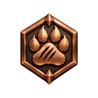
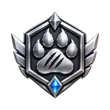
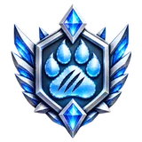

# TigerSquad

**The community that moves open 3D printing forward.** The TigerSquad is the
free, opt-in community of makers who back an open spool standard — by using it,
by tagging their spools, and sometimes by buying the maintainer a coffee.

Joining costs nothing, commits you to nothing and asks for no payment. You get
a level, a few XP and a place on the public
**[TigerSquad wall](https://tigersystem.io/en/tigersquad)** — a ranking of the
makers who keep the project going. *Together, we print further.*

## How to join

From **Tiger Studio Manager**, the desktop app ([Tiger Studio](./products/tiger-studio.md)),
version **2.37.0** or later. Any of these four doors leads to the same place:

| Where | What you see |
|---|---|
| **The invitation** | A TigerSquad window appears 20 seconds after start-up, once your account is more than 7 days old and has not joined yet. *Maybe later* hides it for 30 days. |
| **The Support menu** | The coffee button in the sidebar opens a menu with a *Join the TigerSquad* row. |
| **Improvements & suggestions** | The suggestions panel carries a TigerSquad card. |
| **My profile** | A TigerSquad switch — on to join, off to leave. |

Leaving is the same switch in **My profile**, turned off. Changed your mind?
The invitation comes back once you have left.

## What you get

| | |
|---|---|
|  | **+50 XP the moment you join.** Removed again if you leave. |
|  | **Badges to unlock.** Four levels, from Bronze to Platinum, earned by what you do — not by what you say. |
|  | **A way to support the project.** Optional, and never a condition for anything else. |

## The four levels

Your level is computed by the server, from what is actually in your account.
Nobody declares their own.

|  |  |  |  |
|---|---|---|---|
| **Bronze** | **Silver** | **Gold** | **Platinum** |
| *Start the adventure* | *Get active* | *Give a bit more* | *One of the pillars* |
| You joined, for free. | 20 or more TigerTag chips of any kind in your account — TigerTag, TigerTag+ or certified. | You supported the project with a donation. | A donation **and** 50 or more certified TigerTag+. |

> **Note:** a donation on its own gives no badge. The badge comes with joining
> the TigerSquad — donate first and join later, and the Gold level is waiting
> for you.

Your level shows wherever your profile does:

- a coloured ring and a heart around your avatar;
- a **TigerSquad · *Level*** pill on your profile banner;
- your friends see it too — in their friends list and when they open your profile;
- and on the public [TigerSquad wall](https://tigersystem.io/en/tigersquad).

## XP — what every chip is worth

XP is counted by the server, **once per physical chip** (its UID):

| Chip | XP |
|---|---|
| [Certified TigerTag+](./products/tigertag-plus-certified.md) | **10** |
| [TigerTag+](./products/tigertag-plus.md) | **2** |
| [TigerTag](./products/tigertag.md) | **1** |
| TigerData (no chip) | 0 |

The fine print, which is mostly good news:

- **Your existing spools count**, not only new scans — spools you added long
  ago, imported, or scanned with the phone app all earn their points.
- **Both chips of a [twin spool](./guides/twin-tag-pair.md) count.**
- **A chip earns once, for one account** — the first one that records it — and
  keeps its points. Emptying or deleting the spool does not take them back.
- **Re-programming a chip** on the same UID earns nothing new. The one thing
  that can lift a chip later is proof of certification arriving afterwards:
  it then moves up to 10.
- **"Certified"** means the chip's backup has been verified against the
  TigerTag factory signature (ECDSA) with the TigerTag SDK.

Your XP sits under your name in the sidebar and in **My profile**, for example
*407 XP · 19 certified TigerTag+*.

## The public wall

The [TigerSquad wall](https://tigersystem.io/en/tigersquad) (also in other
languages, e.g. [French](https://tigersystem.io/fr/tigersquad)) shows only what
you would expect a ranking to show:

| Shown | Never shown |
|---|---|
| Pseudo, avatar, level, XP, number of certified TigerTag+ | Any amount you gave |

## Supporting the project

Entirely optional. The app stays free and open source either way.
TigerSystem is a personal open-source project, and donations go to its
maintainer. Every coffee button in the app leads to one of these:

| | |
|---|---|
| **Buy Me a Coffee** | [buymeacoffee.com/benoitl](https://buymeacoffee.com/benoitl) |
| **Ko-fi** | [ko-fi.com/tigersystemio](https://ko-fi.com/tigersystemio) |
| **PayPal** | [paypal.me/tigersystemio](https://paypal.me/tigersystemio) |

### Linking a donation to your account

So the thank-you reaches the right person, use any one of these:

1. **Your supporter code** — a personal `TS-XXXX-XXXX` code shown in the
   Support menu, which never changes. Put it in the payment message.
2. **Your account email** — pay with the same address you sign in with.
3. **Claim it afterwards** — Support menu → *Already gave?* → enter the payer
   email or the transaction id.

A linked donation brings a thank-you notification and — once you are in the
TigerSquad — the Gold level.

---

**▲ [Documentation index](../README.md)** · **Related:** [Support the project](./support.md), [Hall of Fame](./hall-of-fame.md), [Tiger Studio](./products/tiger-studio.md), [TigerTag+ certified](./products/tigertag-plus-certified.md)
