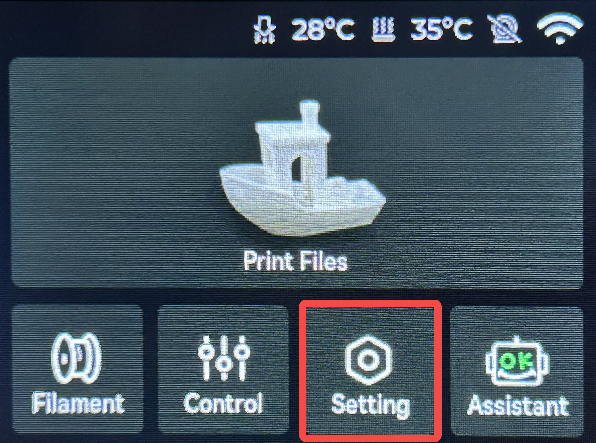
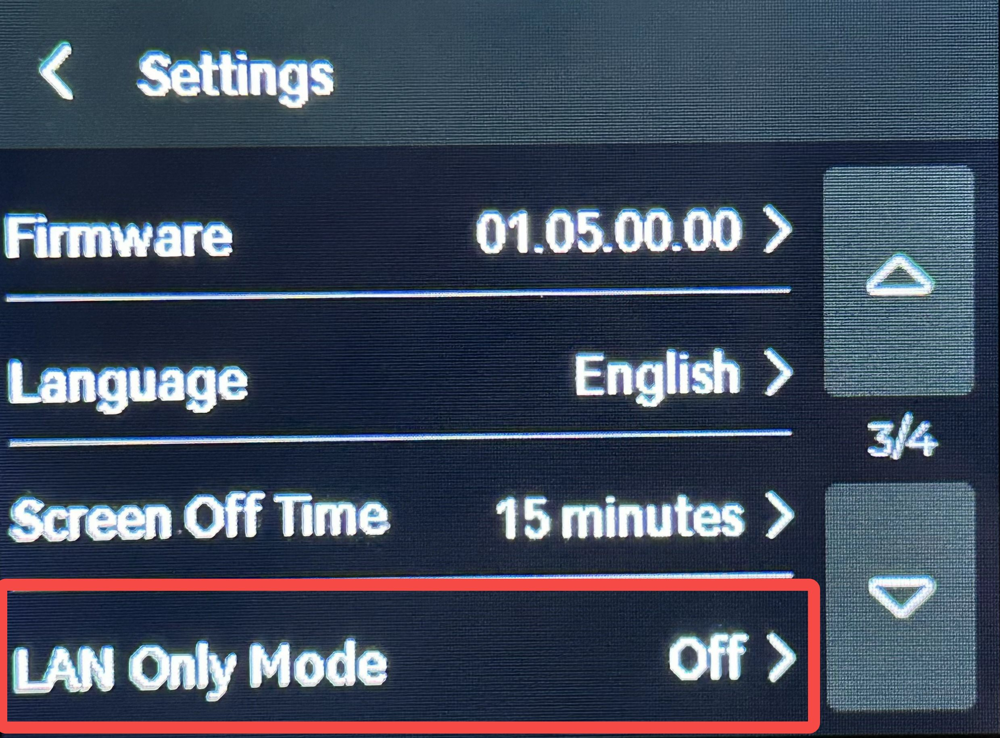
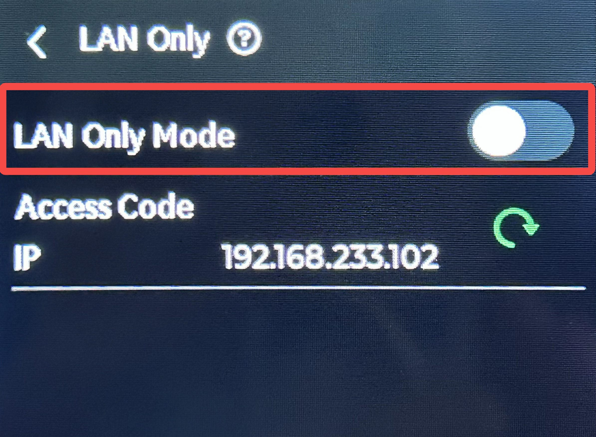
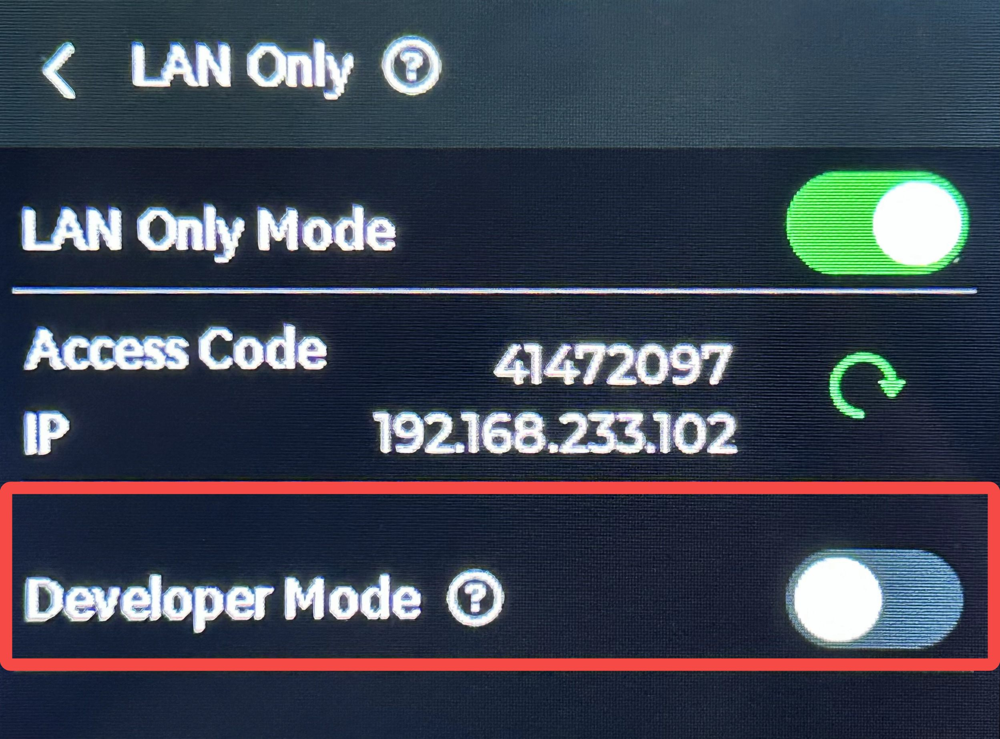
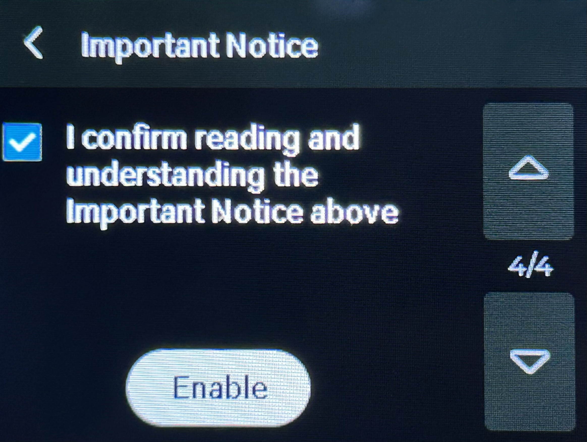
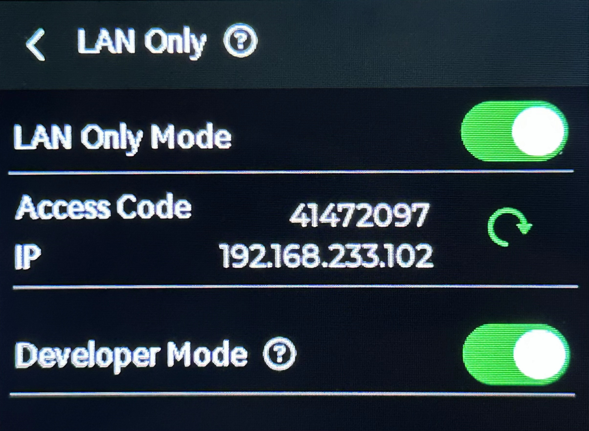

# Bambu Lab A1 series: switch to LAN mode

For the A1 mini, A1 and A2L — enable **LAN Only Mode** and **Developer Mode** on the printer
itself, then add it in Tiger Studio with its IP address, serial number and access code. See
[Bambu Lab compatibility](../compatibility/bambu-lab.md) for the other series and the cloud option.

<strong>Step 1.</strong> Enable LAN Only Mode on the printer side. Enter the Setting page from the printer screen by clicking Setting.

Click "LAN Only Mode".

Enable "LAN Only Mode".

<strong>Step 2.</strong> Enable Developer Mode on the printer side. Enable "Developer Mode".

Please carefully read the Important Notice. If you accept all related risks or consequences, check "I confirm reading and understanding the Important Notice above" and then select "Enable".

Once this feature is enabled, the button will turn green.

Check the printer IP address and Serial Number from the printer settings.

Use the printer IP address, Serial Number and Access Code in Tiger Studio.

---

**◀ Previous:** [Bambu Lab compatibility](../compatibility/bambu-lab.md) · **▲ [Documentation index](../../README.md)**
