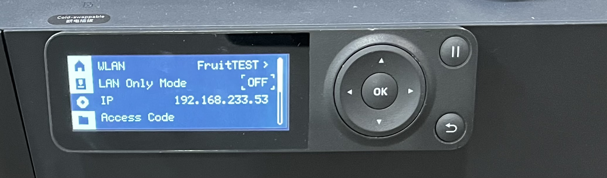
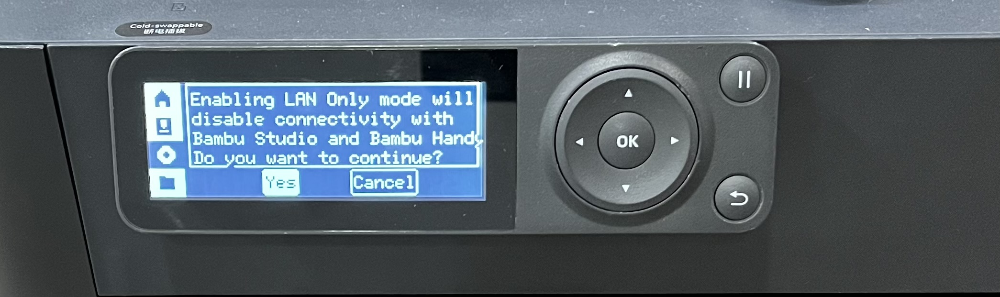
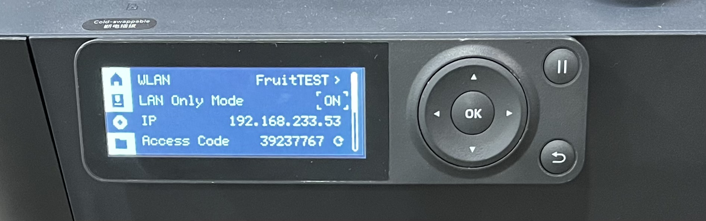

# Bambu Lab P1 series: switch to LAN mode

For the P1P and P1S — enable **LAN Only mode** and **Developer Mode** on the printer itself, then
add it in Tiger Studio with its IP address, serial number and access code. See
[Bambu Lab compatibility](../compatibility/bambu-lab.md) for the other series and the cloud option.

<strong>Step 1.</strong> Enable LAN Only mode on the printer side. Enter the Settings page and select WLAN.

Select LAN Only mode.

Select Yes, and enable LAN Only mode.

After enabling LAN Only mode, ON will be displayed.

<strong>Step 2.</strong> Enable Developer mode on the printer side. After turning on LAN Only mode, click the Scroll Down button and find Developer Mode.

Select Developer Mode, and please read the Important Notice carefully.

If you accept all related risks or consequences, scroll down to the end and click Enable.

After enabling Developer Mode, ON will be displayed. Then use the printer IP address, Serial Number and Access Code in Tiger Studio.

---

**◀ Previous:** [Bambu Lab compatibility](../compatibility/bambu-lab.md) · **▲ [Documentation index](../../README.md)**
