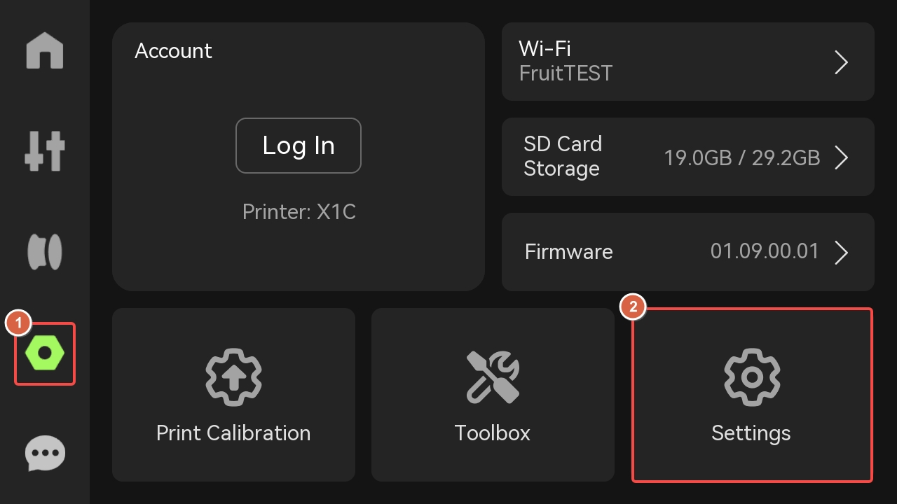
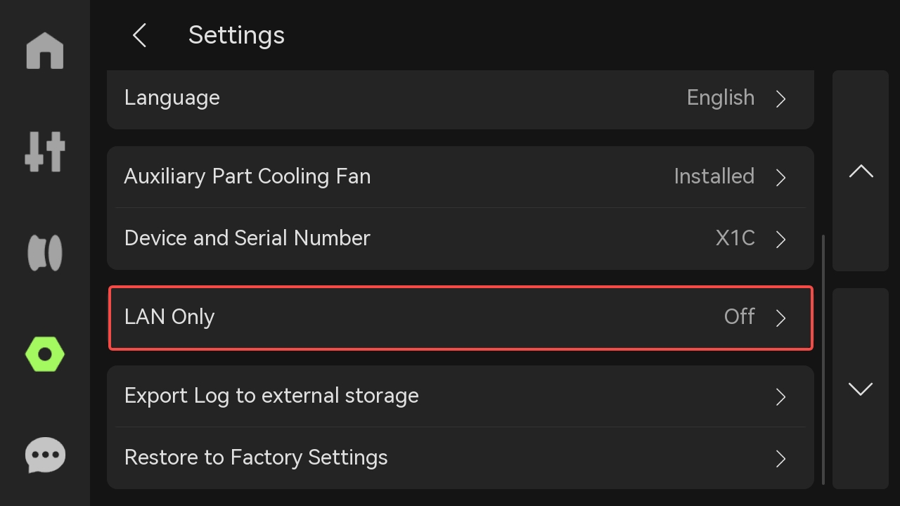
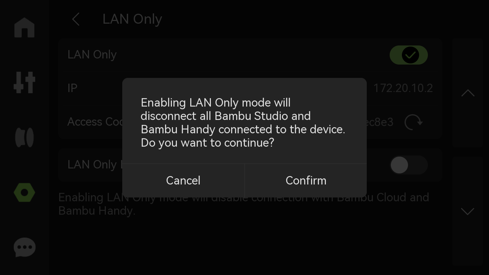
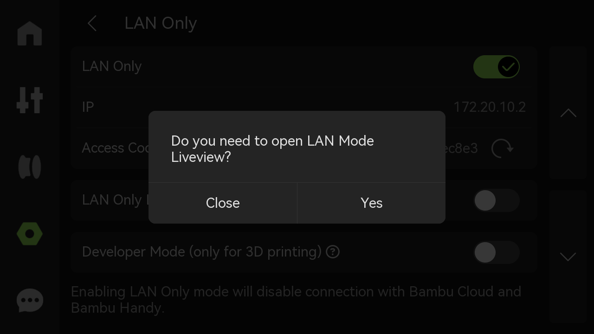
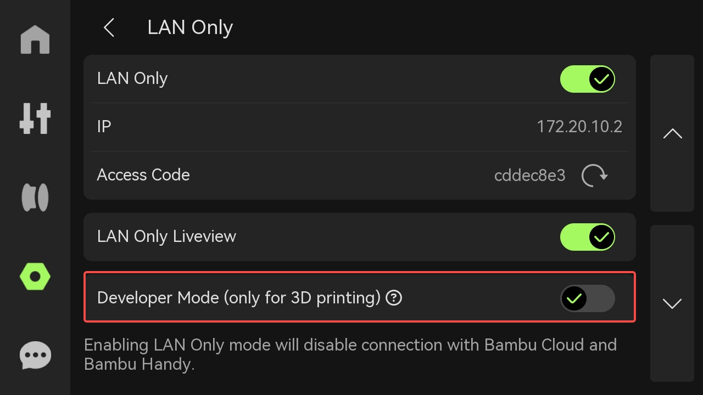
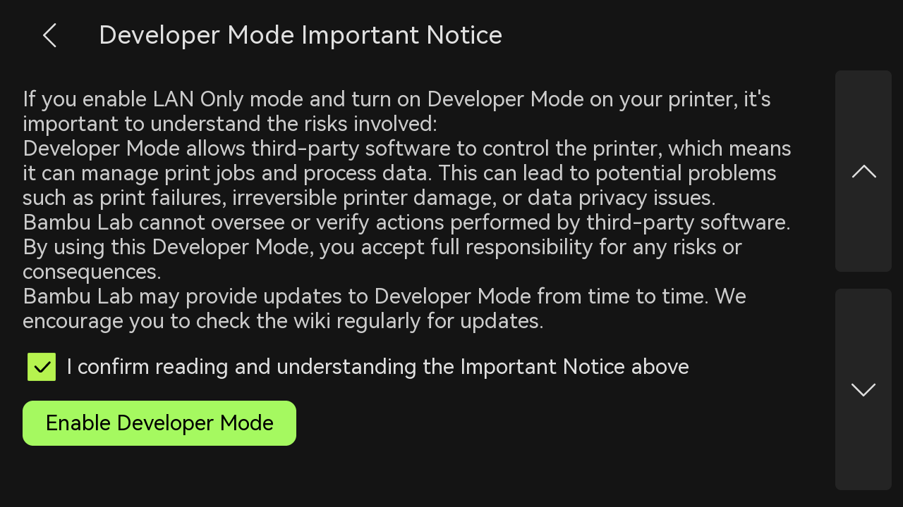
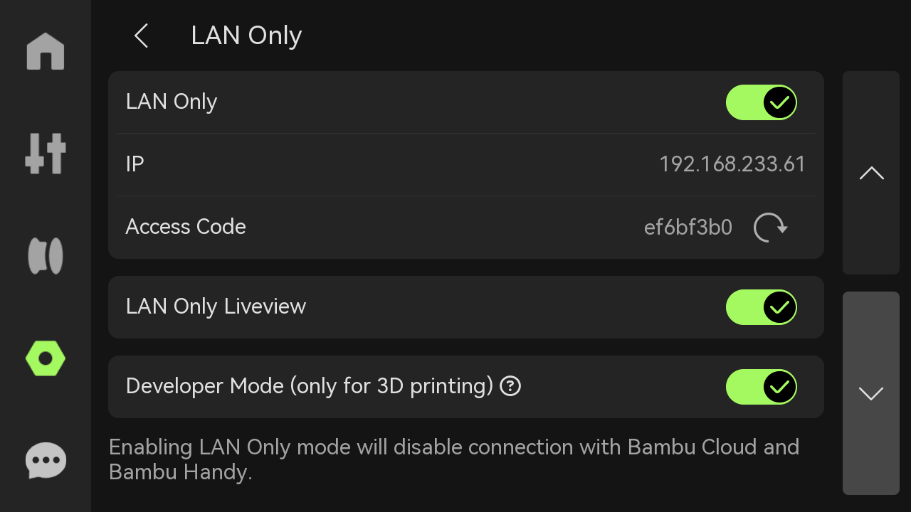

# Bambu Lab X1 / X1E / H2 / P2 series: switch to LAN mode

For the P2S, X1 Carbon, X1E, X2D, H2S, H2D, H2D Pro and H2C — enable **LAN Only mode** and **Developer
Mode** on the printer itself, then add it in Tiger Studio with its IP address, serial number and
access code. See [Bambu Lab compatibility](../compatibility/bambu-lab.md) for the other series and
the cloud option.

<strong>Step 1.</strong> Enable LAN Only mode on the printer side. Enter the Settings page from the left side of the printer screen and click Settings.

Click "LAN Only".

Enable LAN Only mode.

Choose whether to enable LAN mode liveview according to your needs.

<strong>Step 2.</strong> Enable Developer mode on the printer side. Enable "Developer Mode".

Please carefully read the Important Notice and Risk warning. If you accept all related risks or consequences, check "I confirm reading and understanding the Important Notice above" and then select "Enable Developer Mode".

Once this feature is enabled, the button will turn green. Then use the printer IP address, Serial Number and Access Code in Tiger Studio.

---

**◀ Previous:** [Bambu Lab compatibility](../compatibility/bambu-lab.md) · **▲ [Documentation index](../../README.md)**
